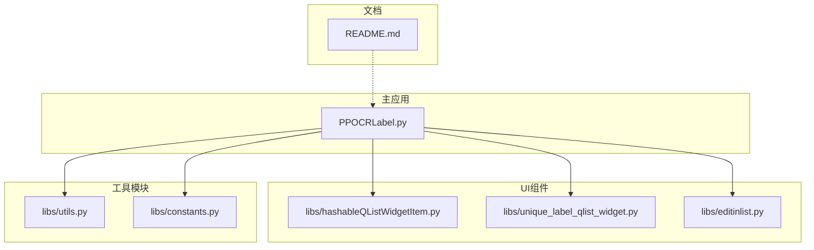
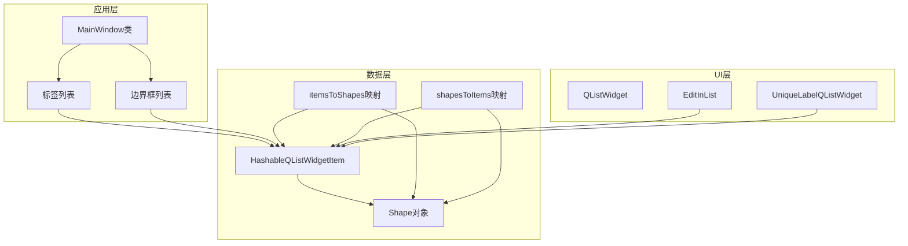
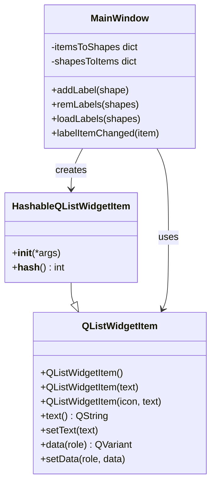
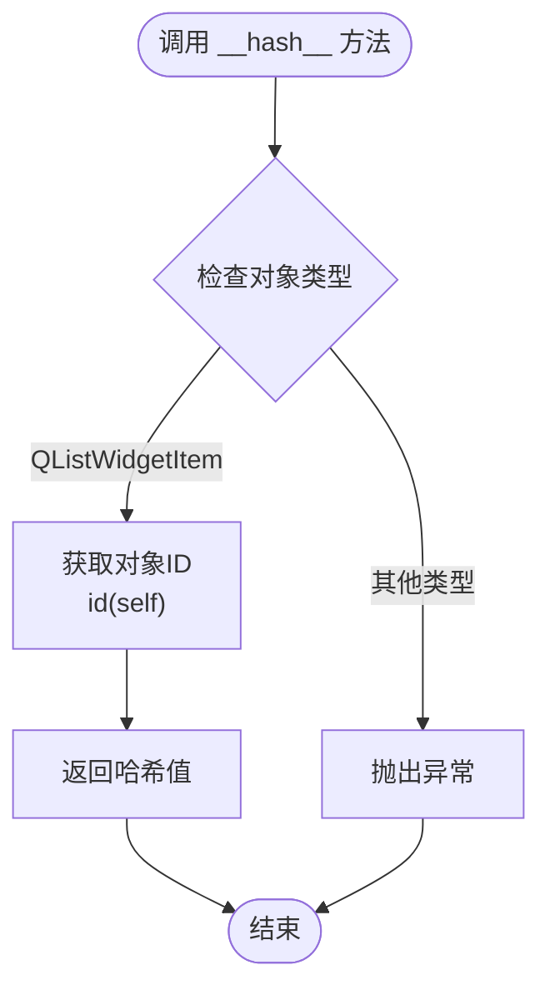
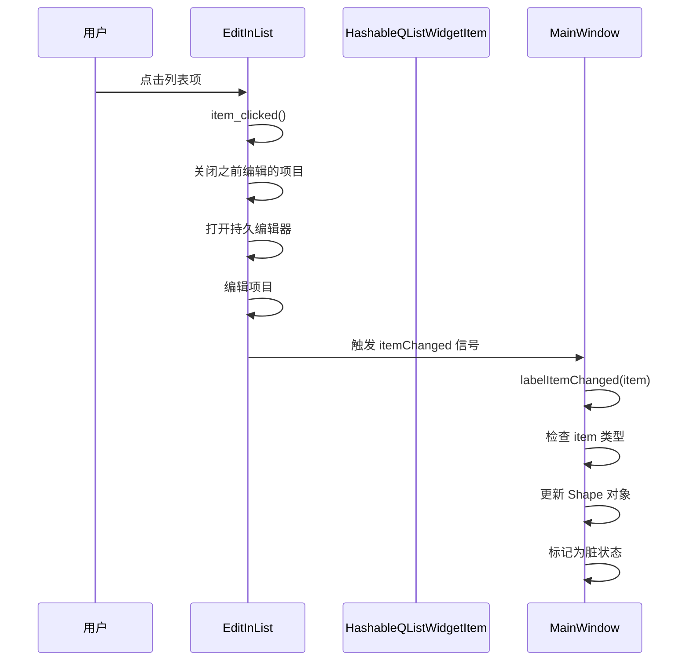
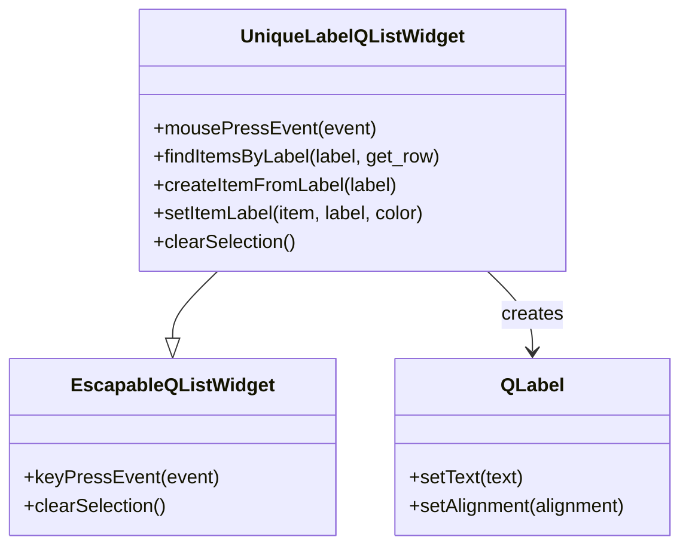
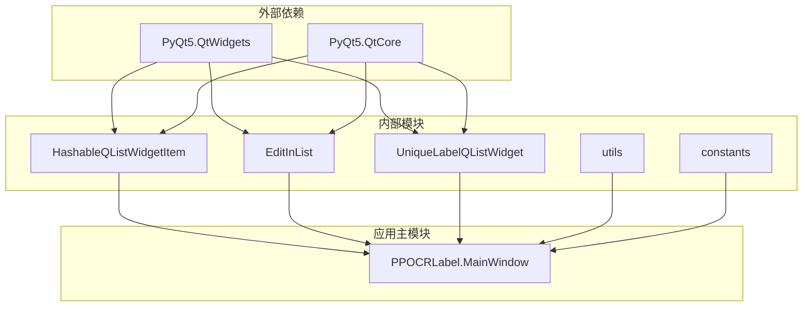

# 可哈希列表项

<cite>
**本文档引用的文件**
- [libs/hashableQListWidgetItem.py](hashableQListWidgetItem.md)
- [libs/unique_label_qlist_widget.py](unique_label_qlist_widget.md)
- [PPOCRLabel.py](PPOCRLabel.md)
- [libs/editinlist.py](editinlist.md)
- [libs/utils.py](utils.md)
- [libs/constants.py](constants.md)
- [README.md](README.md)
</cite>

## 目录
1. [简介](#简介)
2. [项目结构](#项目结构)
3. [核心组件](#核心组件)
4. [架构概览](#架构概览)
5. [详细组件分析](#详细组件分析)
6. [依赖关系分析](#依赖关系分析)
7. [性能考量](#性能考量)
8. [故障排除指南](#故障排除指南)
9. [结论](#结论)
10. [附录](#附录)

## 简介
本文档详细介绍 PPOCRLabel 项目中实现的可哈希列表项功能。该功能通过扩展 PyQt5 的 QListWidgetItem 类，使其支持哈希操作，从而能够在 Python 的集合和字典中作为键值使用。这对于需要进行去重、集合运算和高效查找的 OCR 标注场景至关重要。

PPOCRLabel 是一个半自动图形标注工具，专门用于 OCR 领域，内置 PP-OCR 模型来自动检测和识别数据。该工具支持矩形框、表格、不规则文本和关键信息标注模式，标注结果可直接用于 PP-OCR 检测和识别模型的训练。

## 项目结构
PPOCRLabel 项目采用模块化设计，主要包含以下关键目录和文件：



**图表来源**
- [PPOCRLabel.py](PPOCRLabel.md)
- [libs/hashableQListWidgetItem.py](hashableQListWidgetItem.md)
- [libs/unique_label_qlist_widget.py](unique_label_qlist_widget.md)

**章节来源**
- [PPOCRLabel.py](PPOCRLabel.md)
- [README.md](README.md)

## 核心组件
可哈希列表项功能的核心实现位于 `libs/hashableQListWidgetItem.py` 文件中，这是一个简单的类扩展，为 PyQt5 的 QListWidgetItem 添加了哈希支持。

### 主要特性
- **哈希支持**: 通过 `__hash__()` 方法实现，使用对象的内存地址作为哈希值
- **向后兼容**: 继承自 `QListWidgetItem`，保持原有所有功能
- **轻量级实现**: 仅包含必要的哈希逻辑，无额外开销

### 实现原理
该实现采用了基于对象身份的哈希策略，即使用 `id(self)` 作为哈希值。这种方法确保了：
- 每个对象都有唯一的哈希值
- 哈希值在对象生命周期内保持不变
- 哈希计算具有 O(1) 时间复杂度

**章节来源**
- [libs/hashableQListWidgetItem.py](hashableQListWidgetItem.md)

## 架构概览
可哈希列表项功能在整个 PPOCRLabel 应用中的架构关系如下：



**图表来源**
- [PPOCRLabel.py](PPOCRLabel.md)
- [libs/hashableQListWidgetItem.py](hashableQListWidgetItem.md)
- [libs/editinlist.py](editinlist.md)

## 详细组件分析

### HashableQListWidgetItem 类分析

#### 类定义和继承关系


**图表来源**
- [libs/hashableQListWidgetItem.py](hashableQListWidgetItem.md)
- [PPOCRLabel.py](PPOCRLabel.md)

#### 哈希算法实现
可哈希列表项使用基于对象身份的哈希算法：



**图表来源**
- [libs/hashableQListWidgetItem.py](hashableQListWidgetItem.md)

#### 在 PPOCRLabel 中的应用场景

##### 1. 标签管理
在 `addLabel` 方法中，可哈希列表项被用来：
- 创建标签项并与 Shape 对象关联
- 维护双向映射关系
- 支持标签的增删改查操作

##### 2. 边界框管理
同样在 `addLabel` 方法中，可哈希列表项也被用于：
- 存储边界框的坐标信息
- 维护边界框与 Shape 对象的对应关系

##### 3. 数据同步
在 `labelItemChanged` 方法中，系统检查项目类型：
- 确保只有可哈希项目才能触发标签变更事件
- 提供错误处理机制防止未哈希项目导致的问题

**章节来源**
- [PPOCRLabel.py](PPOCRLabel.md)
- [PPOCRLabel.py](PPOCRLabel.md)

### EditInList 组件分析
EditInList 是一个增强的 QListWidget，支持就地编辑功能：



**图表来源**
- [libs/editinlist.py](editinlist.md)
- [PPOCRLabel.py](PPOCRLabel.md)

**章节来源**
- [libs/editinlist.py](editinlist.md)
- [PPOCRLabel.py](PPOCRLabel.md)

### UniqueLabelQListWidget 组件分析
UniqueLabelQListWidget 提供了唯一标签列表的功能：



**图表来源**
- [libs/unique_label_qlist_widget.py](unique_label_qlist_widget.md)

**章节来源**
- [libs/unique_label_qlist_widget.py](unique_label_qlist_widget.md)

## 依赖关系分析

### 模块间依赖关系


**图表来源**
- [PPOCRLabel.py](PPOCRLabel.md)
- [libs/hashableQListWidgetItem.py](hashableQListWidgetItem.md)

### 关键依赖链
1. **PPOCRLabel.MainWindow** 依赖于多个 UI 组件
2. **HashableQListWidgetItem** 依赖于 PyQt5 的 QListWidgetItem
3. **EditInList** 和 **UniqueLabelQListWidget** 依赖于 PyQt5 的 QListWidget
4. **utils** 和 **constants** 提供辅助功能

**章节来源**
- [PPOCRLabel.py](PPOCRLabel.md)
- [libs/hashableQListWidgetItem.py](hashableQListWidgetItem.md)

## 性能考量

### 哈希算法性能特征
可哈希列表项的哈希算法具有以下性能特点：

| 特性 | 描述 | 复杂度 |
|------|------|--------|
| 哈希计算 | 基于对象ID的简单计算 | O(1) |
| 内存占用 | 无额外内存开销 | O(1) |
| 查找性能 | 字典/集合查找 | O(1) 平均 |
| 去重效率 | 快速去重操作 | O(n) |

### 性能优化建议
1. **批量操作**: 在大量数据操作时，优先使用集合运算而非循环遍历
2. **缓存策略**: 对频繁访问的数据建立缓存机制
3. **延迟初始化**: 延迟创建大量可哈希项目，减少内存压力

### 与其他数据结构的对比

| 数据结构 | 访问时间 | 内存开销 | 适用场景 |
|----------|----------|----------|----------|
| 列表 | O(n) | O(n) | 小数据集，有序访问 |
| 集合 | O(1) | O(n) | 去重，成员检查 |
| 字典 | O(1) | O(n) | 键值映射，快速查找 |
| 可哈希项目 | O(1) | O(1) | 作为字典键值使用 |

## 故障排除指南

### 常见问题及解决方案

#### 1. 未哈希项目导致的错误
**问题**: 当项目不是 HashableQListWidgetItem 类型时，系统会记录警告信息。

**解决方案**: 
- 确保所有项目都是通过 `HashableQListWidgetItem` 创建
- 检查项目类型使用 `isinstance(item, HashableQListWidgetItem)`

#### 2. 哈希冲突问题
**问题**: 虽然基于对象ID的哈希很少发生冲突，但在极端情况下可能出现。

**解决方案**:
- 检查对象的生命周期和引用计数
- 避免在同一对象上重复使用不同的键

#### 3. 内存泄漏风险
**问题**: 长期运行可能导致内存占用增加。

**解决方案**:
- 定期清理不再使用的项目
- 监控项目数量和内存使用情况

**章节来源**
- [PPOCRLabel.py](PPOCRLabel.md)

### 调试技巧
1. **日志监控**: 利用 `logger.warning` 输出调试信息
2. **类型检查**: 使用 `isinstance` 进行类型验证
3. **单元测试**: 为关键功能编写测试用例

## 结论
可哈希列表项功能为 PPOCRLabel 提供了强大的数据管理能力。通过简单的类扩展，实现了对 PyQt5 列表项的哈希支持，使得开发者能够利用 Python 集合和字典的强大功能来处理 OCR 标注数据。

该功能的主要优势包括：
- **简洁性**: 实现简单，维护成本低
- **高效性**: 哈希操作具有 O(1) 时间复杂度
- **兼容性**: 完全兼容 PyQt5 的现有功能
- **实用性**: 直接解决了 OCR 标注中的去重和查找需求

在实际应用中，可哈希列表项为 PPOCRLabel 的标签管理、边界框管理和数据同步提供了坚实的基础，是该工具能够高效处理大量 OCR 标注数据的关键技术支撑。

## 附录

### 使用示例和最佳实践

#### 1. 创建可哈希列表项
```python
# 在 PPOCRLabel 中的标准用法
item = HashableQListWidgetItem(shape.label)
```

#### 2. 数据结构设计
```python
# 建立双向映射关系
self.itemsToShapes[item] = shape
self.shapesToItems[shape] = item
```

#### 3. 类型安全检查
```python
# 确保项目类型正确
if isinstance(item, HashableQListWidgetItem):
    # 安全地处理项目
    pass
```

### 相关配置和常量
- **默认编码**: UTF-8
- **窗口设置**: 包含窗口大小、位置、状态等配置
- **颜色配置**: 标签颜色映射和生成

**章节来源**
- [libs/constants.py](constants.md)
- [libs/utils.py](utils.md)