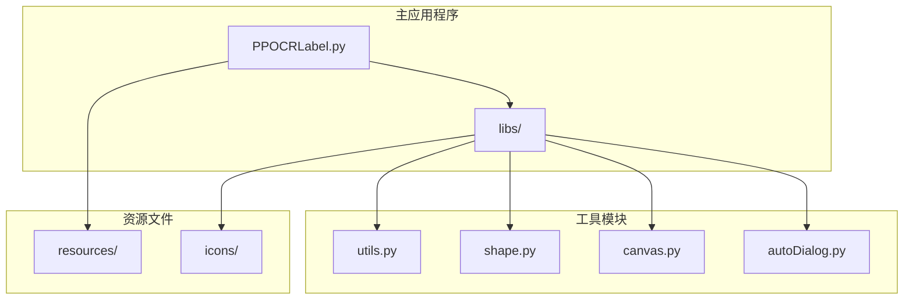
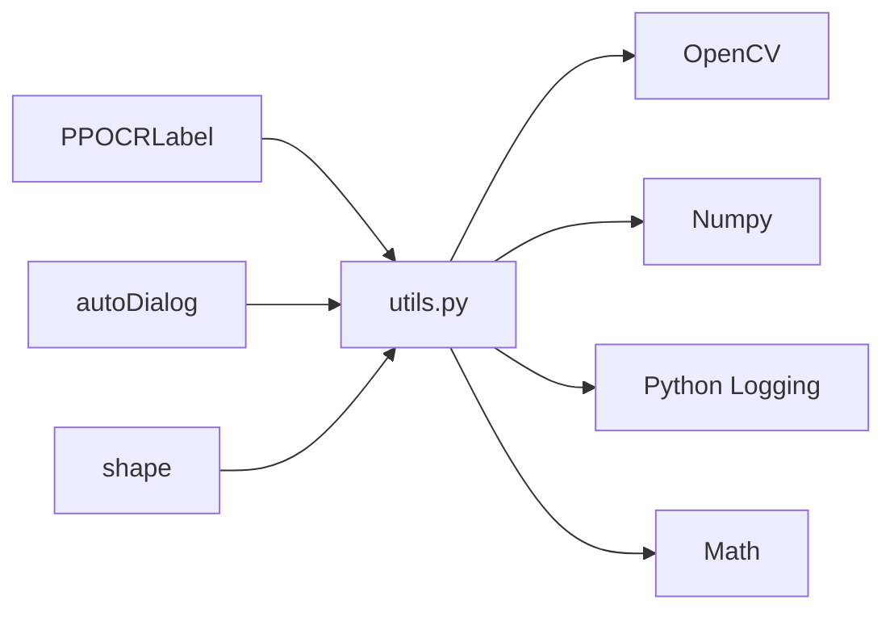
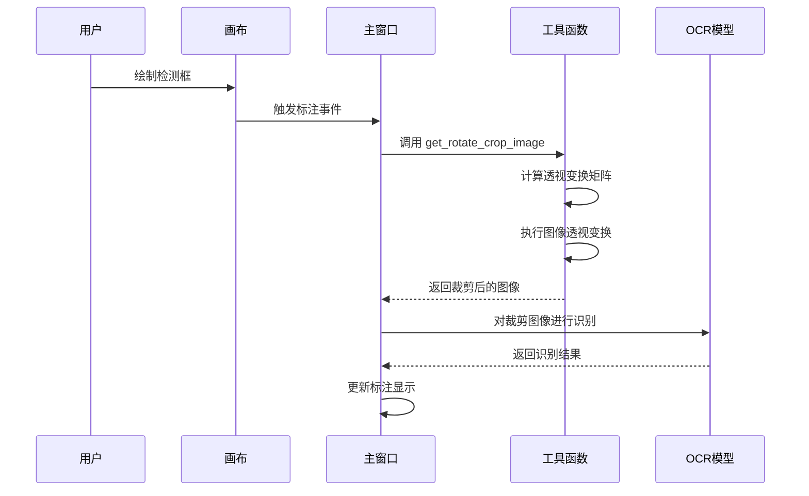
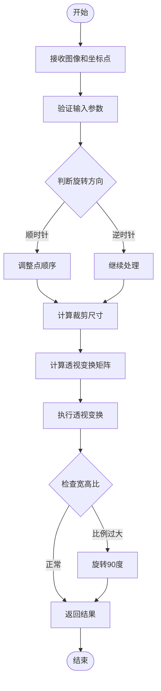
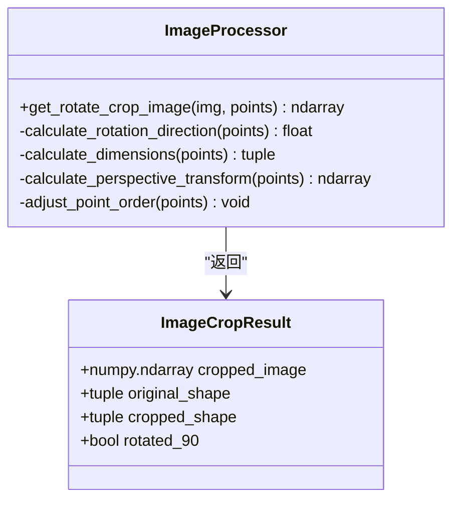
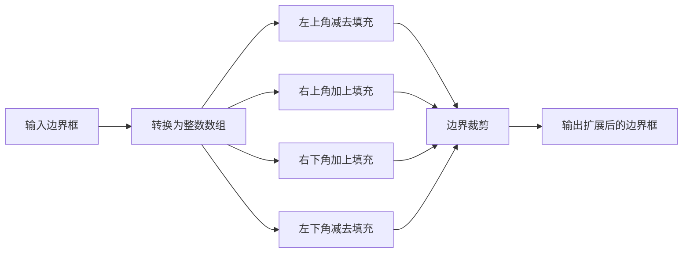
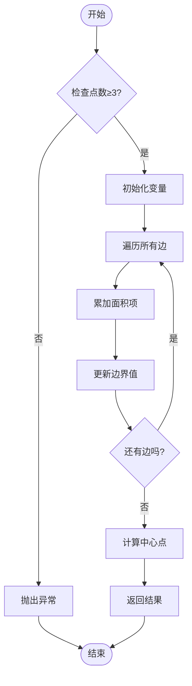
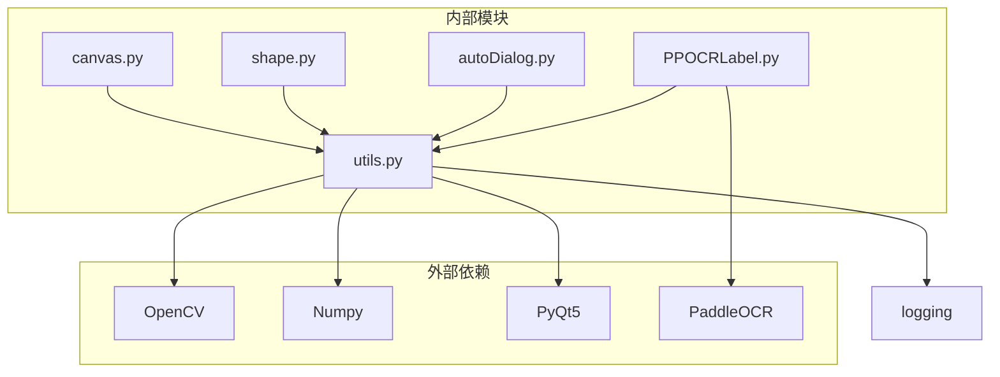
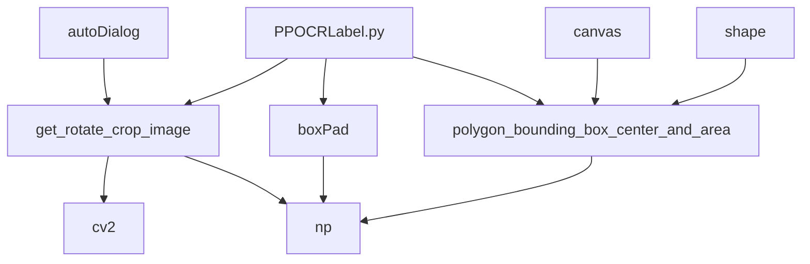
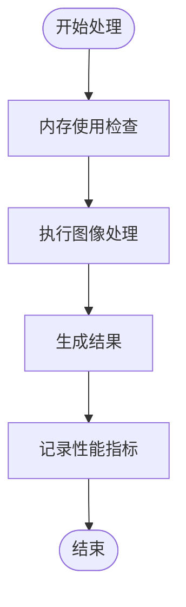

# 图像处理工具

<cite>
**本文档引用的文件**
- [libs/utils.py](utils.md)
- [PPOCRLabel.py](PPOCRLabel.md)
- [libs/autoDialog.py](autoDialog.md)
- [libs/shape.py](shape.md)
- [libs/canvas.py](canvas.md)
- [README.md](README.md)
</cite>

## 目录
1. [简介](#简介)
2. [项目结构](#项目结构)
3. [核心组件](#核心组件)
4. [架构概览](#架构概览)
5. [详细组件分析](#详细组件分析)
6. [依赖关系分析](#依赖关系分析)
7. [性能考虑](#性能考虑)
8. [故障排除指南](#故障排除指南)
9. [结论](#结论)

## 简介

PPOCRLabel 是一个半自动图形标注工具，专为 OCR 领域设计，内置 PP-OCR 模型用于自动检测和重新识别数据。该工具支持矩形框、表格、不规则文本和关键信息标注模式，标注结果可直接用于 PP-OCR 检测和识别模型的训练。

本文档专注于 `libs/utils.py` 模块中的图像处理工具函数，特别是 `get_rotate_crop_image`、`boxPad` 和 `polygon_bounding_box_center_and_area` 函数的实现原理和应用场景。

## 项目结构

该项目采用模块化架构，主要包含以下核心模块：



**图表来源**
- [PPOCRLabel.py](PPOCRLabel.md)
- [libs/utils.py](utils.md)

**章节来源**
- [PPOCRLabel.py](PPOCRLabel.md)
- [README.md](README.md)

## 核心组件

### 图像处理工具模块

`libs/utils.py` 模块提供了 OCR 标注过程中必需的图像处理功能，主要包括：

1. **几何变换函数**：`get_rotate_crop_image` - 实现图像旋转裁剪
2. **边界框操作函数**：`boxPad` - 扩展边界框
3. **多边形计算函数**：`polygon_bounding_box_center_and_area` - 计算多边形中心和面积
4. **辅助工具函数**：各种实用工具函数

### 主要依赖关系



**图表来源**
- [libs/utils.py](utils.md)
- [PPOCRLabel.py](PPOCRLabel.md)

**章节来源**
- [libs/utils.py](utils.md)
- [PPOCRLabel.py](PPOCRLabel.md)

## 架构概览

### OCR 标注流程架构



**图表来源**
- [PPOCRLabel.py](PPOCRLabel.md)
- [libs/utils.py](utils.md)

### 图像处理管道



**图表来源**
- [libs/utils.py](utils.md)

**章节来源**
- [PPOCRLabel.py](PPOCRLabel.md)
- [libs/utils.py](utils.md)

## 详细组件分析

### get_rotate_crop_image 函数

#### 函数签名和参数



**图表来源**
- [libs/utils.py](utils.md)

#### 实现原理

`get_rotate_crop_image` 函数实现了复杂的图像旋转裁剪功能，主要包含以下步骤：

1. **旋转方向判断**：使用绿色定理计算多边形面积来确定旋转方向
2. **点序调整**：根据旋转方向调整四个顶点的顺序
3. **尺寸计算**：计算裁剪区域的宽度和高度
4. **透视变换**：计算透视变换矩阵并执行图像变换
5. **方向校正**：根据宽高比决定是否需要旋转90度

#### 参数说明

| 参数 | 类型 | 描述 | 必需 |
|------|------|------|------|
| img | numpy.ndarray | 输入图像数组 | 是 |
| points | array-like | 四个顶点的坐标 [[x1,y1],[x2,y2],[x3,y3],[x4,x4]] | 是 |

#### 返回值

| 返回值 | 类型 | 描述 |
|--------|------|------|
| dst_img | numpy.ndarray | 裁剪并旋转后的图像 |

#### 异常处理

函数包含完整的异常处理机制：
- 捕获透视变换过程中的所有异常
- 记录详细的错误日志
- 返回 None 以指示处理失败

**章节来源**
- [libs/utils.py](utils.md)
- [PPOCRLabel.py](PPOCRLabel.md)

### boxPad 函数

#### 功能描述

`boxPad` 函数用于在每个边上为边界框添加指定像素数的填充，主要用于扩大标注区域以便更好地包含文本内容。

#### 实现细节



**图表来源**
- [libs/utils.py](utils.md)

#### 参数和返回值

| 参数 | 类型 | 描述 |
|------|------|------|
| box | array-like | 原始边界框坐标 |
| imgShape | tuple | 图像形状 (height, width, channels) |
| pad | int | 填充像素数 |

| 返回值 | 类型 | 描述 |
|--------|------|------|
| box | numpy.ndarray | 扩展后的边界框坐标 |

**章节来源**
- [libs/utils.py](utils.md)

### polygon_bounding_box_center_and_area 函数

#### 数学原理

该函数使用鞋带公式（Shoelace Formula）计算多边形面积，并同时计算包围盒的中心点。

#### 算法实现



**图表来源**
- [libs/utils.py](utils.md)

#### 数学公式

**面积计算（鞋带公式）**：
```
Area = 1/2 * |Σ(xi * yi+1 - xi+1 * yi)|
```

**边界框计算**：
```
CenterX = (minX + maxX) / 2
CenterY = (minY + maxY) / 2
```

**章节来源**
- [libs/utils.py](utils.md)

## 依赖关系分析

### 模块间依赖关系



**图表来源**
- [libs/utils.py](utils.md)
- [PPOCRLabel.py](PPOCRLabel.md)

### 函数调用关系



**图表来源**
- [PPOCRLabel.py](PPOCRLabel.md)
- [libs/autoDialog.py](autoDialog.md)

**章节来源**
- [PPOCRLabel.py](PPOCRLabel.md)
- [libs/autoDialog.py](autoDialog.md)

## 性能考虑

### 优化策略

1. **内存管理**
   - 使用适当的图像数据类型（uint8）
   - 及时释放不需要的中间变量
   - 避免重复创建大型数组

2. **算法优化**
   - 使用向量化操作替代循环
   - 缓存计算结果避免重复计算
   - 优先使用高效的 OpenCV 函数

3. **并发处理**
   - 在批量处理时使用多线程
   - 合理设置线程池大小
   - 避免线程安全问题

### 性能监控



**章节来源**
- [libs/autoDialog.py](autoDialog.md)

## 故障排除指南

### 常见问题及解决方案

#### 图像旋转裁剪失败

**问题症状**：
- `get_rotate_crop_image` 返回 None
- OCR 识别结果显示 "无法识别检测框"

**可能原因**：
1. 输入坐标点无效或顺序错误
2. 图像尺寸过小
3. 透视变换矩阵计算失败

**解决方法**：
```python
# 添加输入验证
if len(points) != 4:
    raise ValueError("需要4个顶点坐标")

# 检查坐标有效性
for point in points:
    if not (isinstance(point, (list, tuple, np.ndarray)) and len(point) == 2):
        raise ValueError("坐标格式无效")
```

#### 边界框扩展异常

**问题症状**：
- `boxPad` 函数抛出异常
- 图像边界越界

**解决方法**：
```python
# 确保输入参数类型正确
box = np.array(box, dtype=np.int32)
h, w, _ = imgShape

# 添加边界检查
box[:, 0] = np.clip(box[:, 0], 0, w)
box[:, 1] = np.clip(box[:, 1], 0, h)
```

#### 多边形计算错误

**问题症状**：
- `polygon_bounding_box_center_and_area` 抛出 ValueError
- 面积计算结果异常

**解决方法**：
```python
# 验证输入点数
if len(points) < 3:
    raise ValueError("至少需要3个点形成多边形")

# 检查点的有效性
for i, point in enumerate(points):
    if not hasattr(point, 'x') or not hasattr(point, 'y'):
        raise ValueError(f"第{i}个点缺少x或y属性")
```

**章节来源**
- [libs/utils.py](utils.md)
- [libs/utils.py](utils.md)
- [libs/utils.py](utils.md)

### 错误处理最佳实践

1. **输入验证**：始终验证函数参数的有效性
2. **异常捕获**：使用 try-except 捕获特定异常
3. **日志记录**：详细记录错误信息便于调试
4. **回退机制**：提供合理的默认行为

## 结论

PPOCRLabel 的图像处理工具模块提供了 OCR 标注过程中必需的核心功能。通过 `get_rotate_crop_image`、`boxPad` 和 `polygon_bounding_box_center_and_area` 等函数，系统能够高效地处理各种图像处理任务。

### 主要优势

1. **功能完整性**：涵盖了 OCR 标注所需的主要图像处理需求
2. **错误处理**：完善的异常处理机制确保系统稳定性
3. **性能优化**：使用高效的算法和数据结构
4. **易于集成**：清晰的接口设计便于与其他模块协作

### 应用场景

- **文本检测**：支持矩形和不规则文本的检测
- **图像预处理**：为 OCR 模型提供高质量的输入图像
- **标注质量提升**：通过边界框扩展提高识别准确性
- **批量处理**：支持大规模图像的自动化处理

### 发展建议

1. **性能监控**：添加更详细的性能指标收集
2. **缓存机制**：实现计算结果的缓存以提高效率
3. **并行处理**：利用多核处理器加速图像处理
4. **可视化调试**：提供图像处理过程的可视化界面