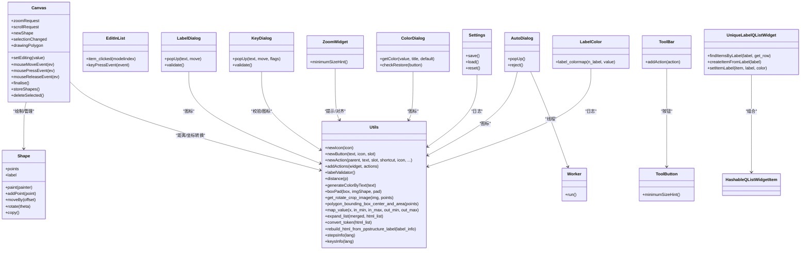

# 工具和辅助功能

<cite>
**本文引用的文件**
- [libs/constants.py](constants.md)
- [libs/utils.py](utils.md)
- [libs/canvas.py](canvas.md)
- [libs/shape.py](shape.md)
- [libs/editinlist.py](editinlist.md)
- [libs/zoomWidget.py](zoomWidget.md)
- [libs/colorDialog.py](colorDialog.md)
- [libs/labelDialog.py](labelDialog.md)
- [libs/settings.py](settings.md)
- [libs/toolBar.py](toolBar.md)
- [libs/autoDialog.py](autoDialog.md)
- [libs/keyDialog.py](keyDialog.md)
- [libs/unique_label_qlist_widget.py](unique_label_qlist_widget.md)
- [libs/hashableQListWidgetItem.py](hashableQListWidgetItem.md)
- [libs/labelColor.py](labelColor.md)
</cite>

## 目录
1. [简介](#简介)
2. [项目结构](#项目结构)
3. [核心组件](#核心组件)
4. [架构总览](#架构总览)
5. [详细组件分析](#详细组件分析)
6. [依赖关系分析](#依赖关系分析)
7. [性能考量](#性能考量)
8. [故障排查指南](#故障排查指南)
9. [结论](#结论)
10. [附录](#附录)

## 简介
本章节系统梳理 PPOCRLabel 中的工具与辅助功能模块，覆盖常量定义、通用工具函数、图形绘制画布、形状对象、列表编辑组件、缩放控件、颜色选择器、标签输入对话框、设置持久化、工具栏与按钮、自动标注线程与对话框、键盘交互增强、唯一标签列表与可哈希项、以及标签颜色映射等。文档旨在帮助开发者快速理解各模块职责、使用场景与实现原理，并提供扩展与自定义建议。

## 项目结构
- libs 目录集中存放所有工具与辅助功能模块，采用按职责分层组织：
  - 常量与通用工具：constants.py、utils.py
  - 图形与绘制：canvas.py、shape.py
  - 列表与编辑：editinlist.py、unique_label_qlist_widget.py、hashableQListWidgetItem.py
  - 缩放与界面控件：zoomWidget.py、toolBar.py、colorDialog.py、labelDialog.py、keyDialog.py
  - 设置与持久化：settings.py
  - 自动标注：autoDialog.py
  - 标签颜色：labelColor.py

**图表来源**
- [libs/constants.py](constants.md)
- [libs/utils.py](utils.md)
- [libs/canvas.py](canvas.md)
- [libs/shape.py](shape.md)
- [libs/editinlist.py](editinlist.md)
- [libs/zoomWidget.py](zoomWidget.md)
- [libs/colorDialog.py](colorDialog.md)
- [libs/labelDialog.py](labelDialog.md)
- [libs/settings.py](settings.md)
- [libs/toolBar.py](toolBar.md)
- [libs/autoDialog.py](autoDialog.md)
- [libs/keyDialog.py](keyDialog.md)
- [libs/unique_label_qlist_widget.py](unique_label_qlist_widget.md)
- [libs/hashableQListWidgetItem.py](hashableQListWidgetItem.md)
- [libs/labelColor.py](labelColor.md)

**章节来源**
- [libs/constants.py](constants.md)
- [libs/utils.py](utils.md)

## 核心组件
- 常量与配置
  - 统一管理窗口尺寸、几何、颜色、标签格式、编码等键名与默认值，便于全局一致访问与维护。
- 通用工具函数
  - UI 构建：newIcon/newButton/newAction/addActions
  - 文本与校验：labelValidator、stepsInfo、keysInfo
  - 数学与图像：distance、polygon_bounding_box_center_and_area、map_value
  - 几何处理：boxPad、get_rotate_crop_image
  - HTML 表格导出：expand_list、convert_token、rebuild_html_from_ppstructure_label
  - 颜色：generateColorByText
- 绘图与形状
  - Canvas：鼠标事件、拖拽、平移、缩放信号、多点绘制、复制/移动/删除、撤销备份
  - Shape：路径绘制、顶点高亮、文本与索引绘制、旋转、边界矩形、拷贝
- 列表与编辑
  - EditInList：就地编辑列表项，支持回车/换行关闭编辑
  - UniqueLabelQListWidget：唯一标签列表，支持按标签查找、设置彩色标签项
  - HashableQListWidgetItem：使列表项可哈希，便于集合操作
- 缩放与控件
  - ZoomWidget：百分比缩放输入框，范围与提示
  - ToolBar/ToolButton：统一工具栏样式与按钮最小尺寸
  - ColorDialog：带透明通道与默认恢复的调色板
  - LabelDialog：带补全的标签输入对话框
  - KeyDialog：键盘交互增强，支持上下键导航、正则匹配、旗标勾选
- 设置与持久化
  - Settings：基于 pickle 的键值设置加载/保存/重置
- 自动标注
  - Worker/QThread：后台 OCR 推理与进度回调
  - AutoDialog：进度条、日志列表、取消与结束信号
- 标签颜色
  - label_colormap/rgb2hsv/hsv2rgb：生成标签颜色映射表

**章节来源**
- [libs/constants.py](constants.md)
- [libs/utils.py](utils.md)
- [libs/canvas.py](canvas.md)
- [libs/shape.py](shape.md)
- [libs/editinlist.py](editinlist.md)
- [libs/zoomWidget.py](zoomWidget.md)
- [libs/colorDialog.py](colorDialog.md)
- [libs/labelDialog.py](labelDialog.md)
- [libs/settings.py](settings.md)
- [libs/toolBar.py](toolBar.md)
- [libs/autoDialog.py](autoDialog.md)
- [libs/keyDialog.py](keyDialog.md)
- [libs/unique_label_qlist_widget.py](unique_label_qlist_widget.md)
- [libs/hashableQListWidgetItem.py](hashableQListWidgetItem.md)
- [libs/labelColor.py](labelColor.md)

## 架构总览
以下类图展示核心模块之间的关系与依赖：

**图表来源**
- [libs/canvas.py](canvas.md)
- [libs/shape.py](shape.md)
- [libs/utils.py](utils.md)
- [libs/editinlist.py](editinlist.md)
- [libs/zoomWidget.py](zoomWidget.md)
- [libs/colorDialog.py](colorDialog.md)
- [libs/labelDialog.py](labelDialog.md)
- [libs/settings.py](settings.md)
- [libs/toolBar.py](toolBar.md)
- [libs/autoDialog.py](autoDialog.md)
- [libs/keyDialog.py](keyDialog.md)
- [libs/unique_label_qlist_widget.py](unique_label_qlist_widget.md)
- [libs/hashableQListWidgetItem.py](hashableQListWidgetItem.md)
- [libs/labelColor.py](labelColor.md)

## 详细组件分析

### 常量与配置（constants.py）
- 设计目的：集中管理应用配置键名与默认值，避免魔法字符串散落各处，提升一致性与可维护性。
- 使用场景：窗口状态、颜色、标签文件格式、自动保存、单类模式、绘图约束等。
- 关键点：统一键名、默认编码、格式枚举（如 PascalVOC/YOLO）。

**章节来源**
- [libs/constants.py](constants.md)

### 通用工具函数（utils.py）
- UI 构建与快捷键：newIcon/newButton/newAction/addActions、fmtShortcut
- 文本与校验：labelValidator、自然排序、步骤说明与快捷键说明
- 几何与图像：distance、polygon_bounding_box_center_and_area、boxPad、get_rotate_crop_image
- HTML 导出：expand_list、convert_token、rebuild_html_from_ppstructure_label
- 其他：generateColorByText、map_value、结构体构造 struct

**图表来源**
- [libs/utils.py](utils.md)

**章节来源**
- [libs/utils.py](utils.md)

### 绘图画布（canvas.py）
- 设计目的：提供交互式标注画布，支持矩形/四点绘制、多选、拖拽、平移、缩放、撤销与高亮。
- 关键流程：
  - 鼠标事件：更新坐标、绘制预览线、吸附起始点、闭合判断、右键菜单
  - 键盘事件：ESC 取消、回车闭合、方向键与 Z/X/C/V/B 移动/旋转顶点
  - 形状管理：新增/复制/移动/删除、存储备份、高亮顶点、绘制标签与索引
  - 缩放滚动：Control+滚轮缩放、无 Control 滚轮滚动

**图表来源**
- [libs/canvas.py](canvas.md)
- [libs/shape.py](shape.md)

**章节来源**
- [libs/canvas.py](canvas.md)
- [libs/shape.py](shape.md)

### 形状对象（shape.py）
- 设计目的：抽象标注形状，统一绘制、高亮、旋转、文本与索引渲染。
- 关键点：顶点高亮策略、路径绘制、边界矩形、拷贝与旋转中心计算。

**章节来源**
- [libs/shape.py](shape.md)

### 列表编辑组件（editinlist.py）
- 设计目的：在列表中就地编辑当前项，支持按键关闭编辑，避免频繁弹窗。
- 使用场景：标签列表、识别结果列表等需要快速修改的场合。

**章节来源**
- [libs/editinlist.py](editinlist.md)

### 缩放控件（zoomWidget.py）
- 设计目的：提供直观的缩放百分比输入控件，限制范围并居中显示。
- 使用场景：配合 Canvas 的缩放请求信号进行联动。

**章节来源**
- [libs/zoomWidget.py](zoomWidget.md)

### 颜色选择器（colorDialog.py）
- 设计目的：提供带透明通道的调色板，支持默认值恢复。
- 使用场景：标注框颜色、填充颜色等个性化配置。

**章节来源**
- [libs/colorDialog.py](colorDialog.md)

### 标签输入对话框（labelDialog.py）
- 设计目的：提供带补全的标签输入，支持确定/取消按钮与图标。
- 使用场景：创建新标注时输入标签名称。

**章节来源**
- [libs/labelDialog.py](labelDialog.md)

### 设置持久化（settings.py）
- 设计目的：以 pickle 存储用户设置，支持加载、保存、重置。
- 使用场景：窗口状态、最近文件、绘图颜色等偏好。

**章节来源**
- [libs/settings.py](settings.md)

### 工具栏与按钮（toolBar.py）
- 设计目的：统一工具栏样式与按钮尺寸，保证界面一致性。
- 使用场景：主界面工具条上的各类操作按钮。

**章节来源**
- [libs/toolBar.py](toolBar.md)

### 自动标注（autoDialog.py）
- 设计目的：通过后台线程批量执行 OCR 推理，实时更新进度与结果列表，支持取消。
- 关键流程：Worker.run 中逐图推理、结果序列化、主线程保存、进度信号回调。

**图表来源**
- [libs/autoDialog.py](autoDialog.md)

**章节来源**
- [libs/autoDialog.py](autoDialog.md)

### 键盘交互增强（keyDialog.py）
- 设计目的：增强标签输入的键盘体验，支持上下键在列表中导航、正则匹配、动态旗标。
- 使用场景：复杂标签管理与快速选择。

**章节来源**
- [libs/keyDialog.py](keyDialog.md)

### 唯一标签列表与可哈希项（unique_label_qlist_widget.py、hashableQListWidgetItem.py）
- 设计目的：确保标签唯一性与可搜索性；使列表项可哈希以便集合运算。
- 使用场景：标签面板、颜色标识、快速定位。

**章节来源**
- [libs/unique_label_qlist_widget.py](unique_label_qlist_widget.md)
- [libs/hashableQListWidgetItem.py](hashableQListWidgetItem.md)

### 标签颜色映射（labelColor.py）
- 设计目的：生成标签 ID 到颜色的映射表，支持 HSV 调整明度/饱和度。
- 使用场景：不同类别标注的可视化区分。

**章节来源**
- [libs/labelColor.py](labelColor.md)

## 依赖关系分析
- 模块内聚与耦合
  - canvas 与 shape 高内聚：Canvas 管理 Shape 生命周期与绘制，二者紧密耦合但职责清晰。
  - utils 作为通用层：被多个 UI 组件复用（newIcon/newAction/validators 等），降低重复代码。
  - autoDialog 与 Worker：通过信号解耦，避免阻塞主线程。
- 外部依赖
  - PyQt5：UI 与事件系统
  - OpenCV/PIL/Numpy：图像处理与颜色空间转换
  - pickle：设置持久化

**图表来源**
- [libs/utils.py](utils.md)
- [libs/canvas.py](canvas.md)
- [libs/shape.py](shape.md)
- [libs/labelDialog.py](labelDialog.md)
- [libs/keyDialog.py](keyDialog.md)
- [libs/autoDialog.py](autoDialog.md)
- [libs/toolBar.py](toolBar.md)
- [libs/zoomWidget.py](zoomWidget.md)
- [libs/colorDialog.py](colorDialog.md)
- [libs/settings.py](settings.md)
- [libs/unique_label_qlist_widget.py](unique_label_qlist_widget.md)
- [libs/hashableQListWidgetItem.py](hashableQListWidgetItem.md)
- [libs/labelColor.py](labelColor.md)

**章节来源**
- [libs/utils.py](utils.md)
- [libs/canvas.py](canvas.md)
- [libs/autoDialog.py](autoDialog.md)

## 性能考量
- 绘制性能
  - Canvas 在 paintEvent 中仅绘制可见形状与当前线，避免不必要的重绘。
  - 字体大小随图像尺寸自适应，减少过度绘制。
- 计算优化
  - distance 使用平方根简化，polygon_bounding_box_center_and_area 采用向量遍历。
  - get_rotate_crop_image 使用透视变换与裁剪，注意输入尺寸过小的保护。
- 后台处理
  - AutoDialog 的 Worker 运行在独立线程，避免 UI 卡顿；通过信号传递结果，减少主线程负担。
- 内存与备份
  - Canvas 的 shapesBackups 限制历史长度，防止内存膨胀。

[本节为通用建议，无需列出具体文件来源]

## 故障排查指南
- 自动标注无响应或卡死
  - 检查 Worker 是否收到 end_signal，确认线程 handle 是否被置为中断值。
  - 查看日志中关于图像尺寸过小的警告，确认输入图像是否满足最小尺寸要求。
- 缩放无效
  - 确认是否按住 Control 再滚轮缩放；检查 ZoomWidget 的数值范围与提示。
- 标签颜色异常
  - 检查 label_colormap 的 value 参数是否正确传入，确认 HSV/RGB 转换逻辑。
- 设置无法加载
  - 检查设置文件路径与权限，尝试 reset 后重新保存。

**章节来源**
- [libs/autoDialog.py](autoDialog.md)
- [libs/zoomWidget.py](zoomWidget.md)
- [libs/labelColor.py](labelColor.md)
- [libs/settings.py](settings.md)

## 结论
本项目的工具与辅助功能模块围绕“可复用、低耦合、高内聚”的原则设计，既满足 PPOCRLabel 的标注需求，也为扩展与自定义提供了清晰的接口。通过合理使用这些模块，开发者可以快速实现新的标注能力、优化交互体验并保持代码整洁。

## 附录
- 常用扩展建议
  - 新增工具按钮：使用 utils.newAction/newButton 构建动作与按钮，加入 ToolBar。
  - 新增对话框：参考 LabelDialog/KeyDialog 的布局与补全机制，结合 utils.newIcon 提升一致性。
  - 新增颜色方案：基于 labelColor 的 colormap 生成策略，扩展类别到颜色的映射。
  - 新增几何处理：在 utils 中补充算法并复用到 Canvas/Shape。
  - 新增导出格式：在 utils 中扩展 HTML/表格导出函数，适配新格式。

[本节为概念性内容，无需列出具体文件来源]