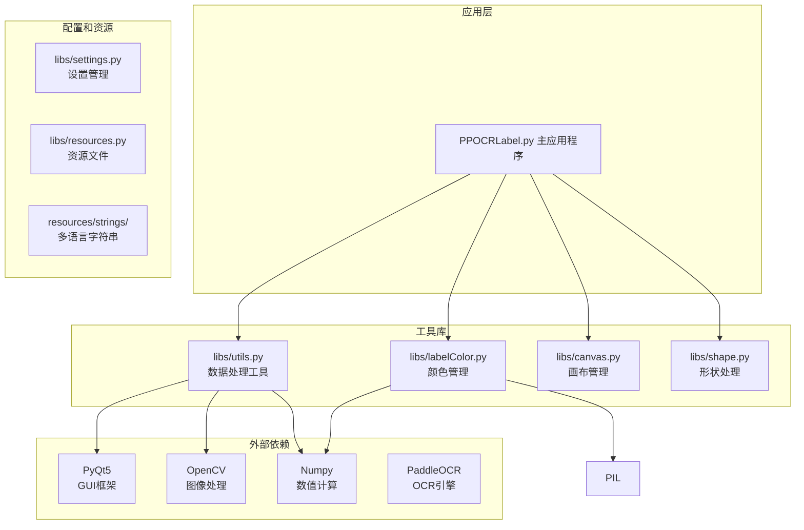
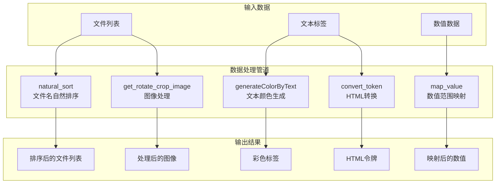
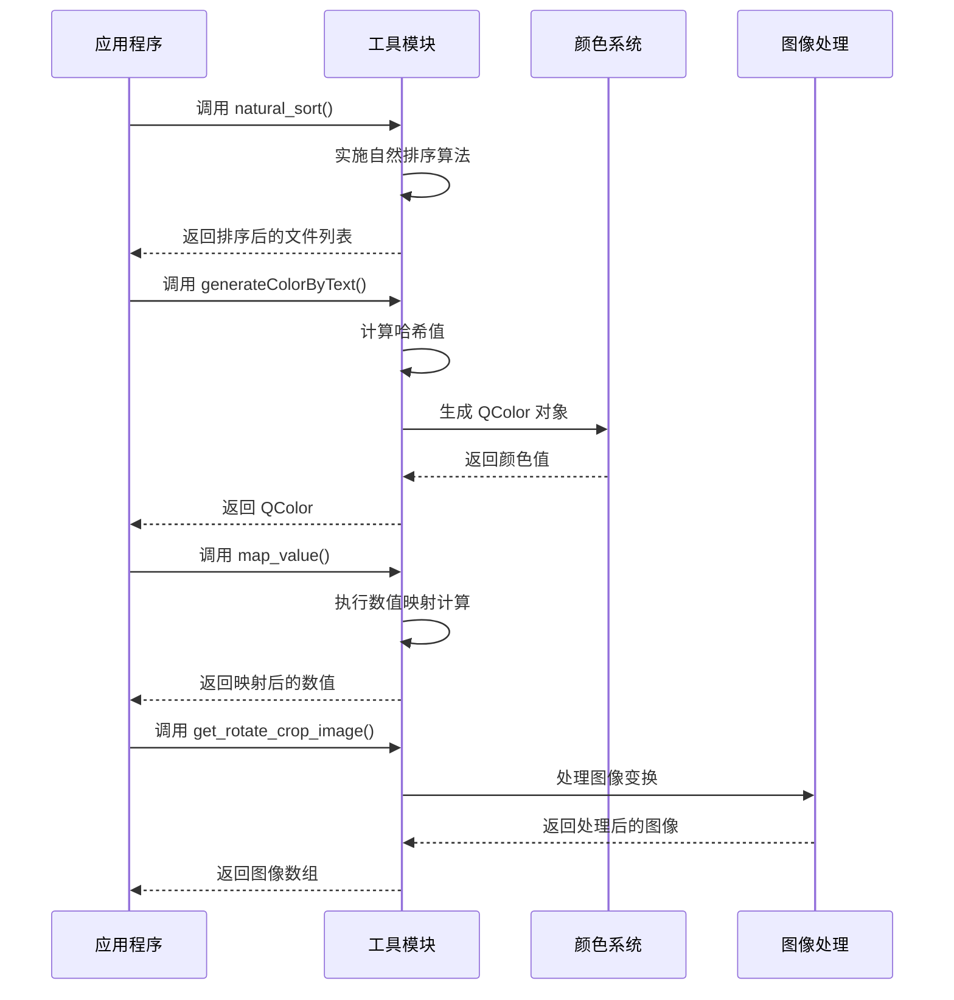
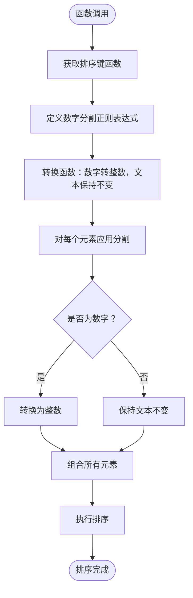
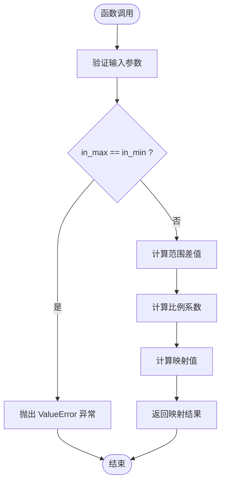
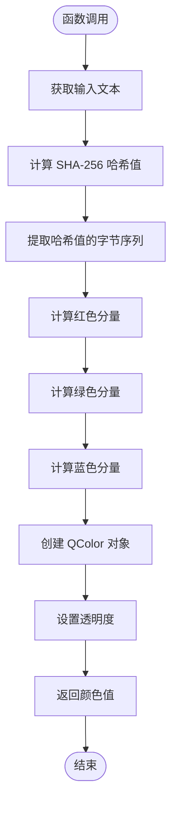
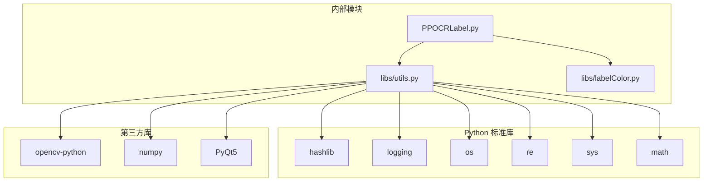
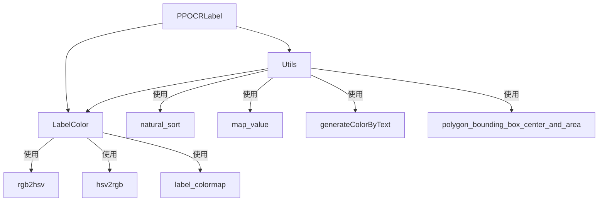

# 数据处理工具

<cite>
**本文档引用的文件**
- [libs/utils.py](utils.md)
- [libs/labelColor.py](labelColor.md)
- [PPOCRLabel.py](PPOCRLabel.md)
- [README.md](README.md)
</cite>

## 目录
1. [简介](#简介)
2. [项目结构](#项目结构)
3. [核心组件](#核心组件)
4. [架构概览](#架构概览)
5. [详细组件分析](#详细组件分析)
6. [依赖关系分析](#依赖关系分析)
7. [性能考虑](#性能考虑)
8. [故障排除指南](#故障排除指南)
9. [结论](#结论)

## 简介

本文档详细介绍 PPOCRLabel 应用程序中 `libs/utils.py` 模块提供的数据处理工具功能。该模块包含了多个实用的数据处理函数，特别是 `natural_sort`、`map_value` 和 `generateColorByText` 等关键函数，用于处理文件名自然排序、数值映射转换和颜色生成等任务。

PPOCRLabel 是一个半自动图形标注工具，专为 OCR 领域设计，内置 PP-OCR 模型以自动检测和重新识别数据。该工具支持矩形框、表格、不规则文本和关键信息标注模式，标注结果可直接用于 PP-OCR 检测和识别模型的训练。

## 项目结构

PPOCRLabel 项目采用模块化架构，主要组件包括：

**图表来源**
- [libs/utils.py](utils.md)
- [libs/labelColor.py](labelColor.md)
- [PPOCRLabel.py](PPOCRLabel.md)

**章节来源**
- [libs/utils.py](utils.md)
- [libs/labelColor.py](labelColor.md)
- [README.md](README.md)

## 核心组件

### 数据处理工具模块概述

`libs/utils.py` 模块提供了丰富的数据处理和工具函数，主要分为以下几类：

1. **文件处理工具**：文件图标生成、按钮创建、动作管理
2. **数据转换工具**：自然排序、数值映射、HTML 转换
3. **图像处理工具**：旋转裁剪、边界框扩展
4. **颜色管理工具**：基于文本的颜色生成、HSV/RGB 转换
5. **验证和辅助工具**：标签验证器、距离计算、快捷键格式化

### 主要函数分类

| 函数类别 | 函数名称 | 功能描述 | 返回类型 |
|---------|---------|---------|---------|
| 文件处理 | `newIcon` | 图标资源加载 | `QIcon` |
| 文件处理 | `newButton` | 创建按钮控件 | `QPushButton` |
| 文件处理 | `newAction` | 创建动作控件 | `QAction` |
| 排序处理 | `natural_sort` | 自然排序算法 | `None` |
| 数值处理 | `map_value` | 数值范围映射 | `float` |
| 颜色处理 | `generateColorByText` | 文本到颜色映射 | `QColor` |
| 图像处理 | `get_rotate_crop_image` | 图像旋转裁剪 | `numpy.ndarray` |
| HTML处理 | `convert_token` | HTML令牌转换 | `list` |

**章节来源**
- [libs/utils.py](utils.md)

## 架构概览

### 数据处理流程架构

**图表来源**
- [libs/utils.py](utils.md)
- [libs/utils.py](utils.md)
- [libs/utils.py](utils.md)

### 组件交互关系

**图表来源**
- [libs/utils.py](utils.md)
- [libs/utils.py](utils.md)
- [libs/utils.py](utils.md)
- [libs/utils.py](utils.md)

## 详细组件分析

### natural_sort 函数分析

#### 函数实现原理

`natural_sort` 函数实现了自然排序算法，能够正确处理包含数字的文件名，使其按照人类预期的方式排序。

**图表来源**
- [libs/utils.py](utils.md)

#### 输入输出规范

- **输入参数**：
  - `list`: 待排序的列表
  - `key`: 可选的键函数，默认为 `lambda s: s`

- **输出结果**：无返回值，直接修改原列表

- **排序规则**：
  - 将字符串按数字和非数字部分分割
  - 数字部分转换为整数进行比较
  - 非数字部分按字典序比较

#### 使用示例和应用场景

在 PPOCRLabel 中，`natural_sort` 主要用于：

1. **文件列表排序**：确保图像文件按自然顺序显示
2. **批处理场景**：在批量标注时保持文件顺序的一致性

**章节来源**
- [libs/utils.py](utils.md)
- [PPOCRLabel.py](PPOCRLabel.md)

### map_value 函数分析

#### 函数实现原理

`map_value` 函数实现了线性数值映射功能，将输入值从一个数值范围映射到另一个数值范围。

**图表来源**
- [libs/utils.py](utils.md)

#### 数学公式

映射公式：`output = (input - in_min) × (out_max - out_min) / (in_max - in_min) + out_min`

#### 输入输出规范

- **输入参数**：
  - `x`: 要映射的数值
  - `in_min`: 输入范围最小值
  - `in_max`: 输入范围最大值
  - `out_min`: 输出范围最小值
  - `out_max`: 输出范围最大值

- **输出结果**：映射后的数值

- **异常处理**：当 `in_max == in_min` 时抛出 `ValueError`

#### 使用示例和应用场景

在 PPOCRLabel 中，`map_value` 主要用于：

1. **缩放控制**：根据检测框面积动态调整缩放级别
2. **透明度计算**：根据面积大小调整标注框的透明度
3. **尺寸映射**：将像素值映射到合适的显示尺寸

**章节来源**
- [libs/utils.py](utils.md)
- [PPOCRLabel.py](PPOCRLabel.md)

### generateColorByText 函数分析

#### 函数实现原理

`generateColorByText` 函数通过哈希算法将文本内容转换为一致的颜色值，确保相同文本始终产生相同的颜色。

**图表来源**
- [libs/utils.py](utils.md)

#### 算法细节

1. **哈希计算**：使用 SHA-256 算法对输入文本进行哈希
2. **颜色分量计算**：
   - 红色分量：`hashCode / 255 % 255`
   - 绿色分量：`hashCode / 65025 % 255`
   - 蓝色分量：`hashCode / 16581375 % 255`
3. **透明度设置**：固定透明度为 100

#### 输入输出规范

- **输入参数**：`text` (字符串)

- **输出结果**：`QColor` 对象，包含 RGB 分量和透明度

- **颜色特性**：相同文本总是产生相同颜色，不同文本产生不同颜色

#### 使用示例和应用场景

在 PPOCRLabel 中，`generateColorByText` 主要用于：

1. **标签着色**：为不同标签文本分配唯一颜色
2. **视觉区分**：帮助用户快速识别不同类型的标注
3. **一致性保证**：确保相同标签在不同界面中显示相同颜色

**章节来源**
- [libs/utils.py](utils.md)
- [PPOCRLabel.py](PPOCRLabel.md)
- [PPOCRLabel.py](PPOCRLabel.md)
- [PPOCRLabel.py](PPOCRLabel.md)

### 辅助函数分析

#### labelValidator 函数

用于创建标签验证器，确保标签文本符合要求（不允许以空格或制表符开头）。

#### distance 函数

计算二维点到原点的距离，使用欧几里得距离公式。

#### fmtShortcut 函数

格式化快捷键显示，将修饰键和主键分别加粗显示。

**章节来源**
- [libs/utils.py](utils.md)
- [libs/utils.py](utils.md)
- [libs/utils.py](utils.md)

## 依赖关系分析

### 外部依赖关系

**图表来源**
- [libs/utils.py](utils.md)
- [libs/labelColor.py](labelColor.md)

### 内部模块依赖

**图表来源**
- [PPOCRLabel.py](PPOCRLabel.md)
- [libs/utils.py](utils.md)
- [libs/utils.py](utils.md)
- [libs/labelColor.py](labelColor.md)

**章节来源**
- [libs/utils.py](utils.md)
- [libs/labelColor.py](labelColor.md)
- [PPOCRLabel.py](PPOCRLabel.md)

## 性能考虑

### 时间复杂度分析

1. **natural_sort**：
   - 时间复杂度：O(n log n × m)，其中 n 为列表长度，m 为平均字符串长度
   - 空间复杂度：O(n × m)
   - 主要瓶颈：字符串分割和比较操作

2. **map_value**：
   - 时间复杂度：O(1)
   - 空间复杂度：O(1)
   - 性能优异，适合大量数值映射操作

3. **generateColorByText**：
   - 时间复杂度：O(m)，其中 m 为文本长度
   - 空间复杂度：O(1)
   - 主要成本：SHA-256 哈希计算

### 内存优化策略

1. **延迟计算**：`natural_sort` 直接修改原列表，避免额外内存分配
2. **缓存机制**：颜色生成使用哈希值，避免重复计算
3. **流式处理**：图像处理函数使用 OpenCV 的向量化操作

### 最佳实践建议

1. **批量处理**：对于大量数据，优先使用 `map_value` 进行批量数值映射
2. **缓存复用**：对于重复的文本颜色生成，考虑在应用层添加缓存机制
3. **内存管理**：注意图像处理函数的内存使用，及时释放不需要的图像数据

## 故障排除指南

### 常见问题和解决方案

#### natural_sort 排序异常

**问题描述**：文件名排序不符合预期

**可能原因**：
- 输入列表包含非字符串元素
- 键函数返回值类型不一致

**解决方案**：
- 确保输入列表元素类型一致
- 提供适当的键函数

#### map_value 数值映射错误

**问题描述**：数值映射结果异常

**可能原因**：
- 输入范围相等（in_max == in_min）
- 数值超出预期范围

**解决方案**：
- 检查输入参数的有效性
- 确保输入范围合理

#### generateColorByText 颜色不一致

**问题描述**：相同文本产生不同颜色

**可能原因**：
- 编码问题导致哈希值不同
- 字符串包含不可见字符

**解决方案**：
- 确保输入文本编码一致
- 清理字符串中的空白字符

### 调试技巧

1. **日志记录**：使用 `logging` 模块记录关键操作
2. **单元测试**：为每个函数编写测试用例
3. **性能监控**：使用性能分析工具监控函数执行时间

**章节来源**
- [libs/utils.py](utils.md)
- [libs/utils.py](utils.md)

## 结论

PPOCRLabel 的数据处理工具模块提供了强大而灵活的数据处理能力，特别是 `natural_sort`、`map_value` 和 `generateColorByText` 三个核心函数，在图像标注和处理任务中发挥着重要作用。

### 主要优势

1. **实用性**：函数设计针对 OCR 标注场景，解决实际问题
2. **性能优异**：关键函数具有良好的时间复杂度
3. **易于使用**：简洁的 API 设计，便于集成到现有代码中
4. **稳定性强**：经过实际应用验证，功能稳定可靠

### 应用前景

这些数据处理工具不仅适用于 PPOCRLabel 应用程序，还可以广泛应用于其他需要：
- 文件名自然排序的场景
- 数值范围映射的数据处理
- 基于内容的颜色生成
- 图像标注和处理的工具开发

通过深入理解和合理使用这些工具函数，开发者可以构建更加高效和用户友好的数据处理应用。