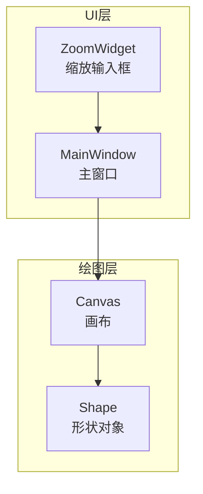
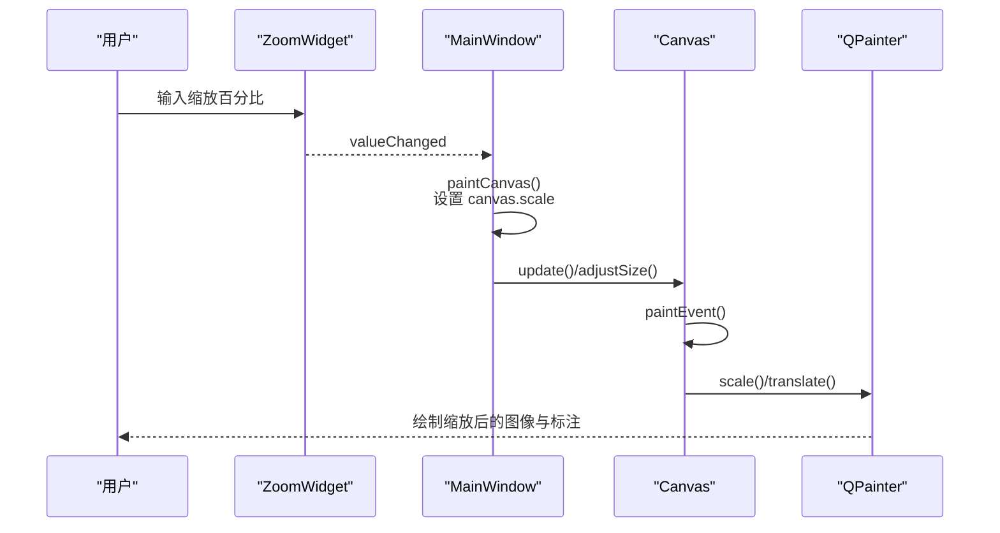
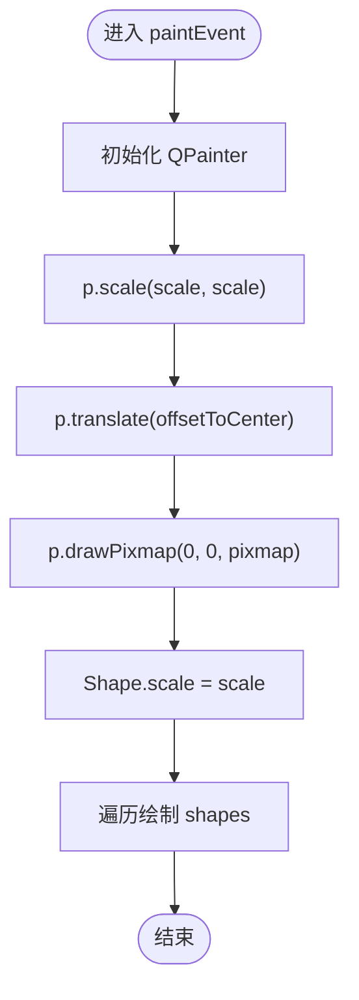
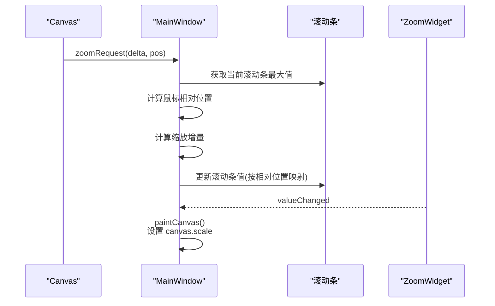
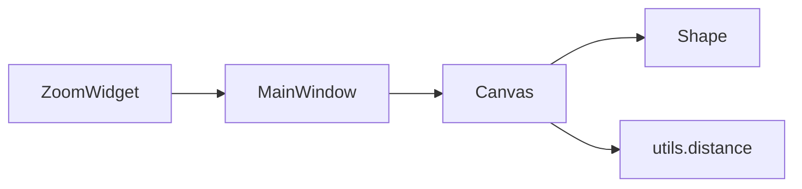

# 缩放控件

<cite>
**本文引用的文件**
- [zoomWidget.py](zoomWidget.md)
- [canvas.py](canvas.md)
- [PPOCRLabel.py](PPOCRLabel.md)
- [shape.py](shape.md)
- [utils.py](utils.md)
</cite>

## 目录
1. [简介](#简介)
2. [项目结构](#项目结构)
3. [核心组件](#核心组件)
4. [架构总览](#架构总览)
5. [详细组件分析](#详细组件分析)
6. [依赖关系分析](#依赖关系分析)
7. [性能考量](#性能考量)
8. [故障排查指南](#故障排查指南)
9. [结论](#结论)
10. [附录](#附录)

## 简介
本文件聚焦于“缩放控件”功能，系统性梳理 PPOCRLabel 应用中与缩放相关的 UI 组件、事件响应与状态管理机制，涵盖：
- 缩放控件的 UI 设计与交互
- 鼠标滚轮与键盘组合键触发缩放的事件链路
- 主窗口与画布之间的缩放状态同步与滚动条联动
- 图像绘制时的缩放变换、平移（拖拽）与旋转（形状级）
- 性能优化策略与用户体验设计要点
- 自定义缩放行为与扩展方案

## 项目结构
围绕缩放功能的关键文件与职责如下：
- libs/zoomWidget.py：提供一个数值输入型缩放控件，用于设置缩放百分比
- libs/canvas.py：承载图像与标注绘制，负责鼠标滚轮缩放、平移、形状旋转等交互
- PPOCRLabel.py：主窗口，连接缩放控件与画布，处理缩放请求、滚动条联动与整体布局
- libs/shape.py：形状对象，支持旋转与绘制，受画布缩放比例影响
- libs/utils.py：通用工具函数，如距离计算等

图表来源
- [zoomWidget.py](zoomWidget.md)
- [PPOCRLabel.py](PPOCRLabel.md)
- [canvas.py](canvas.md)
- [shape.py](shape.md)

章节来源
- [zoomWidget.py](zoomWidget.md)
- [PPOCRLabel.py](PPOCRLabel.md)
- [canvas.py](canvas.md)
- [shape.py](shape.md)

## 核心组件
- 缩放控件 ZoomWidget
  - 基于 QSpinBox，范围 1%-500%，无按钮，居中对齐，显示百分号后缀
  - 提供最小尺寸提示，确保宽度足以容纳最大值
- 画布 Canvas
  - 维护缩放比例 scale、偏移 offsetToCenter、当前 pixmap 等状态
  - 处理鼠标滚轮事件，按 Ctrl+滚轮触发缩放请求；否则触发滚动请求
  - 在 paintEvent 中应用缩放与平移，绘制图像与标注
  - 支持形状旋转（按键事件），并更新选中形状状态
- 主窗口 MainWindow
  - 将 ZoomWidget 的值变化与画布重绘绑定
  - 接收 Canvas 发出的缩放请求，计算滚动条新位置并保持鼠标焦点处的相对位置不变
  - 提供“适合窗口/适合宽度”等缩放模式切换

章节来源
- [zoomWidget.py](zoomWidget.md)
- [canvas.py](canvas.md)
- [canvas.py](canvas.md)
- [canvas.py](canvas.md)
- [PPOCRLabel.py](PPOCRLabel.md)
- [PPOCRLabel.py](PPOCRLabel.md)
- [PPOCRLabel.py](PPOCRLabel.md)

## 架构总览
缩放功能由“输入控件—事件分发—状态同步—渲染更新”构成闭环。下图展示了从用户输入到最终渲染的关键路径。

图表来源
- [PPOCRLabel.py](PPOCRLabel.md)
- [PPOCRLabel.py](PPOCRLabel.md)
- [canvas.py](canvas.md)

章节来源
- [PPOCRLabel.py](PPOCRLabel.md)
- [PPOCRLabel.py](PPOCRLabel.md)
- [canvas.py](canvas.md)

## 详细组件分析

### 缩放控件 ZoomWidget
- 功能定位
  - 作为用户输入缩放倍率的入口，范围 1%-500%，默认 100%
  - 通过无按钮样式与居中对齐提升可读性与一致性
- UI 行为
  - 设置后缀“%”，提示当前单位
  - 最小尺寸根据字体度量计算，保证最大值可见
- 使用场景
  - 与 MainWindow 的 valueChanged 信号绑定，驱动画布重绘
  - 与图像尺寸滑杆联动，保持一致的缩放值

章节来源
- [zoomWidget.py](zoomWidget.md)
- [PPOCRLabel.py](PPOCRLabel.md)
- [PPOCRLabel.py](PPOCRLabel.md)

### 画布 Canvas 的缩放与绘制
- 缩放状态
  - scale：缩放比例（以像素为单位的比例因子）
  - offsetToCenter：将绘制区域平移到画布中心的偏移
- 绘制流程
  - 在 paintEvent 中启用抗锯齿与高质量渲染
  - 先 scale 再 translate，最后绘制 pixmap 与形状
  - 同步 Shape.scale，使形状绘制随缩放变化
- 鼠标滚轮事件
  - Ctrl+垂直滚动：发出 zoomRequest 信号
  - 其他情况：发出 scrollRequest 信号，触发滚动条移动
- 平移（拖拽）
  - 左键拖动时，向 MainWindow 发送 scrollRequest，实现平移
- 形状旋转
  - 键盘事件支持对选中形状进行微小角度旋转，并检查边界防止越界

图表来源
- [canvas.py](canvas.md)

章节来源
- [canvas.py](canvas.md)
- [canvas.py](canvas.md)
- [canvas.py](canvas.md)
- [canvas.py](canvas.md)

### 主窗口 MainWindow 的缩放协调
- 缩放值变更
  - 连接 ZoomWidget.valueChanged 到 paintCanvas，即时刷新画布
- 缩放请求处理
  - 接收 Canvas.zoomRequest，计算鼠标焦点在缩放前后的相对位置
  - 根据新缩放比例调整滚动条最大值差，将滚动条值映射到新的相对位置
- 缩放模式
  - 提供“适合窗口/适合宽度/手动缩放”三种模式，配合 adjustScale 计算合适比例
- 与图像尺寸滑杆联动
  - 滑杆值变化时同步到 ZoomWidget，反之亦然

图表来源
- [PPOCRLabel.py](PPOCRLabel.md)
- [PPOCRLabel.py](PPOCRLabel.md)
- [PPOCRLabel.py](PPOCRLabel.md)

章节来源
- [PPOCRLabel.py](PPOCRLabel.md)
- [PPOCRLabel.py](PPOCRLabel.md)
- [PPOCRLabel.py](PPOCRLabel.md)

### 形状对象与缩放
- 形状绘制
  - Shape.scale 与 Canvas.scale 同步，确保标注点位与文本字号随缩放变化
  - 绘制时根据选中状态与高亮模式绘制顶点与路径
- 形状旋转
  - 通过 rotate/rotatePoint 实现绕中心点旋转
  - 旋转前检查是否越界，避免超出图像边界

章节来源
- [shape.py](shape.md)
- [shape.py](shape.md)
- [canvas.py](canvas.md)

## 依赖关系分析
- ZoomWidget 与 MainWindow
  - MainWindow 通过 valueChanged 信号驱动 paintCanvas，间接控制 Canvas 的 scale
- Canvas 与 MainWindow
  - Canvas 通过 zoomRequest 与 scrollRequest 与 MainWindow 协作，实现滚轮缩放与平移联动
- Canvas 与 Shape
  - Canvas 在绘制时同步 Shape.scale，使标注随缩放正确呈现
- Utils
  - distance 等工具函数被 Canvas 用于几何判断（如近邻点判断）

图表来源
- [PPOCRLabel.py](PPOCRLabel.md)
- [canvas.py](canvas.md)
- [canvas.py](canvas.md)
- [utils.py](utils.md)

章节来源
- [PPOCRLabel.py](PPOCRLabel.md)
- [canvas.py](canvas.md)
- [canvas.py](canvas.md)
- [utils.py](utils.md)

## 性能考量
- 渲染质量与性能平衡
  - 开启抗锯齿与高质量渲染，提升视觉效果；在大图或高频缩放时可能影响帧率
  - 平滑像素变换选项有助于减少缩放时的锯齿，但也会增加绘制成本
- 缩放与滚动条联动
  - 通过计算鼠标焦点的相对位置，避免缩放时画面跳变，提升交互体验
- 几何计算
  - 距离计算与边界判断在频繁交互中应尽量避免重复开销
- 建议
  - 对于超大图像，可考虑延迟绘制或分块渲染策略
  - 在高频缩放场景下，可暂时关闭平滑像素变换以换取性能

[本节为通用指导，不直接分析具体文件]

## 故障排查指南
- 缩放无效
  - 确认 ZoomWidget 是否启用且与 MainWindow 的 valueChanged 连接正常
  - 检查 MainWindow 的 paintCanvas 是否被调用
- 滚轮缩放异常
  - 确认 Canvas 的 wheelEvent 是否正确发出 zoomRequest 或 scrollRequest
  - 检查 Ctrl 键修饰符是否生效
- 缩放后滚动条错位
  - 检查 MainWindow 的 zoomRequest 中相对位置计算逻辑
  - 确认滚动条最大值差与新值映射是否正确
- 形状旋转越界
  - 检查 rotateOutOfBound 的边界判断逻辑
  - 确保旋转后所有顶点仍在图像范围内

章节来源
- [PPOCRLabel.py](PPOCRLabel.md)
- [PPOCRLabel.py](PPOCRLabel.md)
- [canvas.py](canvas.md)
- [canvas.py](canvas.md)

## 结论
缩放控件通过 ZoomWidget 提供直观的缩放输入，结合 Canvas 的滚轮事件与 MainWindow 的缩放请求处理，实现了“输入—事件—状态—渲染”的完整闭环。画布在绘制阶段应用缩放与平移，确保图像与标注同步缩放；形状对象则通过与画布缩放状态的同步，实现标注的准确呈现。整体设计兼顾了交互体验与渲染质量，同时提供了扩展点以满足更复杂的缩放需求。

[本节为总结性内容，不直接分析具体文件]

## 附录

### 使用示例与最佳实践
- 使用缩放控件进行图像导航
  - 步骤：在 ZoomWidget 中输入目标百分比，或使用 Ctrl+滚轮在画布上缩放
  - 关联行为：MainWindow 的 paintCanvas 会根据 ZoomWidget 的值设置 Canvas.scale 并触发重绘
- 快捷键与组合键
  - Ctrl+滚轮：缩放
  - Ctrl+方向键：微调标注位置（与缩放控件无直接关系，但有助于标注精度）
- 自定义缩放行为
  - 扩展缩放步长：在 MainWindow 的 addZoom 或 zoomRequest 中调整缩放增量
  - 自定义缩放模式：在 adjustScale 中添加新的缩放策略（如“适合高度”）
  - 限制缩放范围：在 ZoomWidget 的 setRange 中调整最小/最大值
- 用户体验设计建议
  - 保持鼠标焦点处的相对位置不变，避免缩放时画面跳变
  - 在缩放过程中提供实时反馈（如状态栏坐标提示）
  - 对于复杂标注，适当降低平滑像素变换以提升性能

章节来源
- [PPOCRLabel.py](PPOCRLabel.md)
- [PPOCRLabel.py](PPOCRLabel.md)
- [PPOCRLabel.py](PPOCRLabel.md)
- [zoomWidget.py](zoomWidget.md)
- [canvas.py](canvas.md)