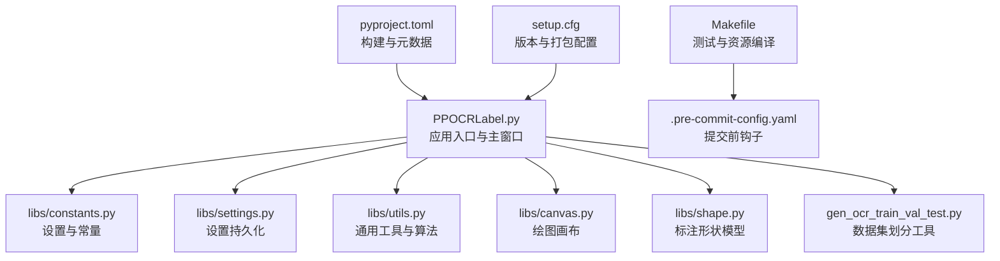
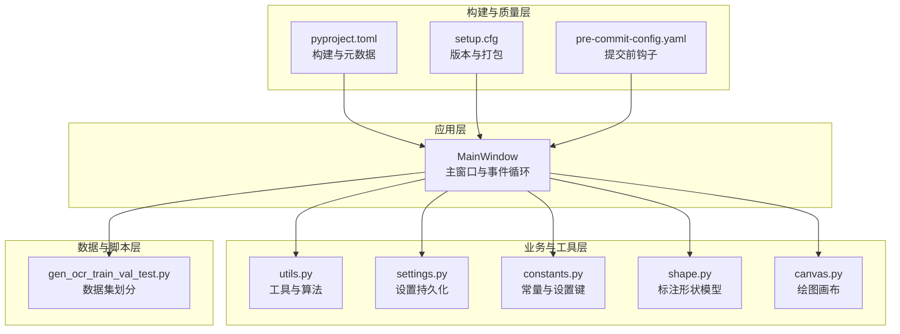
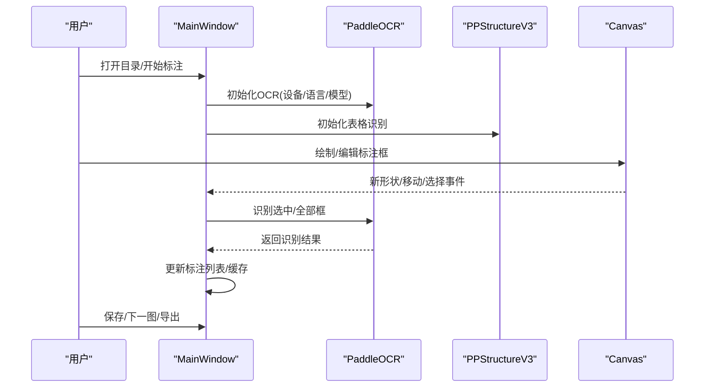
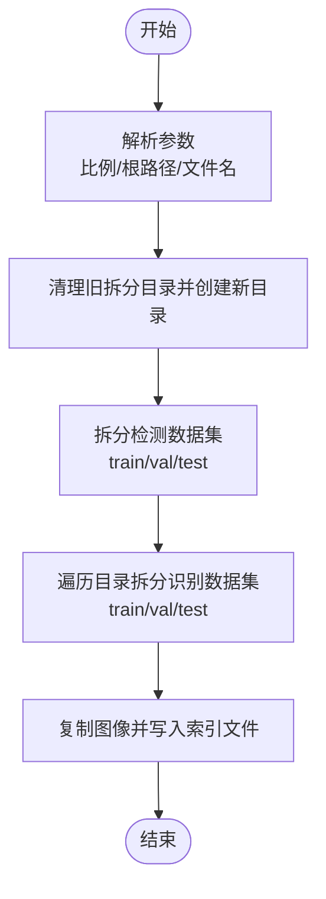
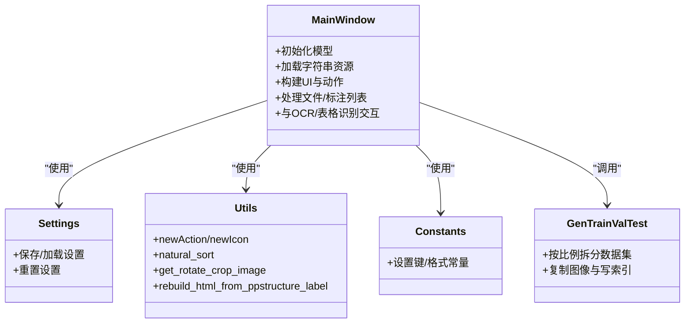
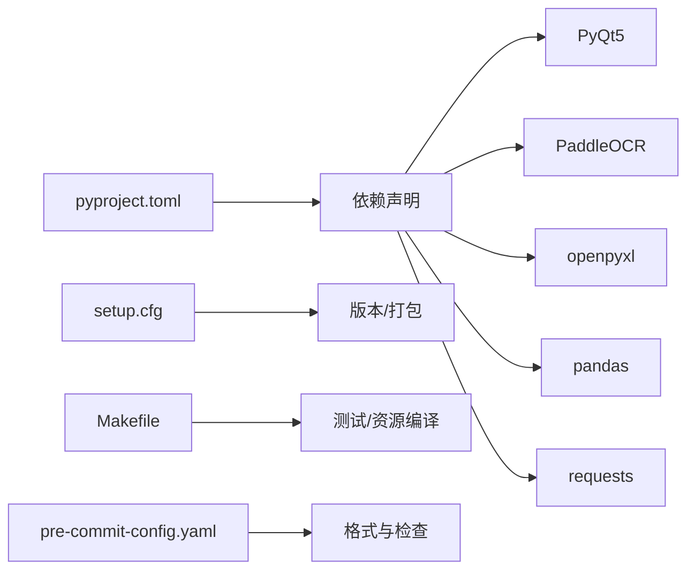

# 代码贡献

<cite>
**本文引用的文件**
- [README.md](README.md)
- [README_ch.md](README_ch.md)
- [PPOCRLabel.py](PPOCRLabel.md)
- [Makefile](Makefile.md)
- [.pre-commit-config.yaml](pre-commit-config.md)
- [pyproject.toml](pyproject.md)
- [setup.cfg](setup.md)
- [gen_ocr_train_val_test.py](gen_ocr_train_val_test.md)
- [libs/constants.py](constants.md)
- [libs/settings.py](settings.md)
- [libs/utils.py](utils.md)
</cite>

## 目录
1. [引言](#引言)
2. [项目结构](#项目结构)
3. [核心组件](#核心组件)
4. [架构总览](#架构总览)
5. [详细组件分析](#详细组件分析)
6. [依赖分析](#依赖分析)
7. [性能考虑](#性能考虑)
8. [故障排查指南](#故障排查指南)
9. [结论](#结论)
10. [附录](#附录)

## 引言
本指南面向希望为 PPOCRLabel 贡献代码的开发者，覆盖从需求分析、设计与开发、代码风格与静态分析、提交与分支管理、Pull Request 流程、代码审查与质量门禁，到测试与文档更新、变更日志维护的全流程规范。目标是帮助贡献者高效、高质量地交付可维护的功能与修复。

## 项目结构
- 应用入口与主窗口逻辑集中在应用根目录的主程序文件中，采用 PyQt5 构建 GUI，并集成 PaddleOCR 推理能力。
- 核心业务与 UI 组件拆分为 libs 子模块，包含常量、设置、工具函数、画布、形状等模块化组件。
- 工具脚本位于根目录，如数据集划分脚本，便于批量处理标注数据。
- 项目使用 setuptools 构建，支持本地安装与打包；通过 pre-commit 在提交前统一格式与静态检查。

图表来源
- [PPOCRLabel.py](PPOCRLabel.md)
- [libs/constants.py](constants.md)
- [libs/settings.py](settings.md)
- [libs/utils.py](utils.md)
- [gen_ocr_train_val_test.py](gen_ocr_train_val_test.md)
- [Makefile](Makefile-L1-L36.md)
- [.pre-commit-config.yaml](pre-commit-config.md)
- [pyproject.toml](pyproject.md)
- [setup.cfg](setup.md)

章节来源
- [PPOCRLabel.py](PPOCRLabel.md)
- [Makefile](Makefile-L1-L36.md)

## 核心组件
- 主窗口与事件流：负责加载模型、管理文件列表、标注列表、缩放与画布交互、动作与快捷键绑定。
- 设置与常量：集中管理窗口状态、颜色、标签格式、编码等全局配置。
- 工具与算法：提供图标封装、动作构造、自然排序、图像裁剪与透视变换、HTML 表格重建等工具。
- 数据集划分工具：按比例拆分检测与识别数据集，生成训练/验证/测试集合与对应索引文件。

章节来源
- [PPOCRLabel.py](PPOCRLabel.md)
- [libs/constants.py](constants.md)
- [libs/settings.py](settings.md)
- [libs/utils.py](utils.md)
- [gen_ocr_train_val_test.py](gen_ocr_train_val_test.md)

## 架构总览
PPOCRLabel 采用“主窗口 + 模块化 libs + 工具脚本”的分层架构。主程序负责 UI 与交互，libs 提供可复用的业务与工具能力，工具脚本提供数据处理能力。构建与发布通过 pyproject.toml 与 setup.cfg 配置，pre-commit 钩子保障提交质量。

图表来源
- [PPOCRLabel.py](PPOCRLabel.md)
- [libs/utils.py](utils.md)
- [libs/settings.py](settings.md)
- [libs/constants.py](constants.md)
- [gen_ocr_train_val_test.py](gen_ocr_train_val_test.md)
- [pyproject.toml](pyproject.md)
- [setup.cfg](setup.md)
- [.pre-commit-config.yaml](pre-commit-config.md)

## 详细组件分析

### 主窗口与交互序列
主窗口负责初始化模型、加载字符串资源、构建 UI 组件与动作、连接信号槽、处理文件与标注列表、以及与 OCR/表格识别服务交互。

图表来源
- [PPOCRLabel.py](PPOCRLabel.md)
- [PPOCRLabel.py](PPOCRLabel.md)

章节来源
- [PPOCRLabel.py](PPOCRLabel.md)
- [PPOCRLabel.py](PPOCRLabel.md)

### 数据集划分流程
数据集划分脚本按比例拆分检测与识别数据，复制图像并生成对应索引文件，支持自定义根路径与文件名。

图表来源
- [gen_ocr_train_val_test.py](gen_ocr_train_val_test.md)

章节来源
- [gen_ocr_train_val_test.py](gen_ocr_train_val_test.md)

### 类与职责关系

图表来源
- [PPOCRLabel.py](PPOCRLabel.md)
- [libs/settings.py](settings.md)
- [libs/utils.py](utils.md)
- [libs/constants.py](constants.md)
- [gen_ocr_train_val_test.py](gen_ocr_train_val_test.md)

章节来源
- [PPOCRLabel.py](PPOCRLabel.md)
- [libs/settings.py](settings.md)
- [libs/utils.py](utils.md)
- [libs/constants.py](constants.md)
- [gen_ocr_train_val_test.py](gen_ocr_train_val_test.md)

## 依赖分析
- 构建与元数据：pyproject.toml 定义项目元信息、依赖、入口脚本与打包配置；setup.cfg 配合版本与打包；Makefile 提供测试与资源编译任务。
- 依赖链：主程序依赖 PyQt5、PaddleOCR、openpyxl、pandas、requests 等；libs 子模块提供工具与设置；脚本依赖标准库与第三方库。
- 质量与格式：pre-commit 配置 Black、flake8、CRLF/Tab/EOF 等检查，确保提交一致性。

图表来源
- [pyproject.toml](pyproject.md)
- [setup.cfg](setup.md)
- [Makefile](Makefile-L1-L36.md)
- [.pre-commit-config.yaml](pre-commit-config.md)

章节来源
- [pyproject.toml](pyproject.md)
- [setup.cfg](setup.md)
- [Makefile](Makefile-L1-L36.md)
- [.pre-commit-config.yaml](pre-commit-config.md)

## 性能考虑
- 设备选择：主窗口根据是否支持 CUDA 选择 GPU/CPU 推理，减少不必要的设备切换开销。
- 图像处理：工具函数提供透视变换与裁剪，注意输入合法性与边界裁剪，避免无效计算。
- UI 响应：大量列表项与拖拽排序时，建议在批量更新时暂时禁用重绘或使用延迟刷新策略。
- 数据集划分：拆分时尽量使用批量复制与顺序写入，避免频繁 IO。

章节来源
- [PPOCRLabel.py](PPOCRLabel.md)
- [libs/utils.py](utils.md)
- [gen_ocr_train_val_test.py](gen_ocr_train_val_test.md)

## 故障排查指南
- 资源编译错误：缺失字符串 ID 或图标资源时，需重新生成资源文件。
- 平台兼容性：Linux 可能遇到 Qt 平台插件或 OpenCV 版本问题；Windows 可能缺少 win32com 依赖。
- 模型依赖冲突：paddleocr wheel 与源码调用优先级可能造成异常，建议统一安装渠道。
- 版本与打包：版本号由 setuptools_scm 管理，确保遵循语义化版本与标签策略。

章节来源
- [README.md](README.md)
- [README_ch.md](README_ch.md)
- [Makefile](Makefile-L23-L24.md)
- [pyproject.toml](pyproject.md)
- [setup.cfg](setup.md)

## 结论
通过明确的组件职责、严格的代码风格与静态分析、完善的测试与质量门禁，PPOCRLabel 能够持续稳定地演进。贡献者应遵循本文档的流程与规范，确保每次改动具备可维护性、可测试性与可追溯性。

## 附录

### 代码提交规范与分支管理
- 分支策略
  - 主分支：仅接受通过审查与测试的 PR 合并。
  - 开发分支：feature/*、fix/*、hotfix/*，基于最新 develop 拉取并保持同步。
  - 发布分支：release/*，用于发布前的最终验证与小修。
- 提交信息
  - 格式：类型(作用域): 描述；正文说明动机与影响；脚注引用 Issue。
  - 示例：feat(ui): 添加自动保存未提交变更开关；fix(utils): 修正图像裁剪边界越界。
- 提交前检查
  - 运行本地测试与 pre-commit 钩子，确保格式与静态检查通过。
  - 保持最小改动，避免无关格式化提交。

章节来源
- [.pre-commit-config.yaml](pre-commit-config.md)
- [Makefile](Makefile-L1-L20.md)

### Pull Request 流程与审查要点
- PR 要点
  - 清晰描述需求背景、改动范围与测试策略。
  - 包含必要的单元测试或端到端操作步骤。
  - 更新相关文档与变更日志片段。
- 审查关注点
  - 代码风格与静态检查是否通过。
  - 是否引入循环依赖或破坏性变更。
  - 性能与健壮性：边界条件、异常处理、资源释放。
  - 文档与国际化：字符串资源、帮助信息、快捷键说明。

章节来源
- [.pre-commit-config.yaml](pre-commit-config.md)
- [README.md](README.md)
- [README_ch.md](README_ch.md)

### 代码风格与静态分析
- Python 风格
  - 使用 Black 统一格式；flake8 作为额外检查，聚焦 E9/F63/F7/F82 等错误类别。
  - PyQt 相关：使用 newAction/newIcon 等工具函数统一图标与快捷键；避免硬编码字符串，使用 StringBundle 获取本地化文案。
- 其他
  - Markdown 文档禁止 CRLF、制表符与尾随空白；资源文件需重新编译。

章节来源
- [.pre-commit-config.yaml](pre-commit-config.md)
- [libs/utils.py](utils.md)
- [libs/constants.py](constants.md)

### 质量门禁与测试
- 本地测试
  - 使用 Makefile 中的测试目标运行单元测试。
- 质量门禁
  - 通过 pre-commit 钩子；CI 中运行测试与静态检查（如适用）。
- 回归与验证
  - 关键功能（标注、识别、导出、数据集划分）需提供操作步骤与预期结果。

章节来源
- [Makefile](Makefile-L1-L20.md)
- [.pre-commit-config.yaml](pre-commit-config.md)

### 变更日志维护
- 记录维度
  - 版本号：遵循语义化版本；由 setuptools_scm 管理。
  - 时间线：按年月记录新增/修复/改进项。
  - 影响面：功能、性能、兼容性、安全等。
- 内容要求
  - 简洁明了，突出对使用者的影响；必要时附带使用说明或迁移指引。

章节来源
- [setup.cfg](setup.md)
- [pyproject.toml](pyproject.md)
- [README.md](README.md)
- [README_ch.md](README_ch.md)

### 新功能开发流程（从需求到提交）
- 需求分析
  - 明确用户场景、收益与风险；评估对现有功能的影响。
- 设计与评审
  - 输出设计草图/流程图；在团队内评审接口与数据流。
- 实现
  - 遵循代码风格与模块化原则；在 libs 中复用工具，在主程序中组织事件流。
- 测试
  - 单元测试与集成测试；提供操作手册与截图/录屏。
- 文档更新
  - 更新 README/README_ch.md 中的操作步骤与快捷键说明。
- 提交流程
  - 提交 PR，附变更日志与测试报告；等待审查与合并。

章节来源
- [PPOCRLabel.py](PPOCRLabel.md)
- [libs/utils.py](utils.md)
- [README.md](README.md)
- [README_ch.md](README_ch.md)