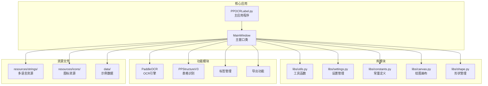

# 快速开始

<cite>
**本文档引用的文件**
- [README.md](README.md)
- [README_ch.md](README_ch.md)
- [PPOCRLabel.py](PPOCRLabel.md)
- [pyproject.toml](pyproject.md)
- [setup.cfg](setup.md)
- [libs/settings.py](settings.md)
- [libs/utils.py](utils.md)
- [libs/constants.py](constants.md)
- [gen_ocr_train_val_test.py](gen_ocr_train_val_test.md)
</cite>

## 目录
1. [简介](#简介)
2. [项目结构](#项目结构)
3. [环境要求](#环境要求)
4. [安装步骤](#安装步骤)
5. [首次运行](#首次运行)
6. [基础标注操作](#基础标注操作)
7. [示例数据集](#示例数据集)
8. [常见问题与故障排除](#常见问题与故障排除)
9. [性能与优化](#性能与优化)
10. [总结](#总结)

## 简介

PPOCRLabel 是一款专为 OCR 领域设计的半自动化图形标注工具，内置 PP-OCR 模型，能够自动检测和重新识别数据。该工具使用 Python3 和 PyQt5 开发，支持矩形框标注、表格标注、不规则文本标注和关键信息标注模式，标注结果可直接用于 PaddleOCR 检测和识别模型的训练。

## 项目结构

PPOCRLabel 项目采用模块化设计，主要包含以下组件：



**图表来源**
- [PPOCRLabel.py](PPOCRLabel.md)
- [libs/utils.py](utils.md)
- [libs/settings.py](settings.md)

**章节来源**
- [PPOCRLabel.py](PPOCRLabel.md)
- [pyproject.toml](pyproject.md)

## 环境要求

### 系统要求

- **操作系统**: Windows 10/11、Ubuntu Linux、macOS
- **Python 版本**: ≥ 3.9
- **内存**: 至少 4GB RAM（建议 8GB+）
- **存储空间**: 至少 2GB 可用空间

### 依赖要求

PPOCRLabel 的核心依赖包括：

| 依赖项 | 版本要求 | 用途 |
|--------|----------|------|
| PyQt5 | 最新版本 | GUI 界面框架 |
| PaddleOCR | ≥ 3.0.2 | OCR 文本检测和识别 |
| OpenCV | 4.2.0.32 | 图像处理和显示 |
| OpenPyXL | 最新版本 | Excel 文件处理 |
| Pandas | 最新版本 | 数据处理和分析 |
| Requests | 最新版本 | 网络请求处理 |

**章节来源**
- [pyproject.toml](pyproject.md)
- [README.md](README.md)

## 安装步骤

### 方法一：通过 pip 安装（推荐）

#### Windows 系统

```bash
# 升级 pip 到最新版本
pip install --upgrade pip

# 安装 PPOCRLabel
pip install PPOCRLabel

# 启动应用程序（中文界面）
PPOCRLabel --lang ch

# 启动 KIE 模式（关键信息提取）
PPOCRLabel --lang ch --kie True
```

#### Ubuntu Linux 系统

```bash
# 升级 pip 到最新版本
pip3 install --upgrade pip

# 安装 PPOCRLabel
pip3 install PPOCRLabel

# 安装 trash-cli（用于安全删除）
pip3 install trash-cli

# 设置 Wayland 平台（可选）
export QT_QPA_PLATFORM=wayland

# 启动应用程序
PPOCRLabel --lang ch
```

#### macOS 系统

```bash
# 升级 pip 到最新版本
pip3 install --upgrade pip

# 安装 PPOCRLabel
pip3 install PPOCRLabel

# 安装特定版本的 OpenCV（用于兼容性）
pip3 install opencv-contrib-python-headless==4.2.0.32

# 启动应用程序
PPOCRLabel --lang ch
```

### 方法二：从源码安装

#### 克隆仓库

```bash
# 克隆项目
git clone https://github.com/PFCCLab/PPOCRLabel.git
cd PPOCRLabel

# 安装开发模式
pip install -e .
```

#### 本地构建和安装

```bash
# 生成资源文件
pyrcc5 -o libs/resources.py resources.qrc

# 构建并安装
pip install -e .

# 验证安装
python -c "import PPOCRLabel; print('安装成功')"
```

### 方法三：PyInstaller 打包

```bash
# 安装 PyInstaller
pip install pyinstaller

# 生成资源文件
pyrcc5 -o libs/resources.py resources.qrc

# 打包应用程序
pyinstaller -c PPOCRLabel.py --collect-all paddleocr --collect-all pyclipper --collect-all imghdr --collect-all skimage --collect-all imgaug --collect-all scipy.io --collect-all lmdb --collect-all paddle --hidden-import=pyqt5 -p ./libs -p ./ -p ./data -p ./resources -F

# 运行打包的应用程序
dist/PPOCRLabel.exe --lang ch
```

**章节来源**
- [README.md](README.md)
- [pyproject.toml](pyproject.md)

## 首次运行

### 启动应用程序

1. **选择语言模式**
   - 中文界面: `PPOCRLabel --lang ch`
   - 英文界面: `PPOCRLabel --lang en`

2. **启动 KIE 模式**（关键信息提取）
   ```bash
   PPOCRLabel --lang ch --kie True
   ```

3. **GPU 加速配置**
   ```bash
   PPOCRLabel --gpu True  # 启用 GPU
   PPOCRLabel --gpu False # 禁用 GPU
   ```

### 基础配置选项

| 参数 | 类型 | 默认值 | 描述 |
|------|------|--------|------|
| `--lang` | 字符串 | "ch" | 界面语言（ch/en） |
| `--gpu` | 布尔值 | True | 是否启用 GPU 加速 |
| `--kie` | 布尔值 | False | 是否启用 KIE 模式 |
| `--img_list_natural_sort` | 布尔值 | True | 图片列表自然排序 |
| `--bbox_auto_zoom_center` | 布尔值 | False | 自动居中缩放边界框 |
| `--det_model_dir` | 字符串 | None | 检测模型目录 |
| `--rec_model_dir` | 字符串 | None | 识别模型目录 |
| `--cls_model_dir` | 字符串 | None | 分类模型目录 |
| `--label_font_path` | 字符串 | None | 标签字体路径 |
| `--selected_shape_color` | RGB元组 | (255,255,0) | 选中形状颜色 |

**章节来源**
- [PPOCRLabel.py](PPOCRLabel.md)

## 基础标注操作

### 1. 准备工作

1. **安装 PaddlePaddle**
   ```bash
   pip3 install --upgrade pip
   python3 -m pip install paddlepaddle -i https://www.paddlepaddle.org.cn/packages/stable/cpu/
   ```

2. **启动应用程序**
   ```bash
   PPOCRLabel --lang ch
   ```

### 2. 加载图像

1. **打开图像文件夹**
   - 菜单栏: `文件` → `打开目录`
   - 或使用快捷键: `Ctrl+U`

2. **选择图像文件夹**
   - 程序会自动扫描选定文件夹下的所有图像文件
   - 支持的图像格式: JPG、PNG、BMP、TIFF

### 3. 自动标注

1. **执行自动标注**
   - 点击工具栏上的 `自动标注` 按钮
   - 或使用快捷键: `Ctrl+Shift+R`

2. **查看标注状态**
   - 图像状态显示在左侧文件列表中
   - "X" 表示未标注，"√" 表示已标注

### 4. 手动标注

#### 矩形框标注
1. **启动标注模式**
   - 点击 `矩形标注` 按钮
   - 或使用快捷键: `W`

2. **绘制标注框**
   - 左键点击并拖拽创建矩形框
   - 松开左键完成绘制

#### 多点标注
1. **启动多点模式**
   - 点击 `四点标注` 按钮
   - 或使用快捷键: `Q`

2. **绘制多边形**
   - 依次点击四个点
   - 双击左键完成绘制

### 5. 标注框管理

#### 编辑标注框
1. **选择标注框**
   - 单击选中目标标注框
   - 按住 `Ctrl` 键可多选

2. **移动和调整**
   - 使用方向键移动选中框
   - 使用鼠标拖拽调整大小

3. **删除标注框**
   - 按 `Backspace` 或 `Delete` 键
   - 或使用菜单: `编辑` → `删除框`

#### 复制和粘贴
1. **复制标注框**
   - 选中目标框后按 `Ctrl+C`
   - 或使用菜单: `编辑` → `复制框`

2. **粘贴标注框**
   - 按 `Ctrl+V`
   - 或使用菜单: `编辑` → `粘贴框`

### 6. 重新识别

1. **单个框重新识别**
   - 选中目标框后按 `Ctrl+R`
   - 或使用菜单: `文件` → `重新识别`

2. **全部重新识别**
   - 按 `Ctrl+Shift+R`
   - 或使用菜单: `文件` → `重新识别`

### 7. 确认和导出

#### 确认标注
1. **确认当前图像**
   - 点击 `确认` 按钮
   - 或使用快捷键: `Ctrl+V` 或 `End`

2. **查看状态变化**
   - 图像状态从 "X" 变为 "√"
   - 自动跳转到下一张图像

#### 导出标注结果
1. **导出检测结果**
   - 菜单: `文件` → `导出标记结果`
   - 结果保存在 `Label.txt` 文件中

2. **导出识别结果**
   - 菜单: `文件` → `导出识别结果`
   - 结果保存在 `rec_gt.txt` 文件中
   - 裁剪图像保存在 `crop_img` 文件夹

**章节来源**
- [README.md](README.md)
- [PPOCRLabel.py](PPOCRLabel.md)

## 示例数据集

### 创建示例数据集

为了帮助用户快速上手，可以使用以下脚本创建示例数据集：

```bash
# 创建示例数据集
mkdir -p sample_dataset/images
mkdir -p sample_dataset/labels

# 添加示例图像
cp data/sample_images/*.jpg sample_dataset/images/

# 运行标注工具
cd PPOCRLabel
python PPOCRLabel.py --lang ch
```

### 数据集组织结构

```
train_data/
├── word_001.png
├── word_002.jpg
├── word_003.png
├── Label.txt          # 检测标注文件
├── rec_gt.txt         # 识别标注文件
├── crop_img/          # 裁剪的识别图像
│   ├── word_001_crop_0.png
│   ├── word_002_crop_0.jpg
│   └── word_003_crop_0.jpg
└── fileState.txt      # 图像状态文件
```

### 数据集分割

使用提供的脚本将标注数据集分割为训练集、验证集和测试集：

```bash
# 运行数据集分割脚本
python gen_ocr_train_val_test.py --trainValTestRatio 6:2:2 --datasetRootPath ../train_data

# 参数说明
# --trainValTestRatio: 训练集:验证集:测试集比例
# --datasetRootPath: 标注数据集根目录
# --detRootPath: 检测数据集输出路径
# --recRootPath: 识别数据集输出路径
```

**章节来源**
- [README.md](README.md)
- [gen_ocr_train_val_test.py](gen_ocr_train_val_test.md)

## 常见问题与故障排除

### 安装问题

#### Windows 系统问题

**问题**: 安装 Shapely 时出现 `OSError: [WinError 126]`
```bash
# 解决方案: 从 LFD UCI 下载合适的 whl 文件
# 从 https://www.lfd.uci.edu/~gohlke/pythonlibs/#shapely 下载
pip install downloaded_shapely_file.whl
```

**问题**: 启动时出现 `No module named win32com`
```bash
# 解决方案: 安装缺失的模块
pip install pypremailer
pip install pywin32
```

#### Linux 系统问题

**问题**: 启动时出现 `objc[XXXXX]:` 错误
```bash
# 解决方案: 安装特定版本的 OpenCV
pip install opencv-python==4.2.0.32
```

**问题**: `Could not load the Qt platform plugin "xcb"`
```bash
# 解决方案: 清理并重新安装
pip uninstall opencv-python opencv-contrib-python
pip install opencv-python-headless
export QT_QPA_PLATFORM=wayland
```

#### macOS 系统问题

**问题**: OpenCV 版本不兼容
```bash
# 解决方案: 安装特定版本
pip3 install opencv-contrib-python-headless==4.2.0.32
```

### 运行时问题

#### 资源文件问题

**问题**: 出现 `Missing string id` 错误
```bash
# 解决方案: 重新编译资源文件
pyrcc5 -o libs/resources.py resources.qrc
```

**问题**: `module 'cv2' has no attribute 'INTER_NEAREST'`
```bash
# 解决方案: 清理并重新安装
pip uninstall opencv-python*
pip install opencv-contrib-python-headless==4.2.0.32
```

#### 性能问题

**问题**: 标注速度慢
```bash
# 解决方案: 启用 GPU 加速
PPOCRLabel --gpu True --lang ch

# 或者降低图像分辨率
# 在设置中调整图像缩放比例
```

### 功能问题

#### 自动标注问题

**问题**: 自动标注不工作
```bash
# 检查图像状态
# 确保图像状态为 "X"（未标注）

# 重新执行自动标注
# 点击 "自动标注" 按钮
```

#### 标注框问题

**问题**: 标注框无法移动
```bash
# 确保正确选择了标注框
# 单击选中目标框

# 检查是否处于正确的标注模式
# 矩形模式: W 键
# 多点模式: Q 键
```

**章节来源**
- [README.md](README.md)
- [README_ch.md](README_ch.md)

## 性能与优化

### GPU 加速配置

PPOCRLabel 支持 GPU 加速，可显著提升标注性能：

```bash
# 启用 GPU 加速
PPOCRLabel --gpu True --lang ch

# 检查 GPU 状态
# 应用程序启动时会自动检测 CUDA 支持
```

### 内存优化

1. **图像缓存管理**
   - 程序会自动管理图像缓存
   - 长时间运行后可清理缓存

2. **批量处理优化**
   - 使用批量选择功能提高效率
   - 按住 `Ctrl` 键进行多选

### 网络配置

如果需要使用自定义模型：

```bash
# 指定自定义模型目录
PPOCRLabel --det_model_dir /path/to/det_model \
           --rec_model_dir /path/to/rec_model \
           --cls_model_dir /path/to/cls_model \
           --lang ch
```

## 总结

PPOCRLabel 作为一款专业的 OCR 图像标注工具，提供了完整的标注工作流程和丰富的功能特性。通过本文档的指导，用户可以快速完成环境搭建、应用安装和基础标注操作。

### 快速检查清单

- [ ] 已安装 Python 3.9+
- [ ] 已安装 PaddlePaddle
- [ ] 已成功安装 PPOCRLabel
- [ ] 已能正常启动应用程序
- [ ] 已能进行基本的图像标注
- [ ] 已能导出标注结果

### 下一步建议

1. **学习高级功能**: 探索 KIE 模式和表格标注功能
2. **自定义配置**: 根据项目需求调整参数设置
3. **批量处理**: 学习使用批量选择和批量操作功能
4. **数据集管理**: 使用数据集分割脚本组织训练数据

通过持续实践和探索，用户将能够充分利用 PPOCRLabel 的强大功能，高效地完成 OCR 项目的标注任务。