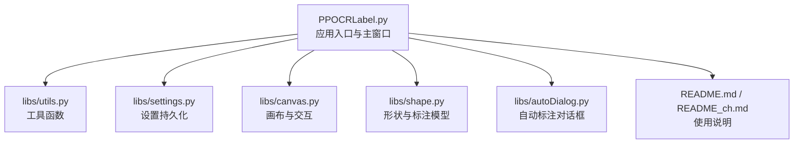
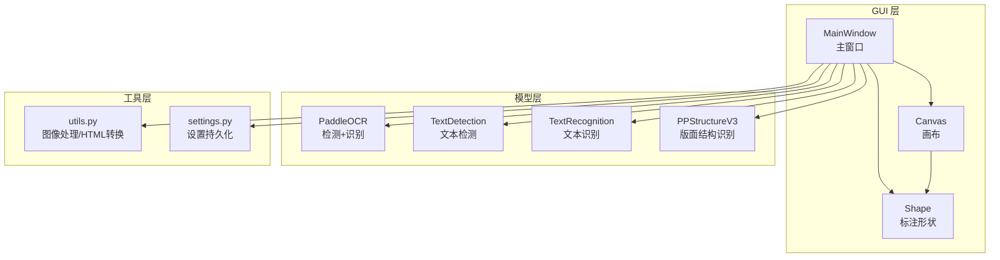
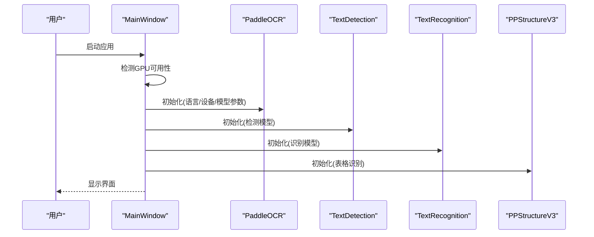
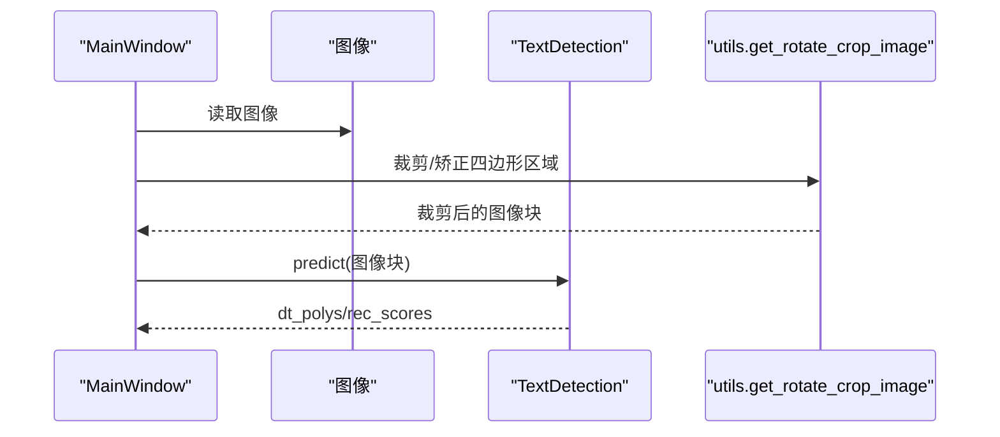
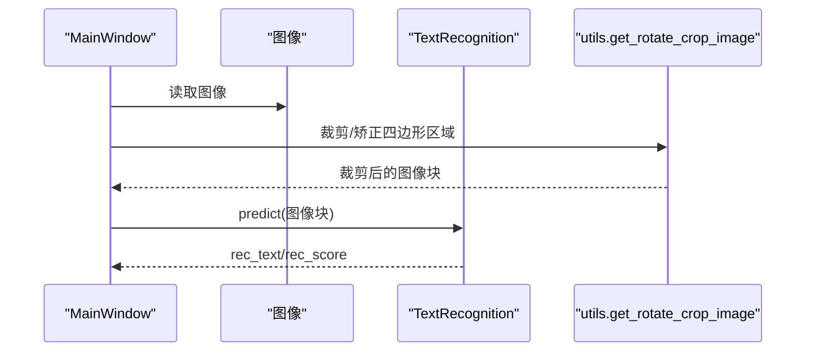
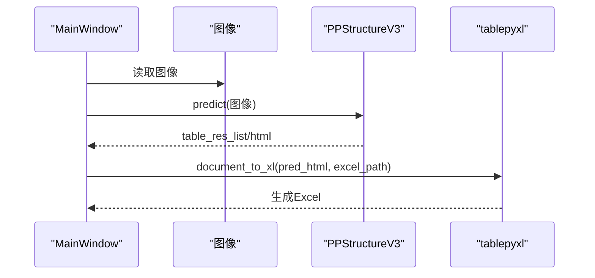
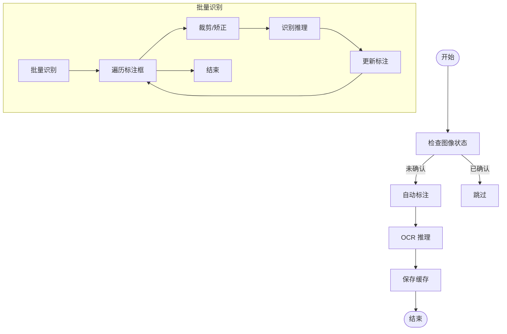
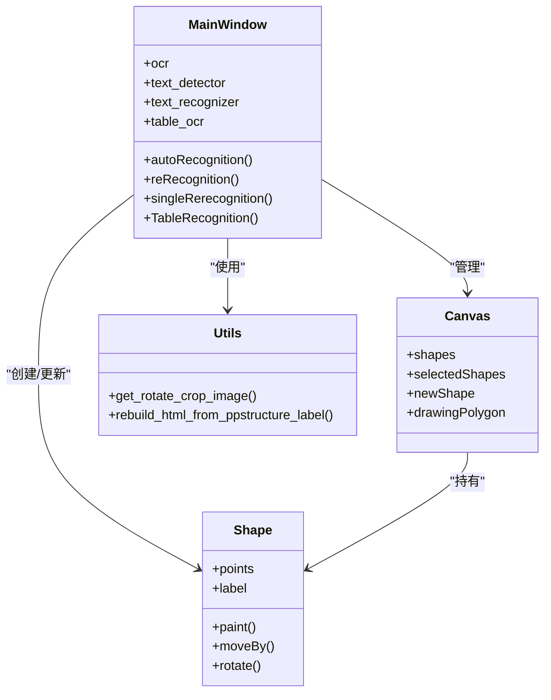
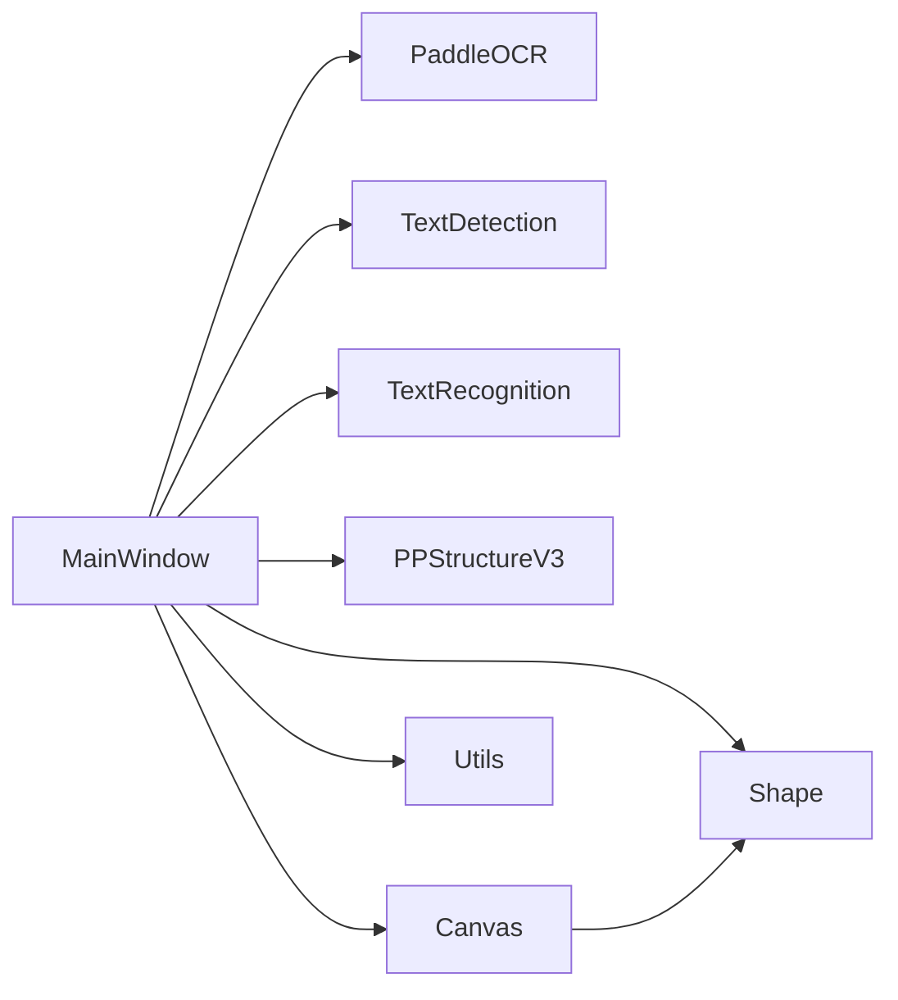

# OCR 模型集成

<cite>
**本文档引用的文件**
- [PPOCRLabel.py](PPOCRLabel.md)
- [libs/utils.py](utils.md)
- [libs/settings.py](settings.md)
- [libs/canvas.py](canvas.md)
- [libs/shape.py](shape.md)
- [libs/autoDialog.py](autoDialog.md)
- [README.md](README.md)
- [README_ch.md](README_ch.md)
</cite>

## 目录
1. [简介](#简介)
2. [项目结构](#项目结构)
3. [核心组件](#核心组件)
4. [架构总览](#架构总览)
5. [详细组件分析](#详细组件分析)
6. [依赖关系分析](#依赖关系分析)
7. [性能考量](#性能考量)
8. [故障排查指南](#故障排查指南)
9. [结论](#结论)
10. [附录](#附录)

## 简介
本文件面向希望在 PaddleOCR 生态中进行 OCR 模型集成与扩展的开发者，系统性阐述 PPOCRLabel 中 PaddleOCR 模型的集成实现，涵盖 TextDetection、TextRecognition 和 PPStructureV3 模型的初始化与使用方式；提供扩展新 OCR 模型的接口规范、参数配置与性能优化建议；并给出自定义模型的集成步骤、推理流程与结果处理方法，以及模型选择策略、GPU/CPU 切换机制与内存管理策略。

## 项目结构
该项目采用 PyQt5 GUI + PaddleOCR 推理管线的混合架构，主要文件组织如下：
- 应用入口与主窗口逻辑：PPOCRLabel.py
- 工具与通用函数：libs/utils.py
- 设置持久化：libs/settings.py
- 画布与标注交互：libs/canvas.py、libs/shape.py
- 自动标注对话框：libs/autoDialog.py
- 文档与使用说明：README.md、README_ch.md

图表来源
- [PPOCRLabel.py](PPOCRLabel.md)
- [libs/utils.py](utils.md)
- [libs/settings.py](settings.md)
- [libs/canvas.py](canvas.md)
- [libs/shape.py](shape.md)
- [libs/autoDialog.py](autoDialog.md)
- [README.md](README.md)

章节来源
- [PPOCRLabel.py](PPOCRLabel.md)
- [README.md](README.md)

## 核心组件
- 主窗口类：负责模型初始化、UI 控件绑定、推理流程调度与结果展示。
- OCR 推理器：封装 PaddleOCR 的 PaddleOCR、TextDetection、TextRecognition、PPStructureV3。
- 工具模块：提供图像裁剪、HTML 转换、坐标变换等辅助能力。
- 设置模块：负责应用设置的序列化与反序列化。
- 画布与形状：负责标注框的绘制、编辑与渲染。

章节来源
- [PPOCRLabel.py](PPOCRLabel.md)
- [libs/utils.py](utils.md)
- [libs/settings.py](settings.md)
- [libs/canvas.py](canvas.md)
- [libs/shape.py](shape.md)

## 架构总览
整体架构由 GUI 层、模型层与工具层组成。GUI 层通过主窗口统一调度模型层的推理能力，并将结果回显到画布与列表控件中；工具层提供图像处理与数据转换能力。

图表来源
- [PPOCRLabel.py](PPOCRLabel.md)
- [libs/utils.py](utils.md)
- [libs/canvas.py](canvas.md)
- [libs/shape.py](shape.md)
- [libs/settings.py](settings.md)

## 详细组件分析

### 模型初始化与设备选择
- 设备选择策略：根据系统 CUDA 支持与用户参数选择 GPU 或 CPU。
- 参数配置：支持语言切换、模型名称与目录、MKLDNN 等参数注入。
- 初始化顺序：先初始化通用 PaddleOCR，再分别初始化 TextDetection、TextRecognition、PPStructureV3。

图表来源
- [PPOCRLabel.py](PPOCRLabel.md)

章节来源
- [PPOCRLabel.py](PPOCRLabel.md)

### 文本检测 TextDetection
- 输入：图像数组
- 输出：多边形边界框、置信度等
- 使用场景：表格单元格内部文本的细粒度识别

图表来源
- [PPOCRLabel.py](PPOCRLabel.md)
- [libs/utils.py](utils.md)

章节来源
- [PPOCRLabel.py](PPOCRLabel.md)
- [libs/utils.py](utils.md)

### 文本识别 TextRecognition
- 输入：图像块（通常为裁剪后的四边形区域）
- 输出：识别文本与置信度
- 使用场景：单个检测框或单元格内文本识别

图表来源
- [PPOCRLabel.py](PPOCRLabel.md)
- [libs/utils.py](utils.md)

章节来源
- [PPOCRLabel.py](PPOCRLabel.md)
- [libs/utils.py](utils.md)

### 版面结构识别 PPStructureV3
- 输入：整图
- 输出：表格结构、HTML、单元格文本等
- 使用场景：表格结构化提取与 Excel 导出

图表来源
- [PPOCRLabel.py](PPOCRLabel.md)

章节来源
- [PPOCRLabel.py](PPOCRLabel.md)

### 自动标注与批量识别
- 自动标注：对未确认的图像批量执行 OCR，生成标注结果缓存。
- 批量识别：对当前图像所有标注框执行识别，支持锁定框与非锁定框分别处理。

图表来源
- [PPOCRLabel.py](PPOCRLabel.md)
- [PPOCRLabel.py](PPOCRLabel.md)

章节来源
- [PPOCRLabel.py](PPOCRLabel.md)
- [PPOCRLabel.py](PPOCRLabel.md)

### 类与关系图（代码级）

图表来源
- [PPOCRLabel.py](PPOCRLabel.md)
- [libs/canvas.py](canvas.md)
- [libs/shape.py](shape.md)
- [libs/utils.py](utils.md)

章节来源
- [PPOCRLabel.py](PPOCRLabel.md)
- [libs/canvas.py](canvas.md)
- [libs/shape.py](shape.md)
- [libs/utils.py](utils.md)

## 依赖关系分析
- 组件耦合：MainWindow 对 OCR 推理器与工具模块存在强依赖；Canvas 与 Shape 作为 UI 展示层与数据层紧密耦合。
- 外部依赖：PaddleOCR、OpenCV、PyQt5、paddle 等。
- 潜在循环依赖：当前结构未发现循环依赖，但模型初始化与 UI 更新之间存在事件驱动的回调链路。

图表来源
- [PPOCRLabel.py](PPOCRLabel.md)
- [libs/canvas.py](canvas.md)
- [libs/shape.py](shape.md)
- [libs/utils.py](utils.md)

章节来源
- [PPOCRLabel.py](PPOCRLabel.md)
- [libs/canvas.py](canvas.md)
- [libs/shape.py](shape.md)
- [libs/utils.py](utils.md)

## 性能考量
- 设备选择：优先使用 GPU，若无 CUDA 支持则回退 CPU；可通过参数控制。
- 模型参数：合理设置语言、模型名称与目录，避免重复加载。
- 图像预处理：使用透视变换与裁剪减少无效区域，提升识别效率。
- 批量处理：批量识别时注意内存占用，必要时分批处理。
- 并发推理：当前实现为串行，若需并发可在独立线程中调用 predict，注意线程安全与结果合并。

章节来源
- [PPOCRLabel.py](PPOCRLabel.md)
- [PPOCRLabel.py](PPOCRLabel.md)
- [libs/utils.py](utils.md)

## 故障排查指南
- 模型加载失败：检查模型目录与名称参数是否正确，确认设备类型匹配。
- 识别结果为空：检查裁剪区域是否有效，确保图像尺寸满足最小要求。
- GPU/CPU 切换异常：确认 paddle 是否正确安装 CUDA 版本，或回退 CPU。
- 导出失败：检查输出目录权限与路径是否存在，确保文件未被占用。

章节来源
- [PPOCRLabel.py](PPOCRLabel.md)
- [PPOCRLabel.py](PPOCRLabel.md)
- [README.md](README.md)

## 结论
本项目通过清晰的模块划分与事件驱动的 UI 流程，实现了 PaddleOCR 检测、识别与版面结构识别的无缝集成。通过合理的设备选择、参数配置与图像预处理，能够在保证精度的同时提升推理效率。扩展新模型时，遵循统一的接口规范与参数注入方式，即可快速接入并参与完整的标注工作流。

## 附录

### 扩展新 OCR 模型的步骤
- 实现接口规范：确保新模型提供 predict 方法，返回标准化的字典结构（如 rec_text、rec_score、dt_polys 等）。
- 参数配置：在 MainWindow 初始化阶段注入模型名称与目录参数，或通过命令行参数传入。
- 推理流程：在对应业务函数中调用模型 predict，处理返回结果并更新 UI。
- 结果处理：将识别结果映射到 Shape 或列表控件，支持手动编辑与导出。

章节来源
- [PPOCRLabel.py](PPOCRLabel.md)
- [PPOCRLabel.py](PPOCRLabel.md)
- [PPOCRLabel.py](PPOCRLabel.md)
- [README.md](README.md)

### 模型选择策略与 GPU/CPU 切换
- 自动检测：根据 paddle.is_compiled_with_cuda() 与用户参数决定设备类型。
- 语言切换：通过菜单项动态重建 PaddleOCR 与 PPStructureV3 实例，支持多语言模型。
- 参数传递：det_model_dir、rec_model_dir、cls_model_dir 等参数可指定自定义模型路径。

章节来源
- [PPOCRLabel.py](PPOCRLabel.md)
- [PPOCRLabel.py](PPOCRLabel.md)
- [README.md](README.md)

### 内存管理与性能优化
- 图像解码：使用 cv2.imdecode 读取文件，避免路径编码问题。
- 结果缓存：自动标注与识别结果缓存至本地文件，减少重复计算。
- 批量处理：限制单次处理的图像数量，避免内存峰值过高。
- 并发推理：在独立线程中执行 predict，注意线程同步与异常捕获。

章节来源
- [PPOCRLabel.py](PPOCRLabel.md)
- [PPOCRLabel.py](PPOCRLabel.md)
- [libs/autoDialog.py](autoDialog.md)