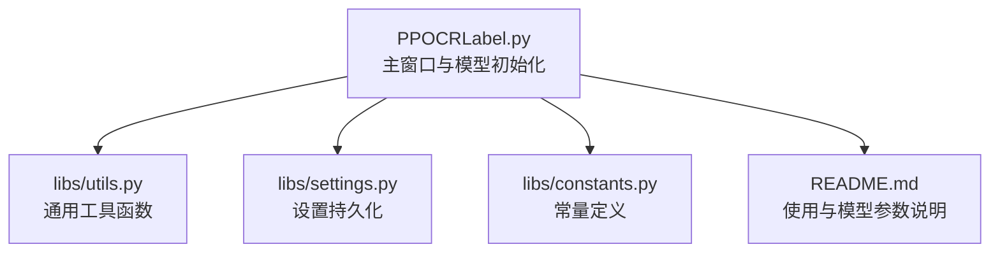
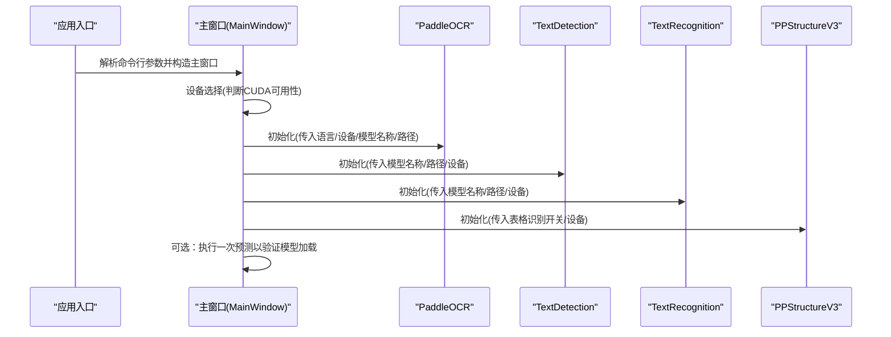
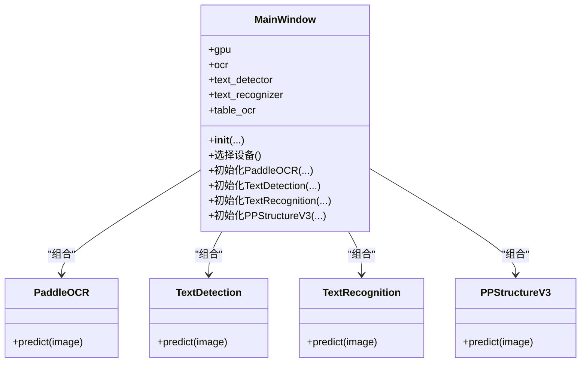
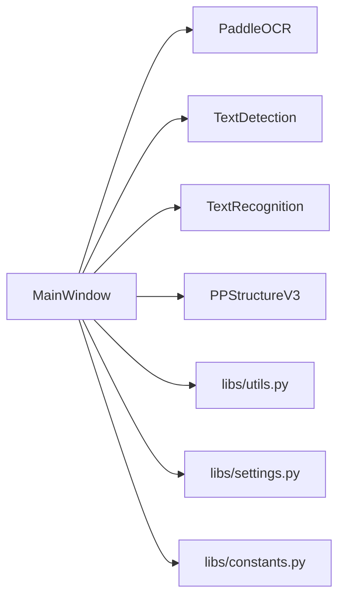

# PaddleOCR 模型初始化

<cite>
**本文引用的文件**
- [PPOCRLabel.py](PPOCRLabel.md)
- [libs/utils.py](utils.md)
- [libs/settings.py](settings.md)
- [libs/constants.py](constants.md)
- [README.md](README.md)
</cite>

## 目录
1. [简介](#简介)
2. [项目结构](#项目结构)
3. [核心组件](#核心组件)
4. [架构总览](#架构总览)
5. [详细组件分析](#详细组件分析)
6. [依赖关系分析](#依赖关系分析)
7. [性能考量](#性能考量)
8. [故障排查指南](#故障排查指南)
9. [结论](#结论)

## 简介
本文档围绕 PPOCRLabel 应用中的 PaddleOCR 模型初始化流程展开，系统性说明 PaddleOCR、TextRecognition、TextDetection 与 PPStructureV3 模型的初始化参数、设备选择（CPU/GPU）、模型路径设置，并给出不同 OCR 任务的模型组合建议、最佳实践（内存管理、模型缓存、性能优化）以及加载失败的处理与恢复策略。内容基于仓库源码与文档进行提炼，确保技术细节可追溯。

## 项目结构
该应用采用 PyQt5 图形界面与 PaddleOCR 推理库结合的方式，核心入口为主窗口类，负责初始化多个 OCR 组件并提供交互能力；工具模块提供通用函数与设置持久化；README 提供使用说明与模型参数说明。

图表来源
- [PPOCRLabel.py](PPOCRLabel.md)
- [libs/utils.py](utils.md)
- [libs/settings.py](settings.md)
- [libs/constants.py](constants.md)
- [README.md](README.md)

章节来源
- [PPOCRLabel.py](PPOCRLabel.md)
- [libs/utils.py](utils.md)
- [libs/settings.py](settings.md)
- [libs/constants.py](constants.md)
- [README.md](README.md)

## 核心组件
- 主窗口类负责初始化三个 OCR 组件：
  - PaddleOCR：统一的检测+识别流水线
  - TextDetection：仅文本检测
  - TextRecognition：仅文本识别
  - PPStructureV3：表格结构识别（含表格外框、单元格、公式等）
- 设备选择逻辑：优先使用 GPU（当 Paddle 编译包含 CUDA 且用户允许时），否则回退到 CPU
- 模型路径参数：支持通过命令行参数传入检测、识别、分类模型目录，或在初始化时显式指定

章节来源
- [PPOCRLabel.py](PPOCRLabel.md)
- [README.md](README.md)

## 架构总览
下图展示主窗口初始化阶段的组件关系与调用顺序，体现模型初始化、设备选择与路径参数传递的关键节点。

图表来源
- [PPOCRLabel.py](PPOCRLabel.md)
- [README.md](README.md)

## 详细组件分析

### 设备选择与参数配置
- 设备选择
  - 依据 Paddle 是否编译了 CUDA 以及用户是否启用 GPU 参数，决定使用 "gpu" 或 "cpu"
  - 该值随后作为参数传入各模型初始化
- 参数配置
  - PaddleOCR 初始化时传入：
    - use_doc_orientation_classify / use_doc_unwarping / use_textline_orientation：控制文档方向、去扭曲、文本行方向等
    - device：设备选择
    - lang：语言
    - text_detection_model_name / text_recognition_model_name：模型名称
    - enable_mkldnn：是否启用 MKLDNN（CPU 加速）
    - 可选：text_detection_model_dir / text_recognition_model_dir / text_line_orientation_model_dir：模型目录
  - TextDetection / TextRecognition：传入 model_name、model_dir、device
  - PPStructureV3：传入 use_table_recognition 等开关与 device

章节来源
- [PPOCRLabel.py](PPOCRLabel.md)
- [README.md](README.md)

### 模型初始化流程（类级）

图表来源
- [PPOCRLabel.py](PPOCRLabel.md)

### 不同 OCR 任务的模型组合建议
- 文本检测（TextDetection）
  - 适用场景：仅需要定位文本区域，无需识别文本内容
  - 初始化：使用 TextDetection 类，传入检测模型名称与路径
- 文本识别（TextRecognition）
  - 适用场景：仅需要识别文本内容，不需要检测框
  - 初始化：使用 TextRecognition 类，传入识别模型名称与路径
- 检测+识别（PaddleOCR）
  - 适用场景：完整 OCR 流水线，同时输出检测框与识别结果
  - 初始化：使用 PaddleOCR，可配置语言、设备、模型名称与路径
- 表格结构识别（PPStructureV3）
  - 适用场景：表格结构解析（表格外框、单元格、合并单元格、公式等）
  - 初始化：使用 PPStructureV3，开启 use_table_recognition 等开关，传入设备

章节来源
- [PPOCRLabel.py](PPOCRLabel.md)
- [README.md](README.md)

### 命令行参数与模型路径设置
- 支持的命令行参数（部分）
  - --lang：语言，默认 "ch"
  - --gpu：是否启用 GPU，默认 True
  - --img_list_natural_sort：自然排序开关
  - --kie：KIE 模式开关
  - --det_model_dir：检测模型目录
  - --rec_model_dir：识别模型目录
  - --rec_char_dict_path：识别字典路径
  - --cls_model_dir：文本行方向模型目录
  - --bbox_auto_zoom_center：单框时自动居中缩放
  - --label_font_path：标签字体路径
  - --selected_shape_color：选中框颜色（RGB）
- 参数传递链路
  - 命令行解析后传入 MainWindow 构造函数
  - MainWindow 内部将 det/rec/cls 模型目录等参数传给对应模型初始化

章节来源
- [PPOCRLabel.py](PPOCRLabel.md)
- [PPOCRLabel.py](PPOCRLabel.md)

### 模型加载失败的处理与恢复
- 日志记录
  - 设置模块使用标准日志器记录警告与异常
- 运行期验证
  - 初始化后可对示例图片执行一次 predict，用于快速验证模型加载成功
- 语言切换与重载
  - 语言切换时，如存在旧实例则先删除再重建，确保新语言模型生效
- 错误提示
  - 导出识别结果时，遇到异常会弹窗提示并记录异常日志

章节来源
- [libs/settings.py](settings.md)
- [PPOCRLabel.py](PPOCRLabel.md)
- [PPOCRLabel.py](PPOCRLabel.md)
- [PPOCRLabel.py](PPOCRLabel.md)

## 依赖关系分析
- 组件耦合
  - 主窗口聚合多个 OCR 组件，彼此独立，便于按需启用
  - 工具模块提供通用函数，降低重复代码
- 外部依赖
  - PaddleOCR：提供 PaddleOCR、TextDetection、TextRecognition、PPStructureV3
  - PyQt5：图形界面框架
  - OpenCV：图像处理
- 可能的循环依赖
  - 当前结构为单向依赖（主窗口依赖工具与设置），无明显循环

图表来源
- [PPOCRLabel.py](PPOCRLabel.md)
- [libs/utils.py](utils.md)
- [libs/settings.py](settings.md)
- [libs/constants.py](constants.md)

章节来源
- [PPOCRLabel.py](PPOCRLabel.md)
- [libs/utils.py](utils.md)
- [libs/settings.py](settings.md)
- [libs/constants.py](constants.md)

## 性能考量
- 设备选择
  - 优先使用 GPU，显著提升推理速度；若无 CUDA 支持则回退 CPU
- 模型名称与路径
  - 使用轻量模型（如 PP-OCRv5_mobile_*）可在保证精度的同时降低资源占用
  - 明确指定模型目录可避免模型查找开销
- 预测验证
  - 初始化后对示例图片执行一次 predict，有助于提前暴露模型问题，减少后续运行时失败概率
- 语言切换
  - 语言切换涉及实例销毁与重建，应避免频繁切换；必要时批量切换后再执行操作

章节来源
- [PPOCRLabel.py](PPOCRLabel.md)
- [PPOCRLabel.py](PPOCRLabel.md)

## 故障排查指南
- 常见问题与处理
  - 模型加载失败
    - 检查模型路径是否正确、模型文件是否存在
    - 确认设备选择与模型兼容（如 CUDA 版本）
    - 在初始化后对示例图片执行 predict，观察日志输出
  - 语言切换无效
    - 确认切换逻辑是否触发实例重建
    - 检查语言映射与参数传递
  - 导出识别结果异常
    - 查看异常日志，确认图像路径与标签格式
    - 按提示修复路径或标签后重试
- 建议
  - 在生产环境中保留日志以便快速定位问题
  - 对关键模型进行预热（predict）以规避首次加载延迟

章节来源
- [libs/settings.py](settings.md)
- [PPOCRLabel.py](PPOCRLabel.md)
- [PPOCRLabel.py](PPOCRLabel.md)
- [PPOCRLabel.py](PPOCRLabel.md)

## 结论
本文梳理了 PPOCRLabel 中 PaddleOCR 模型初始化的完整流程，覆盖设备选择、参数配置、模型路径设置、任务组合建议、性能优化与故障排查。通过明确的初始化参数与设备策略，可有效提升 OCR 推理效率与稳定性；通过日志与预热机制，可降低运行期风险。建议在实际部署中结合硬件条件与业务需求，合理选择模型与设备，并建立完善的监控与日志体系。