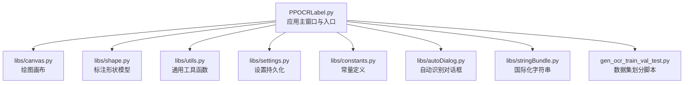
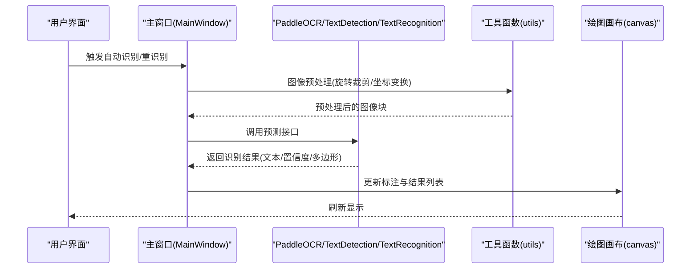
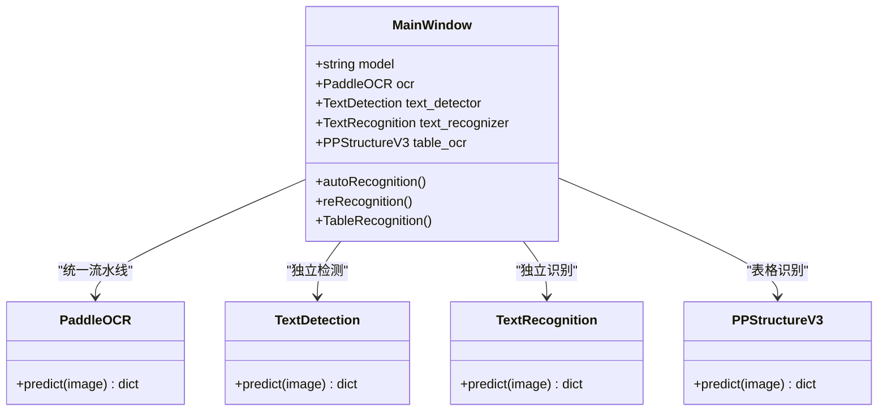
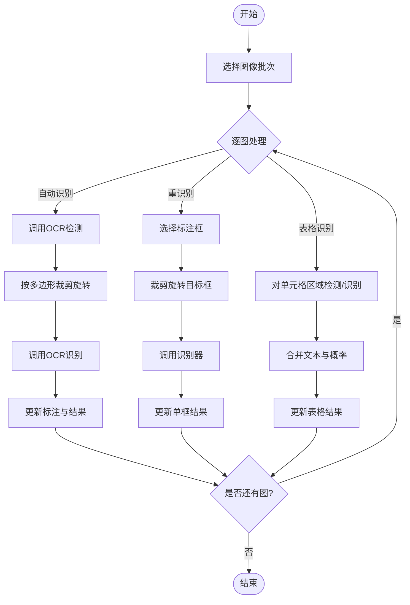
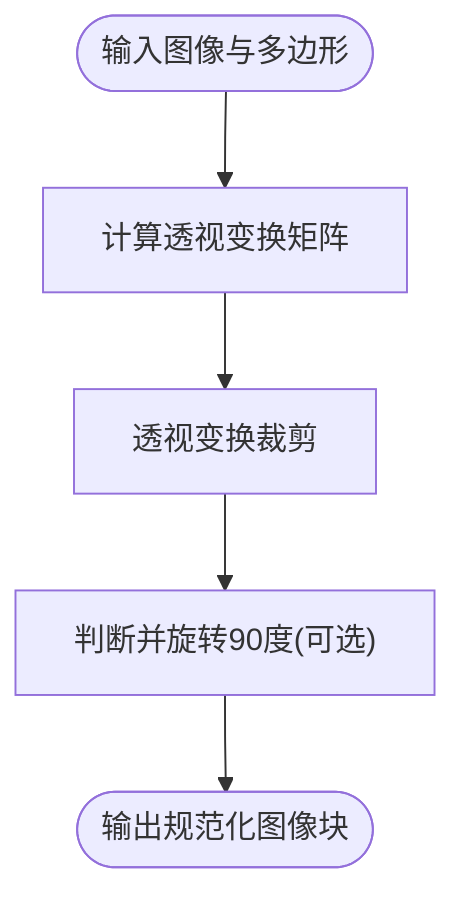
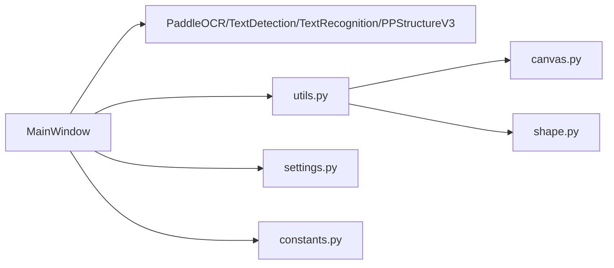

# 自定义 OCR 模型扩展

<cite>
**本文引用的文件**
- [PPOCRLabel.py](PPOCRLabel.md)
- [README.md](README.md)
- [README_ch.md](README_ch.md)
- [libs/__init__.py](__init__.md)
- [libs/settings.py](settings.md)
- [libs/utils.py](utils.md)
- [libs/constants.py](constants.md)
- [libs/canvas.py](canvas.md)
- [libs/shape.py](shape.md)
- [libs/autoDialog.py](autoDialog.md)
- [libs/stringBundle.py](stringBundle.md)
- [gen_ocr_train_val_test.py](gen_ocr_train_val_test.md)
</cite>

## 目录
1. [简介](#简介)
2. [项目结构](#项目结构)
3. [核心组件](#核心组件)
4. [架构总览](#架构总览)
5. [详细组件分析](#详细组件分析)
6. [依赖关系分析](#依赖关系分析)
7. [性能考量](#性能考量)
8. [故障排查指南](#故障排查指南)
9. [结论](#结论)
10. [附录](#附录)

## 简介
本文件面向希望在 PPOCRLabel 中扩展自定义 OCR 模型的开发者，系统阐述如何：
- 设计与实现自定义 OCR 模型接口规范
- 定义参数配置与兼容性要求
- 完成模型注册流程、推理接口适配与结果格式标准化
- 实施模型加载、推理过程与结果处理
- 进行性能评估、错误处理与调试

文档以仓库现有代码为基础，结合 README 中的“自定义模型”说明，给出可操作的扩展步骤与最佳实践。

## 项目结构
PPOCRLabel 是基于 PyQt5 的图形标注工具，集成了 PaddleOCR 的检测与识别能力，并支持表格结构识别与导出。核心入口为应用主窗口类，负责初始化 OCR 组件、管理界面交互与标注数据流。

图表来源
- [PPOCRLabel.py](PPOCRLabel.md)
- [libs/canvas.py](canvas.md)
- [libs/shape.py](shape.md)
- [libs/utils.py](utils.md)
- [libs/settings.py](settings.md)
- [libs/constants.py](constants.md)
- [libs/autoDialog.py](autoDialog.md)
- [libs/stringBundle.py](stringBundle.md)
- [gen_ocr_train_val_test.py](gen_ocr_train_val_test.md)

章节来源
- [PPOCRLabel.py](PPOCRLabel.md)
- [README.md](README.md)

## 核心组件
- 应用主窗口类：负责初始化 OCR 组件（检测、识别、表格识别）、管理界面控件与事件、批量自动识别与重识别、结果展示与导出。
- OCR 组件：
  - PaddleOCR：统一的 OCR 流水线，包含文本检测与识别。
  - TextDetection：独立的文本检测器。
  - TextRecognition：独立的文本识别器。
  - PPStructureV3：表格结构识别器。
- 工具模块：图像裁剪、旋转、坐标变换、自然排序、HTML 转换等。
- 设置与常量：窗口状态、颜色、文件格式、快捷键等。
- 自动识别对话框：调用 OCR 对整图进行批量识别，输出多边形与文本结果。
- 数据集划分脚本：按比例拆分训练/验证/测试集，便于模型训练。

章节来源
- [PPOCRLabel.py](PPOCRLabel.md)
- [libs/utils.py](utils.md)
- [libs/autoDialog.py](autoDialog.md)
- [gen_ocr_train_val_test.py](gen_ocr_train_val_test.md)

## 架构总览
PPOCRLabel 的 OCR 推理链路由主窗口发起，经由工具函数对输入图像进行预处理（如旋转裁剪），再调用 OCR 组件执行推理，最后将结果标准化为内部结构并更新界面。

图表来源
- [PPOCRLabel.py](PPOCRLabel.md)
- [libs/utils.py](utils.md)
- [libs/autoDialog.py](autoDialog.md)

## 详细组件分析

### 主窗口与 OCR 初始化
- 主窗口在构造时根据语言与设备选择初始化 OCR 组件，支持自定义检测/识别/分类模型目录与名称。
- 支持独立的检测器与识别器实例，便于按需调用。
- 提供表格识别器用于表格结构识别。

图表来源
- [PPOCRLabel.py](PPOCRLabel.md)

章节来源
- [PPOCRLabel.py](PPOCRLabel.md)

### 自动识别与重识别流程
- 自动识别：遍历当前批次图像，调用 OCR 对整图进行检测与识别，生成多边形与文本结果。
- 重识别：对选中或全部标注框进行裁剪与旋转，调用识别器获取文本与置信度，更新标注列表。
- 表格识别：对单元格区域进行二次检测与识别，合并文本与概率。

图表来源
- [PPOCRLabel.py](PPOCRLabel.md)
- [PPOCRLabel.py](PPOCRLabel.md)
- [libs/autoDialog.py](autoDialog.md)

章节来源
- [PPOCRLabel.py](PPOCRLabel.md)
- [PPOCRLabel.py](PPOCRLabel.md)
- [libs/autoDialog.py](autoDialog.md)

### 图像预处理与结果标准化
- 旋转裁剪：根据标注四边形计算透视变换矩阵，裁剪并旋转图像块，保证识别方向正确。
- 坐标变换：将多边形坐标转换为标准格式，便于后续处理与导出。
- 结果标准化：统一返回文本、置信度与几何信息，确保 UI 层一致消费。

图表来源
- [libs/utils.py](utils.md)

章节来源
- [libs/utils.py](utils.md)

### 数据集划分与导出
- 数据集划分脚本：按比例将标注数据拆分为训练/验证/测试集，并复制对应图像与标签文件。
- 导出格式：支持检测与识别两类标签文件，便于训练。

章节来源
- [gen_ocr_train_val_test.py](gen_ocr_train_val_test.md)

## 依赖关系分析
- 主窗口依赖 OCR 组件与工具模块；OCR 组件依赖底层推理引擎（PaddleOCR）。
- 工具模块提供图像处理与数据转换能力，贯穿自动识别与重识别流程。
- 设置与常量模块为全局配置提供支撑。

图表来源
- [PPOCRLabel.py](PPOCRLabel.md)
- [libs/utils.py](utils.md)
- [libs/canvas.py](canvas.md)
- [libs/shape.py](shape.md)
- [libs/settings.py](settings.md)
- [libs/constants.py](constants.md)

章节来源
- [PPOCRLabel.py](PPOCRLabel.md)
- [libs/utils.py](utils.md)

## 性能考量
- 设备选择：优先使用 GPU，若不可用则回退到 CPU。
- 模型选择：优先使用轻量级模型以提升实时性；在批量处理时可考虑批量化策略。
- 预处理优化：减少重复的图像变换与内存拷贝，尽量复用中间结果。
- 结果缓存：利用缓存机制避免重复推理，提高交互流畅度。

章节来源
- [PPOCRLabel.py](PPOCRLabel.md)

## 故障排查指南
- 模型加载失败：检查模型目录与名称参数是否正确，确认模型文件存在且与当前平台兼容。
- 推理异常：捕获异常并记录日志，提示用户调整标注框大小或方向。
- 图像尺寸问题：过小图像可能无法识别，建议在 UI 中进行尺寸校验与提示。
- 平台兼容性：不同平台的 OpenCV 版本可能导致兼容问题，按 README 的错误处理建议进行修复。

章节来源
- [README.md](README.md)
- [libs/utils.py](utils.md)

## 结论
通过在主窗口中注入自定义 OCR 组件与参数，结合工具模块的图像预处理与结果标准化，可以平滑地将新的 OCR 模型接入 PPOCRLabel。建议遵循统一的接口规范与结果格式，确保 UI 与数据流的一致性，并在部署前完成充分的性能与兼容性测试。

## 附录

### 自定义 OCR 模型扩展步骤
- 步骤一：准备模型
  - 准备检测、识别与可选的分类模型目录与名称。
  - 确认模型与当前平台兼容（CPU/GPU）。
- 步骤二：参数配置
  - 在主窗口初始化阶段传入自定义模型目录与名称参数。
  - 可选：启用 MKLDNN 加速（视平台而定）。
- 步骤三：注册与初始化
  - 将自定义 OCR 组件注入主窗口，替换默认模型。
  - 初始化独立检测器与识别器（如需）。
- 步骤四：推理接口适配
  - 确保预测接口返回统一格式：文本、置信度、几何信息。
  - 对于表格识别，确保返回结构化信息（如 HTML）。
- 步骤五：结果处理
  - 使用工具函数进行图像预处理（裁剪、旋转）。
  - 将结果标准化为内部结构，更新绘图画布与列表。
- 步骤六：性能评估与调试
  - 记录推理耗时与吞吐，定位瓶颈。
  - 捕获并记录异常，提供用户提示。
  - 按 README 的错误处理建议修复常见问题。

章节来源
- [PPOCRLabel.py](PPOCRLabel.md)
- [README.md](README.md)