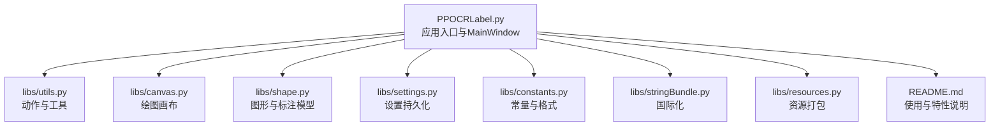
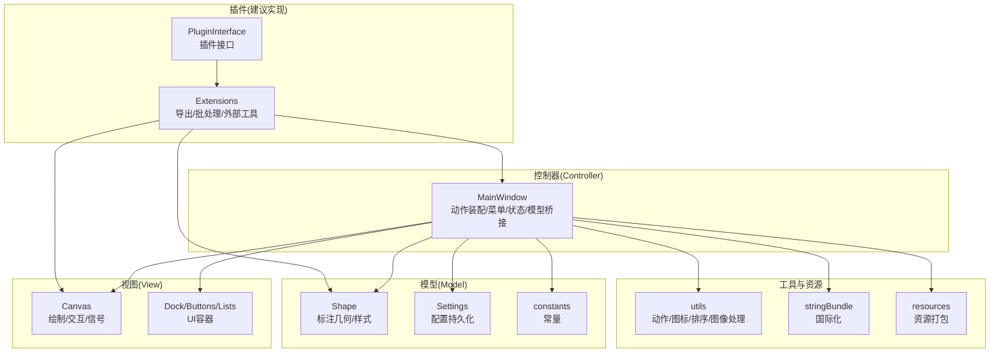
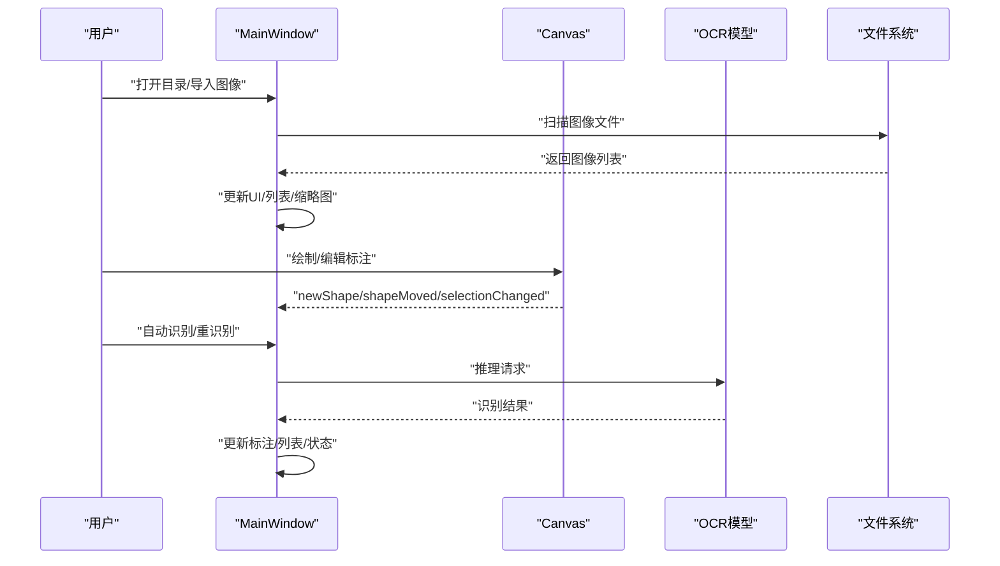
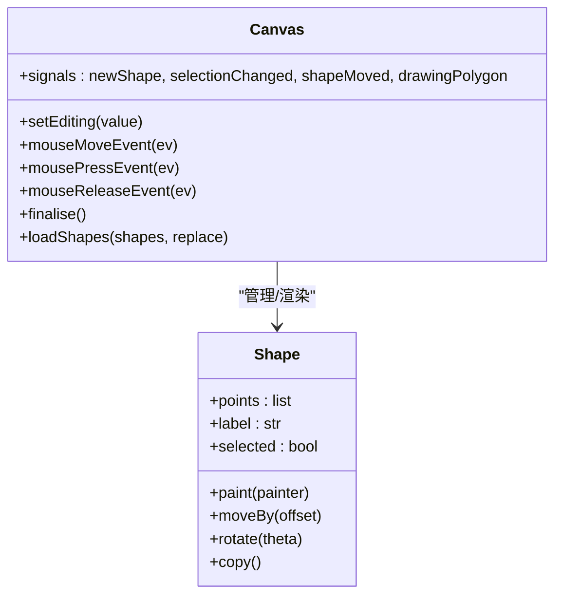
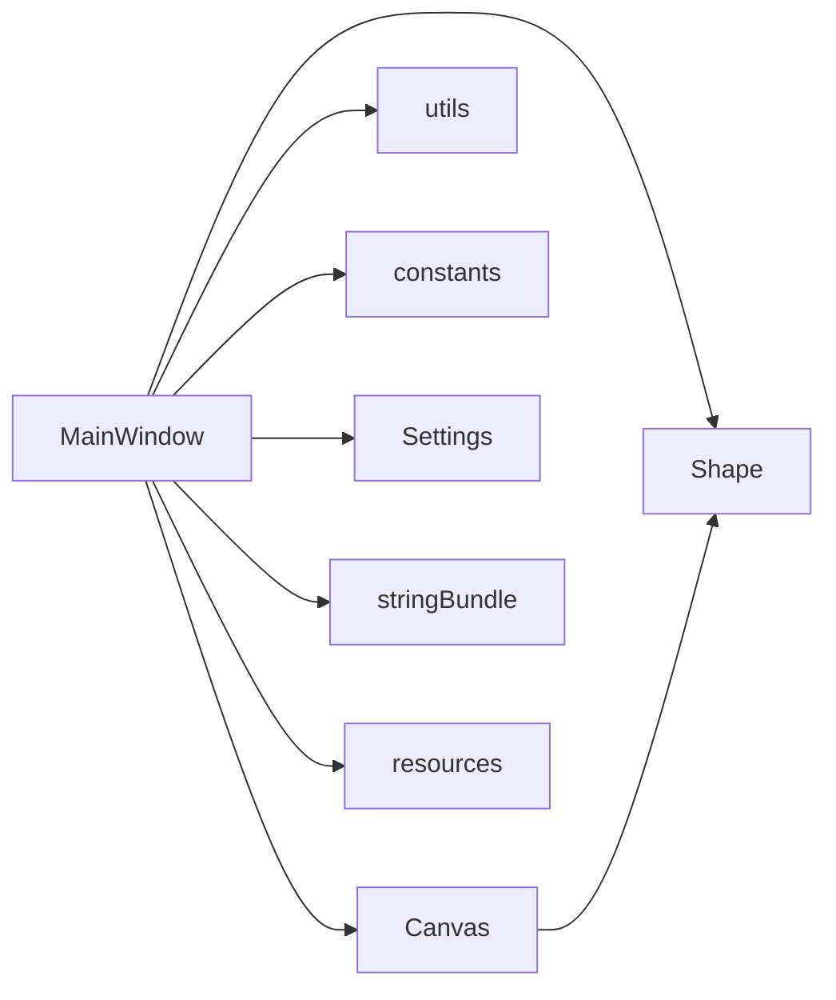

# 插件架构总览

<cite>
**本文引用的文件**
- [PPOCRLabel.py](PPOCRLabel.md)
- [README.md](README.md)
- [libs/settings.py](settings.md)
- [libs/utils.py](utils.md)
- [libs/canvas.py](canvas.md)
- [libs/shape.py](shape.md)
- [libs/constants.py](constants.md)
- [libs/stringBundle.py](stringBundle.md)
- [libs/resources.py](resources.md)
</cite>

## 目录
1. [引言](#引言)
2. [项目结构](#项目结构)
3. [核心组件](#核心组件)
4. [架构总览](#架构总览)
5. [详细组件分析](#详细组件分析)
6. [依赖分析](#依赖分析)
7. [性能考虑](#性能考虑)
8. [故障排查指南](#故障排查指南)
9. [结论](#结论)
10. [附录](#附录)

## 引言
本文件面向 PPOCRLabel 的插件化扩展需求，聚焦于在现有 MVC 架构之上构建可扩展的插件系统。目标是阐明插件设计理念与架构原则，说明 MainWindow 作为核心控制器如何管理插件生命周期、注册与卸载流程；明确插件系统的边界与约束；并总结设计哲学（如松耦合、高内聚、开闭原则）在项目中的落地方式。

## 项目结构
- 应用入口为顶层脚本，负责初始化主窗口与全局资源。
- 核心逻辑集中在 MainWindow 类，承担视图控制、动作装配、菜单组织、文件扫描与导入、模型调用桥接等职责。
- libs 子模块提供通用能力：设置持久化、工具函数、画布与形状渲染、常量定义、国际化字符串包、资源打包等。
- README 提供使用说明、特性列表与错误处理指引，便于理解功能边界与扩展点。

图表来源
- [PPOCRLabel.py](PPOCRLabel.md)
- [libs/utils.py](utils.md)
- [libs/canvas.py](canvas.md)
- [libs/shape.py](shape.md)
- [libs/settings.py](settings.md)
- [libs/constants.py](constants.md)
- [libs/stringBundle.py](stringBundle.md)
- [libs/resources.py](resources.md)
- [README.md](README.md)

章节来源
- [PPOCRLabel.py](PPOCRLabel.md)
- [README.md](README.md)

## 核心组件
- MainWindow：MVC 中的控制器，负责装配动作、菜单、工具栏、画布、列表控件、状态栏等；协调文件导入、自动/重识别、模型调用、标签导出等业务流程。
- Canvas：MVC 中的视图，承载标注绘制、选择、拖拽、缩放、滚动等交互事件，并通过信号与 MainWindow 协作。
- Shape：MVC 中的模型，封装标注几何、颜色、字体、索引等属性，支持绘制、高亮、旋转、拷贝等操作。
- Settings：配置持久化，提供键值存储、序列化/反序列化、默认路径等。
- utils：动作创建、图标加载、快捷键格式化、自然排序、图像裁剪与旋转、表格 HTML 转换等工具方法。
- constants：窗口状态、颜色、文件格式、编码等常量。
- stringBundle：国际化字符串包，支持回退链路与资源加载。
- resources：Qt 资源打包入口，提供资源初始化/清理。

章节来源
- [PPOCRLabel.py](PPOCRLabel.md)
- [libs/canvas.py](canvas.md)
- [libs/shape.py](shape.md)
- [libs/settings.py](settings.md)
- [libs/utils.py](utils.md)
- [libs/constants.py](constants.md)
- [libs/stringBundle.py](stringBundle.md)
- [libs/resources.py](resources.md)

## 架构总览
PPOCRLabel 采用经典的 MVC 架构：
- 视图层：MainWindow 组织界面布局（停靠窗、工具按钮、列表、画布等），Canvas 独立负责绘制与交互。
- 模型层：Shape 表示标注数据，Settings 管理应用配置，文件状态与缓存由 MainWindow 维护。
- 控制器层：MainWindow 负责事件分发、动作启用/禁用、菜单装配、文件扫描与导入、OCR 模型调用桥接。

插件系统建议以“控制器扩展 + 视图适配 + 模型桥接”的方式融入现有架构，确保：
- 松耦合：插件通过接口/回调与核心解耦，避免直接修改 MainWindow 内部逻辑。
- 高内聚：插件聚焦单一职责（如特定导出格式、批处理、外部工具集成）。
- 开闭原则：对扩展开放，对修改关闭；新增插件不影响既有功能。

图表来源
- [PPOCRLabel.py](PPOCRLabel.md)
- [libs/canvas.py](canvas.md)
- [libs/shape.py](shape.md)
- [libs/settings.py](settings.md)
- [libs/utils.py](utils.md)
- [libs/constants.py](constants.md)
- [libs/stringBundle.py](stringBundle.md)
- [libs/resources.py](resources.md)

## 详细组件分析

### MainWindow 作为核心控制器的扩展机制
- 动作与菜单装配：通过工具函数创建动作、快捷键、图标与提示信息，并按功能域组织到菜单与工具栏，形成统一的扩展入口。
- 文件扫描与导入：扫描目录中的图像文件，按需排序，更新 UI 列表与缩略图，触发后续识别与标注流程。
- OCR 模型桥接：在初始化时注入 OCR、文本检测/识别、表格结构识别等模型实例，作为插件化的“外部服务”接入点。
- 状态与 UI 启用控制：根据当前状态动态启用/禁用动作，保证界面一致性与可用性。
- 国际化与资源：通过字符串包与资源打包，支持多语言与静态资源加载。

图表来源
- [PPOCRLabel.py](PPOCRLabel.md)
- [libs/canvas.py](canvas.md)
- [libs/utils.py](utils.md)

章节来源
- [PPOCRLabel.py](PPOCRLabel.md)
- [PPOCRLabel.py](PPOCRLabel.md)
- [libs/canvas.py](canvas.md)
- [libs/utils.py](utils.md)

### Canvas 与 Shape 的协作
- Canvas 负责绘制、交互事件与状态管理，通过信号与 MainWindow 协同；Shape 提供几何与渲染细节，二者通过共享数据结构实现低耦合。
- Canvas 支持绘制模式切换（矩形/四点）、拖拽、缩放、滚动、撤销/重做等，为插件扩展提供稳定的输入输出通道。

图表来源
- [libs/canvas.py](canvas.md)
- [libs/shape.py](shape.md)

章节来源
- [libs/canvas.py](canvas.md)
- [libs/shape.py](shape.md)

### 设置与国际化
- Settings 提供键值存储与持久化，适合插件注册自定义配置项。
- stringBundle 提供多语言字符串加载与回退策略，便于插件文案国际化。

章节来源
- [libs/settings.py](settings.md)
- [libs/stringBundle.py](stringBundle.md)

### 工具与资源
- utils 提供动作创建、图标加载、快捷键格式化、图像处理、表格转换等通用能力，是插件常用的基础工具集合。
- resources 提供资源打包入口，插件可复用资源加载机制。

章节来源
- [libs/utils.py](utils.md)
- [libs/resources.py](resources.md)

## 依赖分析
- 控制器对视图与模型的依赖：MainWindow 依赖 Canvas 进行交互，依赖 Shape 进行数据表达；同时依赖 utils、constants、stringBundle、resources 提供工具与资源。
- 视图对模型的依赖：Canvas 依赖 Shape 进行绘制与交互；Canvas 通过信号向 MainWindow 反馈状态变化。
- 配置与国际化：Settings 与 stringBundle 为跨模块提供配置与文案支持。

图表来源
- [PPOCRLabel.py](PPOCRLabel.md)
- [libs/canvas.py](canvas.md)
- [libs/shape.py](shape.md)
- [libs/utils.py](utils.md)
- [libs/constants.py](constants.md)
- [libs/settings.py](settings.md)
- [libs/stringBundle.py](stringBundle.md)
- [libs/resources.py](resources.md)

章节来源
- [PPOCRLabel.py](PPOCRLabel.md)
- [libs/canvas.py](canvas.md)
- [libs/shape.py](shape.md)
- [libs/utils.py](utils.md)
- [libs/constants.py](constants.md)
- [libs/settings.py](settings.md)
- [libs/stringBundle.py](stringBundle.md)
- [libs/resources.py](resources.md)

## 性能考虑
- 图像扫描与排序：目录扫描与自然排序在大数量文件场景下可能成为瓶颈，建议插件侧尽量减少重复扫描，或利用缓存与增量更新。
- 绘制与渲染：Canvas 在大量 Shape 渲染时应避免频繁重绘，可通过批量更新与可见性过滤降低开销。
- OCR 推理：模型调用应异步化，避免阻塞 UI；插件扩展应遵循非阻塞原则，必要时引入线程池或队列。
- 资源加载：资源打包与解码应在启动阶段完成，插件避免重复加载静态资源。

## 故障排查指南
- 缺少字符串 ID：当国际化资源缺失时，需重新生成资源打包文件。
- 资源打包异常：确保资源编译步骤正确执行，避免运行时无法加载图标或字符串。
- 平台兼容问题：不同平台的 Qt 插件、OpenCV 版本差异可能导致启动失败，需按 README 指引修复。

章节来源
- [README.md](README.md)
- [libs/resources.py](resources.md)

## 结论
PPOCRLabel 的插件系统应以 MainWindow 为核心控制器，围绕“动作装配、菜单组织、模型桥接、状态管理”进行扩展。通过 Canvas 与 Shape 的稳定契约，结合 utils、constants、settings、stringBundle 等通用模块，插件可在不破坏现有架构的前提下实现功能增强。设计哲学强调松耦合、高内聚与开闭原则，确保扩展的可维护性与演进空间。

## 附录
- 插件边界与约束
  - 不应直接修改 MainWindow 的内部状态机与核心流程，避免破坏现有行为。
  - 对外仅暴露清晰的接口与回调，通过信号/槽与事件驱动交互。
  - 配置项与文案应通过 Settings 与 stringBundle 管理，避免硬编码。
- 可插件化方向建议
  - 导出格式扩展：新增标注/识别结果导出格式（如自定义 JSON/CSV）。
  - 批处理工具：批量重识别、批量旋转/排序、批量删除等。
  - 外部工具集成：与外部标注平台或数据管线对接。
  - 可视化增强：额外的标注统计、进度可视化、对比视图等。