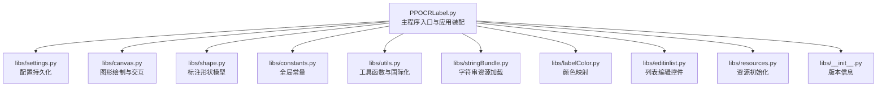
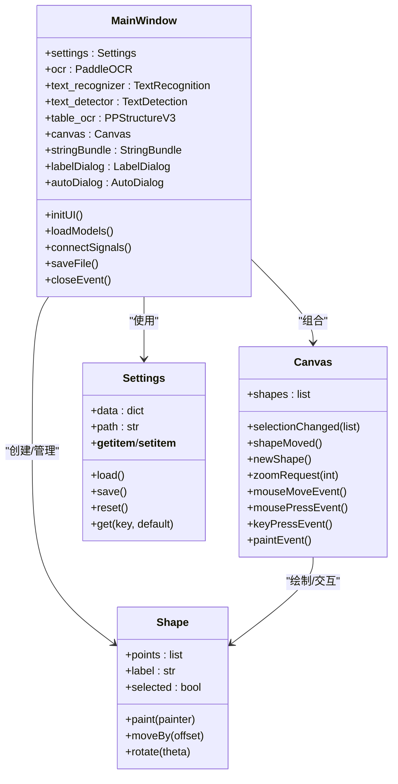
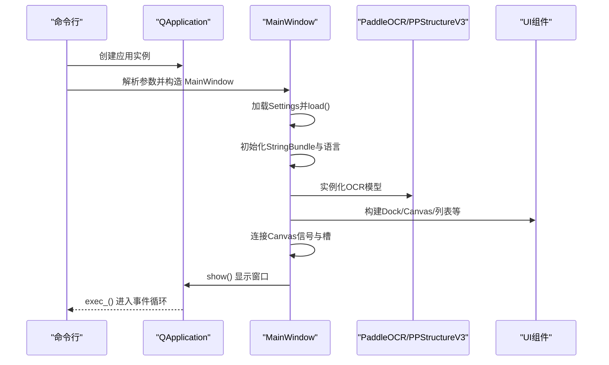
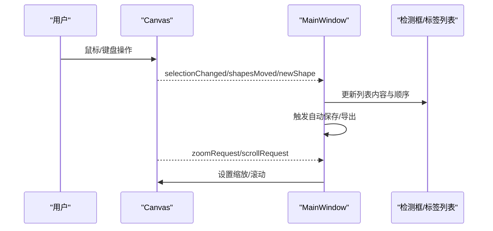
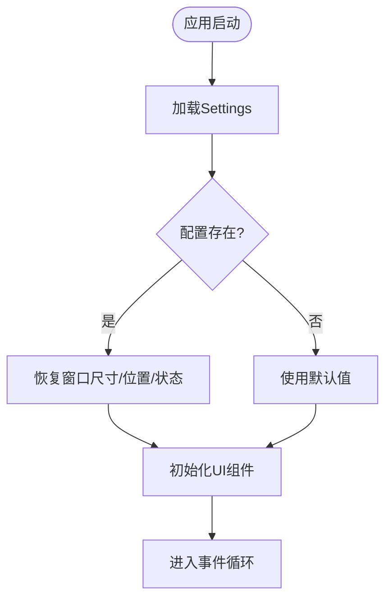
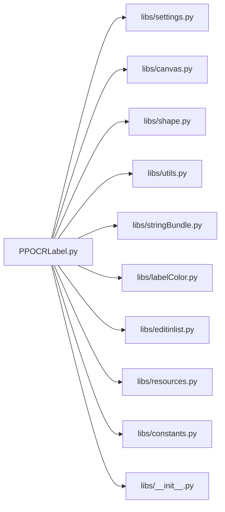

# 插件生命周期管理

<cite>
**本文引用的文件**
- [PPOCRLabel.py](PPOCRLabel.md)
- [libs/settings.py](settings.md)
- [libs/canvas.py](canvas.md)
- [libs/constants.py](constants.md)
- [libs/utils.py](utils.md)
- [libs/shape.py](shape.md)
- [libs/stringBundle.py](stringBundle.md)
- [libs/labelColor.py](labelColor.md)
- [libs/editinlist.py](editinlist.md)
- [libs/__init__.py](__init__.md)
- [libs/resources.py](resources.md)
- [README.md](README.md)
</cite>

## 目录
1. [简介](#简介)
2. [项目结构](#项目结构)
3. [核心组件](#核心组件)
4. [架构总览](#架构总览)
5. [详细组件分析](#详细组件分析)
6. [依赖关系分析](#依赖关系分析)
7. [性能考量](#性能考量)
8. [故障排查指南](#故障排查指南)
9. [结论](#结论)
10. [附录](#附录)

## 简介
本文档系统性阐述 PPOCRLabel 的“插件生命周期管理”。在该应用中，“插件”并非独立可热插拔模块，而是指应用内各功能子系统（如图形绘制、模型推理、配置管理、资源加载等）在启动、初始化、运行、事件驱动与退出阶段的行为与协作方式。本文将围绕以下主题展开：
- 插件加载与初始化：主程序入口、参数解析、模型实例化、UI 组件装配与信号连接
- 运行期交互：Canvas 与 MainWindow 的事件桥接、状态同步与数据流
- 卸载与清理：窗口关闭流程、资源释放与配置落盘
- 配置管理：Settings 持久化、常量定义与默认值策略
- 错误处理与异常恢复：日志记录、健壮性设计与容错机制

## 项目结构
PPOCRLabel 采用基于功能域的组织方式，核心入口位于根目录的主程序文件，功能模块集中在 libs 子目录，资源通过资源编译器打包并在运行时初始化。

图表来源
- [PPOCRLabel.py](PPOCRLabel.md)
- [libs/settings.py](settings.md)
- [libs/canvas.py](canvas.md)
- [libs/shape.py](shape.md)
- [libs/constants.py](constants.md)
- [libs/utils.py](utils.md)
- [libs/stringBundle.py](stringBundle.md)
- [libs/labelColor.py](labelColor.md)
- [libs/editinlist.py](editinlist.md)
- [libs/resources.py](resources.md)
- [libs/__init__.py](__init__.md)

章节来源
- [PPOCRLabel.py](PPOCRLabel.md)
- [README.md](README.md)

## 核心组件
- 主窗口类 MainWindow：负责应用整体状态、UI 组件装配、模型实例化、动作与事件绑定、文件与标签管理、自动保存与导出等。
- Canvas：图形绘制与交互核心，封装鼠标/键盘事件、形状高亮与移动、缩放与滚动、绘制状态机与信号发射。
- Settings：应用配置持久化，支持加载、保存、重置，使用 pickle 序列化存储。
- Shape：标注形状的数据模型，包含点集、边界盒、高亮与绘制逻辑。
- Constants：集中定义配置键、输出格式、编码等常量。
- Utils：通用工具函数，含图标、动作构建、自然排序、图像裁剪、HTML 转换等。
- StringBundle：国际化字符串资源加载，支持回退链路。
- labelColor：标签颜色映射生成。
- editinlist：列表项内编辑控件。
- resources：资源初始化与清理入口。

章节来源
- [PPOCRLabel.py](PPOCRLabel.md)
- [libs/canvas.py](canvas.md)
- [libs/settings.py](settings.md)
- [libs/shape.py](shape.md)
- [libs/constants.py](constants.md)
- [libs/utils.py](utils.md)
- [libs/stringBundle.py](stringBundle.md)
- [libs/labelColor.py](labelColor.md)
- [libs/editinlist.py](editinlist.md)
- [libs/resources.py](resources.md)

## 架构总览
应用采用“主窗口 + 多子系统”的架构，主程序负责装配与协调，子系统通过信号/槽与事件驱动实现解耦。

图表来源
- [PPOCRLabel.py](PPOCRLabel.md)
- [libs/canvas.py](canvas.md)
- [libs/settings.py](settings.md)
- [libs/shape.py](shape.md)

## 详细组件分析

### 主程序入口与生命周期
- 入口函数 main() 调用 get_main_app() 创建 QApplication，并解析命令行参数，随后构造 MainWindow 并显示。
- MainWindow 在 __init__ 中完成：
  - 初始化 Settings 并加载持久化配置
  - 加载语言包与字符串资源
  - 实例化 OCR 推理模型（PaddleOCR、TextRecognition、TextDetection、PPStructureV3）
  - 构建 UI 组件（文件列表、标签列表、检测框列表、Canvas、工具栏等）
  - 建立信号/槽连接（Canvas 与 MainWindow 的事件桥接）
  - 设置窗口尺寸、位置、状态与 Dock 布局
- 应用进入事件循环，等待用户交互与事件驱动。

图表来源
- [PPOCRLabel.py](PPOCRLabel.md)
- [libs/settings.py](settings.md)
- [libs/stringBundle.py](stringBundle.md)

章节来源
- [PPOCRLabel.py](PPOCRLabel.md)
- [README.md](README.md)

### Canvas 与 MainWindow 的交互
- Canvas 提供绘制状态机与多种信号（如 selectionChanged、shapeMoved、newShape、zoomRequest、scrollRequest），MainWindow 订阅这些信号以更新 UI 状态、同步列表与标签。
- Canvas 支持四种标注模式（矩形/四点）、顶点高亮与拖拽、平移与缩放、键盘快捷键（如顶点微调、旋转）。
- MainWindow 在 Canvas 事件触发后，更新检测框列表、标签列表、索引同步、自动保存与导出等。

图表来源
- [libs/canvas.py](canvas.md)
- [PPOCRLabel.py](PPOCRLabel.md)

章节来源
- [libs/canvas.py](canvas.md)
- [PPOCRLabel.py](PPOCRLabel.md)

### 配置管理与状态同步
- Settings 使用 pickle 将字典序列化到用户主目录下的设置文件，提供 load/save/reset/get 等接口。
- MainWindow 在 __init__ 中读取窗口尺寸、位置、最近文件、绘图颜色等配置键（来自 constants），并在运行期通过 Settings 同步状态。
- 常量定义集中于 constants，统一键名与默认值策略，避免魔法字符串散落。

图表来源
- [libs/settings.py](settings.md)
- [libs/constants.py](constants.md)
- [PPOCRLabel.py](PPOCRLabel.md)

章节来源
- [libs/settings.py](settings.md)
- [libs/constants.py](constants.md)
- [PPOCRLabel.py](PPOCRLabel.md)

### 资源与国际化
- resources.py 由资源编译器生成，提供 qInitResources/qCleanupResources，确保图标、字符串等资源在应用生命周期内可用。
- StringBundle 支持按区域回退链加载字符串资源，缺失键会抛出断言错误，便于早期发现配置问题。

章节来源
- [libs/resources.py](resources.md)
- [libs/stringBundle.py](stringBundle.md)

### 错误处理与异常恢复
- 日志记录：各模块使用标准库 logging 获取 logger，统一输出日志。
- 图像处理与几何计算：utils 中包含图像裁剪、旋转、坐标变换等，捕获异常并记录错误信息，避免崩溃。
- 字符串资源：StringBundle 对缺失键进行断言，有助于快速定位资源问题。
- Canvas/Shape：对异常坐标与几何计算进行保护，避免异常输入导致崩溃。

章节来源
- [libs/utils.py](utils.md)
- [libs/stringBundle.py](stringBundle.md)
- [libs/canvas.py](canvas.md)
- [libs/shape.py](shape.md)

## 依赖关系分析

图表来源
- [PPOCRLabel.py](PPOCRLabel.md)
- [libs/settings.py](settings.md)
- [libs/canvas.py](canvas.md)
- [libs/shape.py](shape.md)
- [libs/utils.py](utils.md)
- [libs/stringBundle.py](stringBundle.md)
- [libs/labelColor.py](labelColor.md)
- [libs/editinlist.py](editinlist.md)
- [libs/resources.py](resources.md)
- [libs/constants.py](constants.md)
- [libs/__init__.py](__init__.md)

章节来源
- [PPOCRLabel.py](PPOCRLabel.md)

## 性能考量
- 模型推理：PaddleOCR/PPStructureV3 在 MainWindow 初始化时实例化，建议根据硬件选择 GPU/CPU 与模型名称，避免不必要的初始化开销。
- 图形绘制：Canvas 使用 QPainterPath 与抗锯齿渲染，注意在大图场景下的缩放与滚动性能；可通过合理设置字体大小与绘制频率优化。
- 列表同步：标签与索引列表的同步与拖拽排序可能带来额外开销，建议在批量操作时减少刷新频率。
- 资源加载：资源编译与初始化在应用启动时完成，避免运行时重复加载。

## 故障排查指南
- 资源缺失：若出现“缺少字符串 id”等错误，请重新编译资源文件。
- 图像相关异常：opencv 版本不兼容或属性缺失会导致异常，需按 README 的提示修复依赖。
- 模型初始化失败：检查模型路径与设备选择，确保模型文件存在且可访问。
- 配置损坏：Settings 文件损坏时会记录警告并回退到默认行为，可调用 reset 清理后重试。

章节来源
- [README.md](README.md)
- [libs/settings.py](settings.md)

## 结论
PPOCRLabel 的“插件生命周期管理”体现在主程序对各子系统的有序装配与事件驱动协作上。通过 Settings 的配置持久化、Canvas 的事件桥接、资源与国际化的统一管理，以及完善的错误处理机制，应用实现了稳定、可扩展且易维护的生命周期闭环。遵循本文的最佳实践，可在保证主程序稳定性的同时，安全地扩展与定制功能。

## 附录

### 配置管理最佳实践
- 配置文件格式：使用 pickle 序列化字典，键名统一来源于 constants，避免硬编码。
- 默认值设置：在 Settings.get 中提供默认值，确保配置缺失时有合理回退。
- 配置验证：在加载后进行基本校验（如路径存在性、数值范围），必要时记录警告并引导用户修正。
- 配置迁移：新增字段时保留向后兼容，避免破坏旧配置文件。

章节来源
- [libs/settings.py](settings.md)
- [libs/constants.py](constants.md)