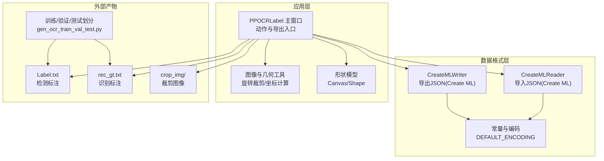
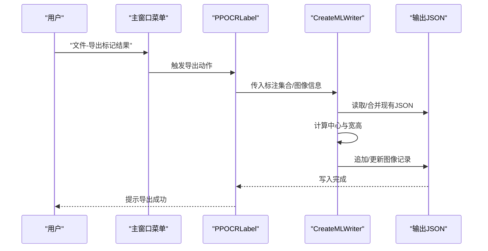
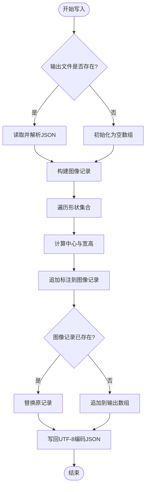
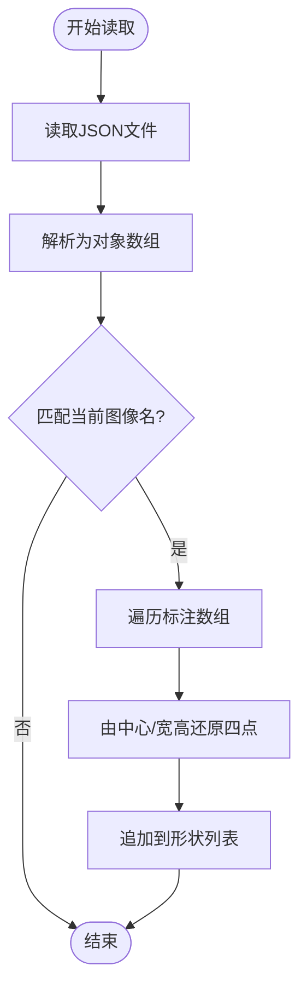
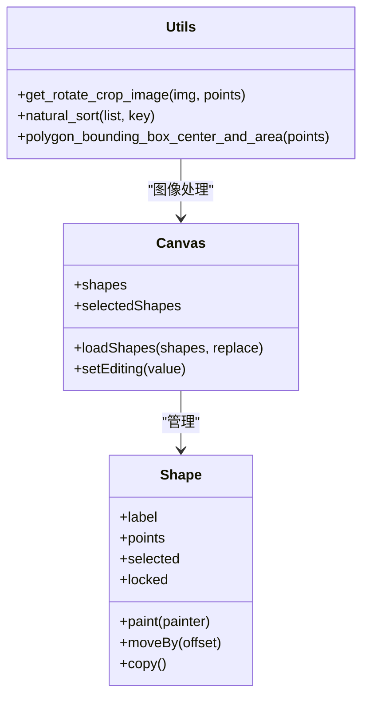
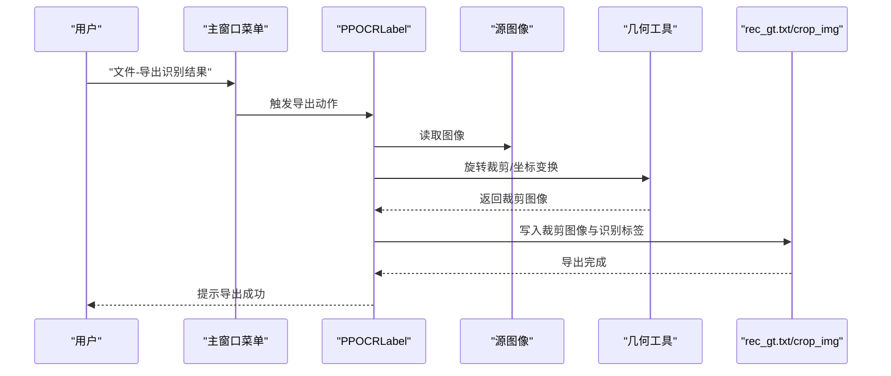
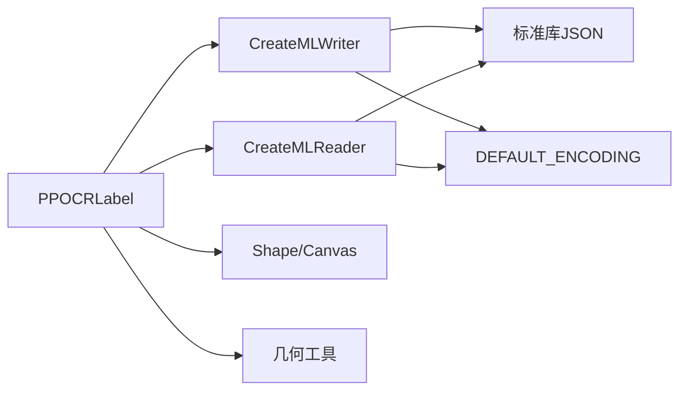

# 数据格式支持

<cite>
**本文引用的文件**
- [libs/create_ml_io.py](create_ml_io.md)
- [libs/constants.py](constants.md)
- [libs/utils.py](utils.md)
- [libs/shape.py](shape.md)
- [PPOCRLabel.py](PPOCRLabel.md)
- [README.md](README.md)
- [gen_ocr_train_val_test.py](gen_ocr_train_val_test.md)
</cite>

## 目录
1. [简介](#简介)
2. [项目结构](#项目结构)
3. [核心组件](#核心组件)
4. [架构总览](#架构总览)
5. [详细组件分析](#详细组件分析)
6. [依赖分析](#依赖分析)
7. [性能考虑](#性能考虑)
8. [故障排查指南](#故障排查指南)
9. [结论](#结论)
10. [附录](#附录)

## 简介
本文件聚焦于 PPOCRLabel 中的数据格式支持能力，特别是 Create ML 格式（JSON）的导入与导出实现机制。文档将系统阐述：
- Create ML 格式的数据结构转换、格式校验与错误处理
- 如何扩展支持新的数据格式（如 JSON、XML、CSV）
- 自定义数据格式的开发指南（格式规范、序列化/反序列化、向后兼容）
- 性能优化策略（增量处理、内存映射、并行处理）
- 数据质量检查、格式标准化与批量转换方案

## 项目结构
围绕数据格式支持的关键模块如下：
- Create ML 导入导出：libs/create_ml_io.py
- 常量与编码：libs/constants.py
- 图像与几何工具：libs/utils.py
- 标注形状模型：libs/shape.py
- 主应用与导出入口：PPOCRLabel.py
- 使用说明与导出行为：README.md
- 训练/验证/测试集划分脚本：gen_ocr_train_val_test.py

图表来源
- [libs/create_ml_io.py](create_ml_io.md)
- [libs/constants.py](constants.md)
- [libs/utils.py](utils.md)
- [libs/shape.py](shape.md)
- [PPOCRLabel.py](PPOCRLabel.md)
- [gen_ocr_train_val_test.py](gen_ocr_train_val_test.md)

章节来源
- [libs/create_ml_io.py](create_ml_io.md)
- [libs/constants.py](constants.md)
- [libs/utils.py](utils.md)
- [libs/shape.py](shape.md)
- [PPOCRLabel.py](PPOCRLabel.md)
- [README.md](README.md)
- [gen_ocr_train_val_test.py](gen_ocr_train_val_test.md)

## 核心组件
- CreateMLWriter：将标注形状转换为 Create ML JSON 结构并写入文件；支持去重更新已有图像记录。
- CreateMLReader：从 Create ML JSON 文件读取指定图像的标注并转换为内部形状列表。
- 常量与编码：统一默认编码（UTF-8），确保跨平台一致性。
- 图像与几何工具：提供旋转裁剪、坐标变换等能力，支撑识别结果导出与质量检查。
- 主应用导出：提供“导出标记结果”“导出识别结果”等菜单项，调用相应逻辑。

章节来源
- [libs/create_ml_io.py](create_ml_io.md)
- [libs/constants.py](constants.md)
- [libs/utils.py](utils.md)
- [PPOCRLabel.py](PPOCRLabel.md)

## 架构总览
Create ML 导入导出在应用中的调用链路如下：

图表来源
- [PPOCRLabel.py](PPOCRLabel.md)
- [libs/create_ml_io.py](create_ml_io.md)

章节来源
- [PPOCRLabel.py](PPOCRLabel.md)
- [libs/create_ml_io.py](create_ml_io.md)

## 详细组件分析

### Create ML Writer 组件分析
- 输入参数：文件夹名、文件名、图像尺寸、形状集合、输出文件路径等
- 写入流程：
  - 若输出文件存在则读取并解析为字典；否则初始化为空数组
  - 为当前图像构建“图像名+标注数组”的结构
  - 遍历形状集合，计算边界框中心与宽高，并写入标注
  - 检查是否已存在该图像记录，若存在则替换，否则追加
  - 将最终结构以 UTF-8 编码写回文件
- 坐标计算：通过最小/最大坐标推导中心点与宽高，确保 Create ML 坐标系一致

图表来源
- [libs/create_ml_io.py](create_ml_io.md)

章节来源
- [libs/create_ml_io.py](create_ml_io.md)

### Create ML Reader 组件分析
- 输入参数：JSON 路径、目标图像文件路径
- 解析流程：
  - 读取 JSON 并解析为对象数组
  - 遍历数组，匹配当前图像名
  - 对每个标注，根据中心与宽高还原矩形四点坐标
  - 将形状追加到内部列表，供应用加载显示

图表来源
- [libs/create_ml_io.py](create_ml_io.md)

章节来源
- [libs/create_ml_io.py](create_ml_io.md)

### 形状模型与几何工具
- Shape：描述标注框的标签、点集、颜色、锁定状态等属性，支持绘制、高亮、复制等操作
- Canvas：承载 Shape 列表，响应鼠标事件，维护选中/编辑状态
- 几何工具：提供旋转裁剪、坐标变换、自然排序等能力，支撑识别结果导出与可视化

图表来源
- [libs/shape.py](shape.md)
- [libs/utils.py](utils.md)

章节来源
- [libs/shape.py](shape.md)
- [libs/utils.py](utils.md)

### 主应用导出与识别结果导出
- 导出标记结果：将已确认图像的标注写入 Label.txt（检测标注）
- 导出识别结果：裁剪文本区域图像并生成 rec_gt.txt（识别标注）
- 训练/验证/测试划分：基于 gen_ocr_train_val_test.py 将标注与图像按比例拆分

图表来源
- [PPOCRLabel.py](PPOCRLabel.md)
- [libs/utils.py](utils.md)

章节来源
- [PPOCRLabel.py](PPOCRLabel.md)
- [README.md](README.md)
- [gen_ocr_train_val_test.py](gen_ocr_train_val_test.md)

## 依赖分析
- CreateMLWriter/Reader 依赖：
  - JSON 解析与写入
  - 默认编码常量（UTF-8）
  - 文件存在性判断与路径处理
- 主应用依赖：
  - 菜单动作（导出标记结果、导出识别结果）
  - Canvas/Shape 提供的标注数据
  - 几何工具提供的图像处理能力

图表来源
- [libs/create_ml_io.py](create_ml_io.md)
- [libs/constants.py](constants.md)
- [PPOCRLabel.py](PPOCRLabel.md)

章节来源
- [libs/create_ml_io.py](create_ml_io.md)
- [libs/constants.py](constants.md)
- [PPOCRLabel.py](PPOCRLabel.md)

## 性能考虑
- 增量处理
  - CreateMLWriter 在写入前仅读取并解析现有 JSON，避免全量扫描
  - 通过“图像名匹配+替换/追加”减少重复写入成本
- 内存映射与大文件
  - 当前实现采用一次性读取/写入，建议在大规模数据场景下：
    - 分块读取 JSON（逐条处理并流式写回）
    - 使用临时文件与原子替换，降低锁竞争与崩溃风险
- 并行处理
  - 多图像导出时可并行执行：
    - 图像裁剪与编码（注意线程安全与资源竞争）
    - JSON 合并阶段串行写入，避免竞态
- I/O 优化
  - 统一 UTF-8 编码，减少字符集转换开销
  - 批量写入（一次 flush）优于频繁小写入

[本节为通用性能建议，无需特定文件引用]

## 故障排查指南
- JSON 解码失败
  - 现象：日志记录“JSON decoding failed”
  - 排查：检查 JSON 文件完整性与编码；确认 CreateMLReader 初始化路径正确
- 图像导出异常
  - 现象：部分图像无法保存，弹窗提示检查路径与标签
  - 排查：确认图像路径存在且可读；检查标注点集有效性；查看日志异常堆栈
- 编码问题
  - 现象：中文乱码或写入异常
  - 排查：确保 DEFAULT_ENCODING 为 UTF-8；导出时统一编码写入

章节来源
- [libs/create_ml_io.py](create_ml_io.md)
- [PPOCRLabel.py](PPOCRLabel.md)
- [libs/constants.py](constants.md)

## 结论
- Create ML 格式在本项目中以 JSON 实现，具备稳定的导入/导出流程与错误处理
- 通过 Shape/Canvas 与几何工具的配合，实现了从标注到识别结果导出的完整闭环
- 扩展新格式时，建议遵循统一的序列化接口、严格的格式校验与错误日志，并提供增量与并行优化策略
- 建议在生产环境引入流式处理与原子写入，提升稳定性与性能

[本节为总结性内容，无需特定文件引用]

## 附录

### 扩展支持新数据格式（JSON/XML/CSV）指南
- 格式规范定义
  - 明确字段映射关系（如标签、边界框、置信度、类别等）
  - 统一坐标系（像素/归一化）、单位与精度
- 序列化与反序列化
  - Reader：解析输入文件，校验结构与类型，转换为内部形状列表
  - Writer：将内部形状列表转换为目标格式，写入文件并进行完整性校验
- 错误处理
  - 对缺失字段、非法值、编码问题进行捕获与日志记录
  - 支持回滚与重试机制
- 向后兼容
  - 保留旧字段并在新版本中兼容读取
  - 提供迁移脚本与版本声明
- 性能优化
  - 增量写入、流式处理、并行导出
  - 使用内存映射或分块 I/O 处理超大文件

[本节为通用开发指南，无需特定文件引用]

### 数据质量检查与标准化
- 质量检查
  - 边界框有效性（非空、顺序正确、数值范围合理）
  - 标签一致性（大小写、特殊字符、长度限制）
  - 图像与标注匹配（路径存在、尺寸一致）
- 格式标准化
  - 统一字段命名与缩进风格
  - 引入 Schema 校验（如 JSON Schema）保障结构一致性
- 批量转换
  - 提供批处理脚本，支持多格式互转与统计报告
  - 与 gen_ocr_train_val_test.py 协作，实现数据集划分与导出

[本节为通用实践建议，无需特定文件引用]