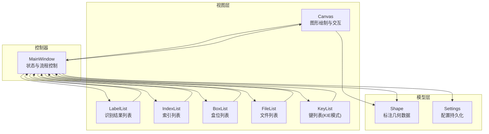
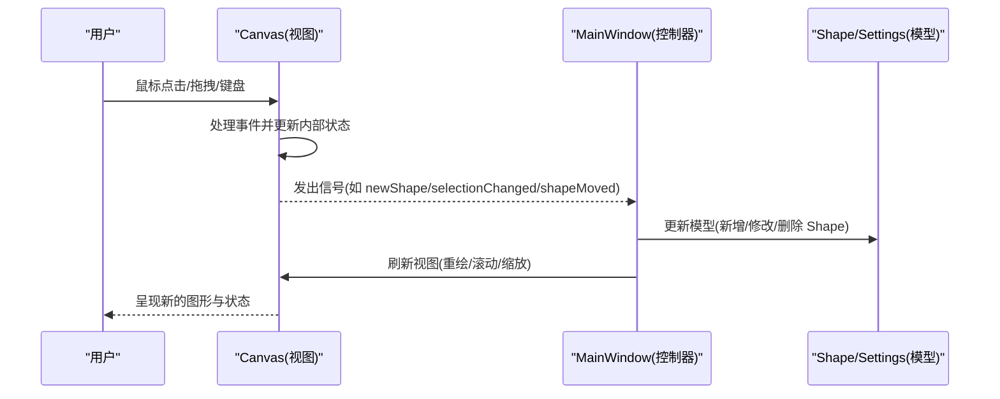
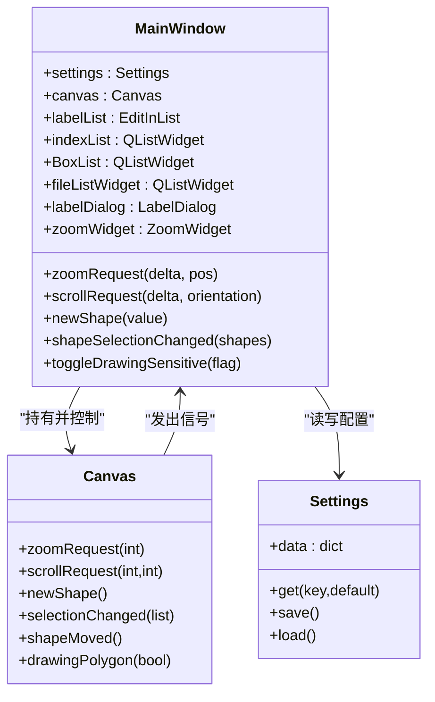
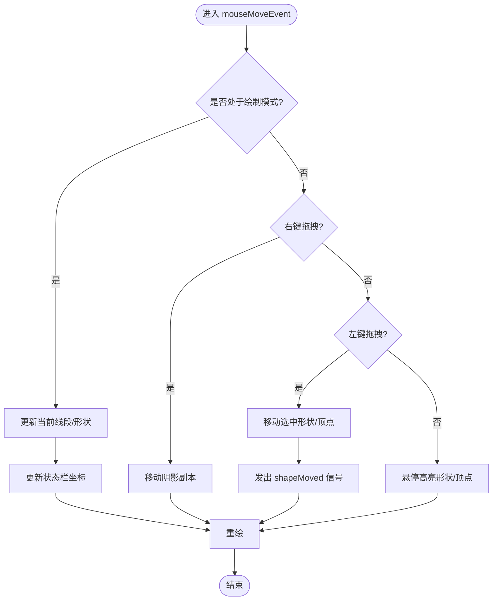
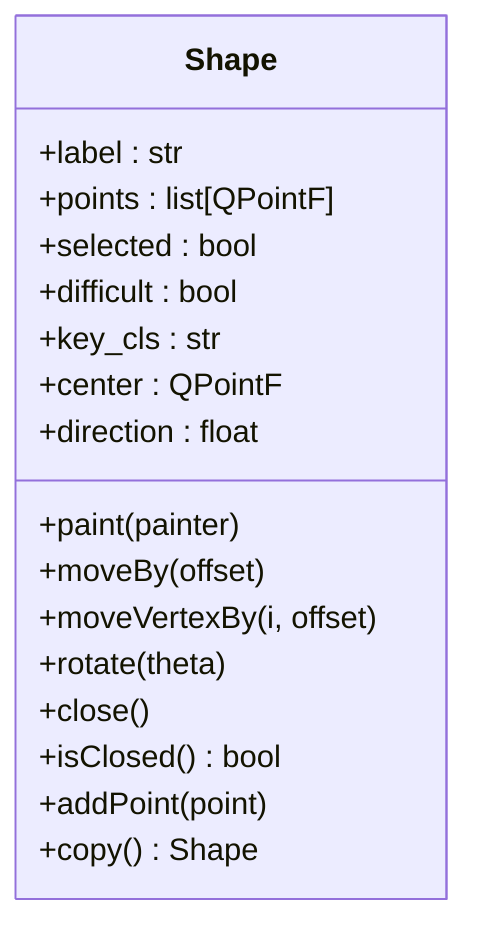
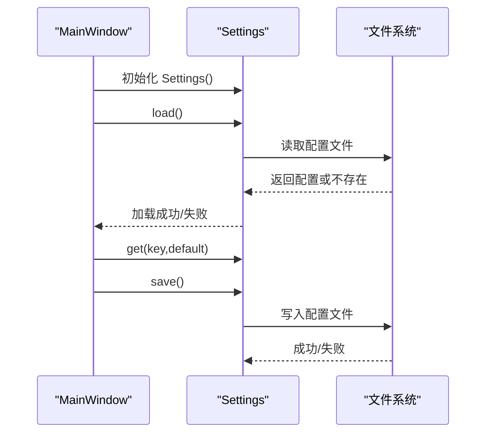
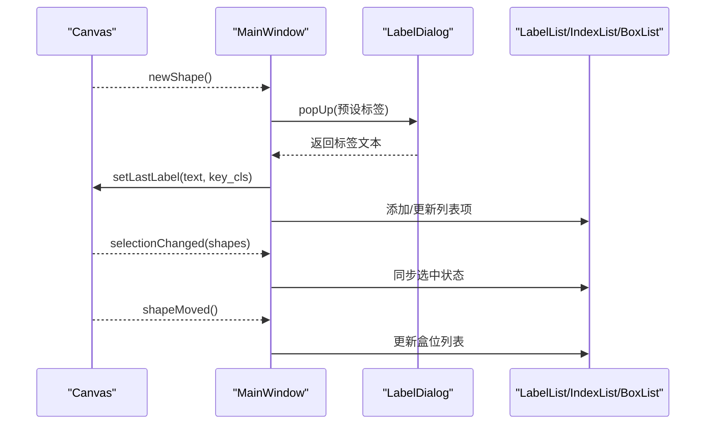
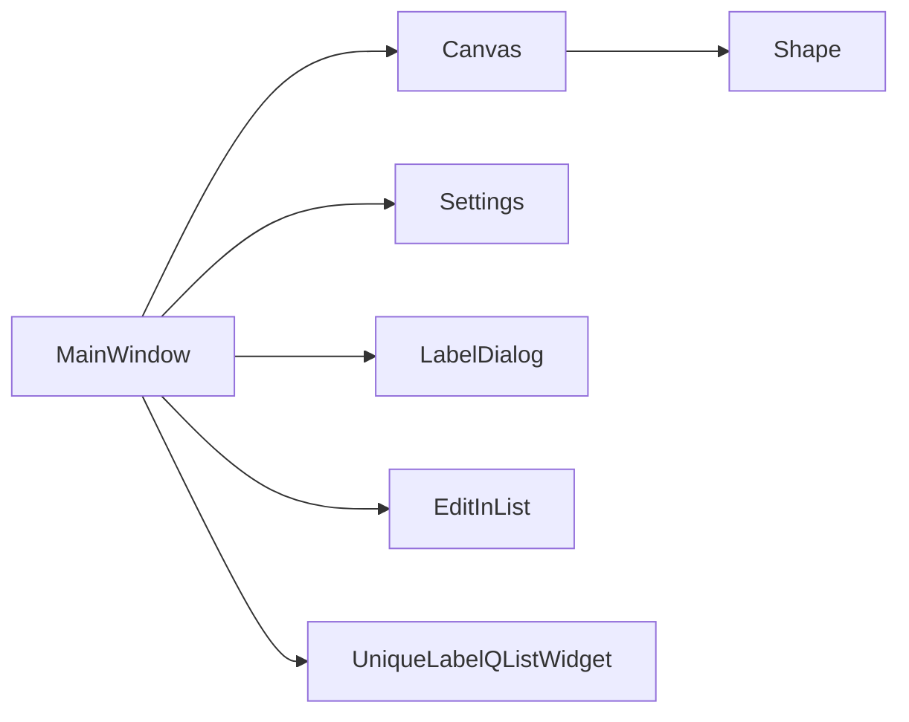

# MVC 架构模式

<cite>
**本文引用的文件列表**
- [PPOCRLabel.py](PPOCRLabel.md)
- [libs/canvas.py](canvas.md)
- [libs/shape.py](shape.md)
- [libs/settings.py](settings.md)
- [libs/constants.py](constants.md)
- [libs/utils.py](utils.md)
- [libs/labelDialog.py](labelDialog.md)
- [libs/editinlist.py](editinlist.md)
- [libs/unique_label_qlist_widget.py](unique_label_qlist_widget.md)
</cite>

## 目录
1. [引言](#引言)
2. [项目结构](#项目结构)
3. [核心组件](#核心组件)
4. [架构总览](#架构总览)
5. [详细组件分析](#详细组件分析)
6. [依赖关系分析](#依赖关系分析)
7. [性能考量](#性能考量)
8. [故障排查指南](#故障排查指南)
9. [结论](#结论)

## 引言
本文件系统化阐述 PPOCRLabel 的 MVC 架构设计与实现，重点说明：
- MainWindow 作为控制器如何管理应用状态、用户交互与业务流程；
- Canvas 作为视图如何处理图形渲染、用户输入与事件分发；
- Shape 与 Settings 作为模型如何封装数据与业务逻辑；
- 三者之间的数据流与控制流，以及信号槽机制的使用方式；
- 如何通过 MVC 实现关注点分离与代码可维护性。

## 项目结构
PPOCRLabel 采用 PyQt5 GUI 框架，遵循 MVC 分层：
- 视图层（View）：Canvas、各类列表控件（标签列表、索引列表、盒位列表等）
- 控制器（Controller）：MainWindow，负责状态管理、事件路由、动作协调
- 模型（Model）：Shape（标注几何）、Settings（配置持久化）

图表来源
- [PPOCRLabel.py](PPOCRLabel.md)
- [libs/canvas.py](canvas.md)
- [libs/shape.py](shape.md)
- [libs/settings.py](settings.md)

章节来源
- [PPOCRLabel.py](PPOCRLabel.md)
- [libs/canvas.py](canvas.md)
- [libs/shape.py](shape.md)
- [libs/settings.py](settings.md)

## 核心组件
- MainWindow（控制器）
  - 负责窗口布局、菜单与工具栏、动作绑定、缩放与滚动、文件加载与保存、KIE 模式支持、自动识别与批量操作等。
  - 通过信号槽连接 Canvas 与各视图，驱动模型更新与界面刷新。
- Canvas（视图）
  - 继承自 QWidget，负责图像绘制、形状渲染、鼠标键盘事件处理、拖拽与平移、缩放与滚动请求。
  - 通过信号向外广播：缩放请求、滚动请求、新形状创建、选择变化、形状移动等。
- Shape（模型）
  - 封装标注几何数据（点集、闭合状态、颜色、标签、是否困难等），提供绘制、旋转、移动、高亮等行为。
- Settings（模型）
  - 提供配置项的存取与持久化，键值来自常量定义。

章节来源
- [PPOCRLabel.py](PPOCRLabel.md)
- [libs/canvas.py](canvas.md)
- [libs/shape.py](shape.md)
- [libs/settings.py](settings.md)

## 架构总览
MVC 在 PPOCRLabel 中的体现：
- 视图（Canvas）渲染 Shape 并响应用户输入，发出信号；
- 控制器（MainWindow）订阅 Canvas 信号，更新模型与视图；
- 模型（Shape/Settings）承载数据与业务规则，被视图与控制器共同消费。

图表来源
- [libs/canvas.py](canvas.md)
- [PPOCRLabel.py](PPOCRLabel.md)
- [libs/shape.py](shape.md)
- [libs/settings.py](settings.md)

## 详细组件分析

### MainWindow（控制器）
- 状态管理
  - 应用窗口、缩放模式、脏标记、文件列表、标签历史、预定义类别、KIE 模式等。
  - 通过 Settings 加载/保存配置，维持窗口尺寸、颜色、最近文件等。
- 事件与动作
  - 绑定菜单、工具按钮、快捷键到具体方法；根据编辑/创建模式切换启用/禁用动作。
  - 处理打开目录、保存、删除、重置、自动识别、重新识别等业务动作。
- 与 Canvas 的信号槽连接
  - Canvas.zoomRequest → MainWindow.zoomRequest
  - Canvas.scrollRequest → MainWindow.scrollRequest
  - Canvas.newShape → MainWindow.newShape
  - Canvas.shapeMoved → MainWindow.updateBoxlist
  - Canvas.selectionChanged → MainWindow.shapeSelectionChanged
  - Canvas.drawingPolygon → MainWindow.toggleDrawingSensitive
- 与视图联动
  - 同步标签列表、索引列表、盒位列表与 Canvas 的选中状态；
  - 通过 LabelDialog、EditInList、UniqueLabelQListWidget 等视图组件完成用户输入与编辑。

图表来源
- [PPOCRLabel.py](PPOCRLabel.md)
- [libs/canvas.py](canvas.md)
- [libs/settings.py](settings.md)

章节来源
- [PPOCRLabel.py](PPOCRLabel.md)
- [PPOCRLabel.py](PPOCRLabel.md)
- [PPOCRLabel.py](PPOCRLabel.md)

### Canvas（视图）
- 渲染与绘制
  - 绘制背景图、标注形状、顶点高亮、文本标签与索引、填充区域、辅助线等。
  - 根据缩放比例与偏移计算坐标变换，保证绘制精度。
- 用户交互
  - 鼠标事件：绘制多边形、移动形状、拖拽顶点、平移画布、双击闭合等。
  - 键盘事件：撤销上一点、回车闭合、方向键微调、旋转等。
- 信号与状态
  - 发出 zoomRequest、scrollRequest、newShape、selectionChanged、shapeMoved、drawingPolygon 等信号。
  - 内部维护 shapes、selectedShapes、current、visible 等状态，支持撤销/恢复。

图表来源
- [libs/canvas.py](canvas.md)
- [libs/canvas.py](canvas.md)

章节来源
- [libs/canvas.py](canvas.md)
- [libs/canvas.py](canvas.md)
- [libs/canvas.py](canvas.md)

### Shape（模型）
- 数据结构
  - points：顶点序列；label/difficult/key_cls：标注信息；selected/fill/locked：显示与状态；center/direction：几何属性。
- 行为方法
  - close/isClosed/reachMaxPoints/addPoint/popPoint/closeEnough：几何与拓扑；
  - moveBy/moveVertexBy/rotate/rotatePoint/highlightVertex/highlightClear：几何变换；
  - paint/drawVertex/makePath/boundingRect：绘制与命中测试；
  - copy/__getitem__/__setitem__/__len__：克隆与访问。
- 与视图协作
  - Canvas 通过 Shape 的 paint 方法进行渲染；Canvas 的 selectionChanged/shapeMoved 等信号由控制器消费以更新 UI。

图表来源
- [libs/shape.py](shape.md)
- [libs/shape.py](shape.md)
- [libs/shape.py](shape.md)

章节来源
- [libs/shape.py](shape.md)
- [libs/shape.py](shape.md)

### Settings（模型）
- 功能
  - 以字典形式存储配置项，提供 get/set 接口；
  - 使用 pickle 持久化到用户主目录下的配置文件；
  - 支持加载失败时的容错与重置。
- 常量键
  - 通过 constants 定义键名，如窗口尺寸、颜色、最近文件、保存目录、绘图模式等。

图表来源
- [libs/settings.py](settings.md)
- [libs/constants.py](constants.md)

章节来源
- [libs/settings.py](settings.md)
- [libs/constants.py](constants.md)

### 信号槽机制与数据流
- Canvas → MainWindow
  - zoomRequest：缩放请求，MainWindow 计算滚动条增量并设置值；
  - scrollRequest：滚动请求，MainWindow 调整滚动条；
  - newShape：触发标签对话框，生成 Shape 并加入 Canvas；
  - selectionChanged：同步标签列表/索引列表/盒位列表的选中状态；
  - shapeMoved：触发 BoxList 更新与脏标记；
  - drawingPolygon：切换绘制敏感状态。
- MainWindow → Canvas
  - 设置绘制模式、方形绘制开关、可见性、颜色等；
  - 触发 loadPixmap/loadShapes、setShapeVisible、setLastLabel 等。
- 视图组件
  - LabelDialog：弹窗输入标签；
  - EditInList：就地编辑标签列表项；
  - UniqueLabelQListWidget：唯一标签列表，支持颜色标记与键值管理（KIE 模式）。

图表来源
- [PPOCRLabel.py](PPOCRLabel.md)
- [PPOCRLabel.py](PPOCRLabel.md)
- [libs/labelDialog.py](labelDialog.md)

章节来源
- [PPOCRLabel.py](PPOCRLabel.md)
- [PPOCRLabel.py](PPOCRLabel.md)
- [libs/labelDialog.py](labelDialog.md)

## 依赖关系分析
- 组件耦合
  - MainWindow 对 Canvas 具有强依赖（持有与控制），并通过信号槽解耦交互；
  - Canvas 仅依赖 Shape 进行绘制与状态管理，不直接依赖 MainWindow；
  - Settings 与 MainWindow 单向依赖（读取/写入），降低耦合度。
- 外部依赖
  - PyQt5 用于 GUI 事件与绘制；
  - OpenCV/PaddleOCR 用于图像与文本识别（非 MVC 核心）。

图表来源
- [PPOCRLabel.py](PPOCRLabel.md)
- [libs/canvas.py](canvas.md)
- [libs/shape.py](shape.md)

章节来源
- [PPOCRLabel.py](PPOCRLabel.md)
- [libs/canvas.py](canvas.md)

## 性能考量
- 绘制优化
  - Canvas 使用 Painter 缓存与按需重绘，避免全量重绘；
  - 通过 visible 与 _hideBackround 控制非选中形状的绘制；
  - 字体大小随图像尺寸动态调整，减少过度绘制。
- 事件处理
  - 鼠标与键盘事件在 Canvas 内部快速判断与短路返回，减少无效计算；
  - 滚动与缩放通过信号聚合，避免频繁 UI 刷新。
- 数据结构
  - Shape 使用 QPointF 列表与 QPainterPath，便于高效绘制与命中测试；
  - shapesBackups 限制长度，避免内存膨胀。

[本节为通用性能建议，无需特定文件引用]

## 故障排查指南
- 配置加载失败
  - 现象：启动后配置未生效或丢失；
  - 排查：确认配置文件路径与权限；检查 Settings.load 的异常日志；
  - 处理：调用 Settings.reset 或手动删除配置文件后重启。
- 图像无法显示
  - 现象：打开图像后空白或报错；
  - 排查：确认图像格式与编码；检查 loadFile 中的 QImage/QPixmap 创建；
  - 处理：更换图像格式或修复路径。
- 形状绘制异常
  - 现象：绘制越界、无法闭合、顶点不可拖拽；
  - 排查：检查 Canvas.outOfPixmap 与 closeEnough 的阈值；
  - 处理：调整 epsilon 或约束边界。
- 信号未触发
  - 现象：UI 不响应 Canvas 事件；
  - 排查：确认 MainWindow 是否正确连接 Canvas 信号；
  - 处理：重新初始化连接或检查信号发射点。

章节来源
- [libs/settings.py](settings.md)
- [libs/canvas.py](canvas.md)
- [libs/canvas.py](canvas.md)

## 结论
PPOCRLabel 的 MVC 架构清晰地实现了关注点分离：
- 控制器集中处理业务流程与状态同步；
- 视图专注渲染与交互反馈；
- 模型封装数据与行为，便于复用与扩展。
通过信号槽机制，三者松耦合协作，既保证了可维护性，也提升了用户体验。后续可在以下方面进一步优化：
- 将 Canvas 的复杂交互拆分为更细粒度的状态机；
- 将 Settings 的键值统一由 Constants 管理，减少魔法字符串；
- 为 Shape 增加更丰富的几何运算与校验接口，提升鲁棒性。