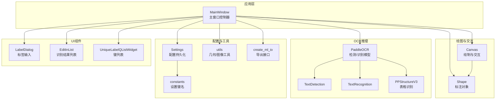
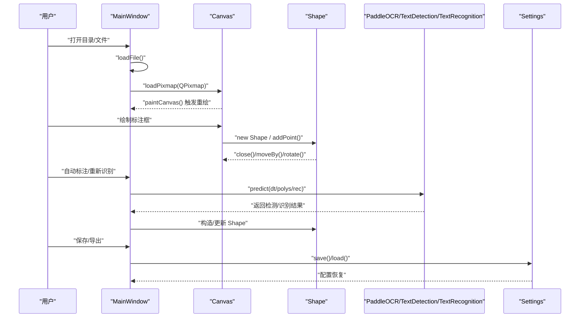
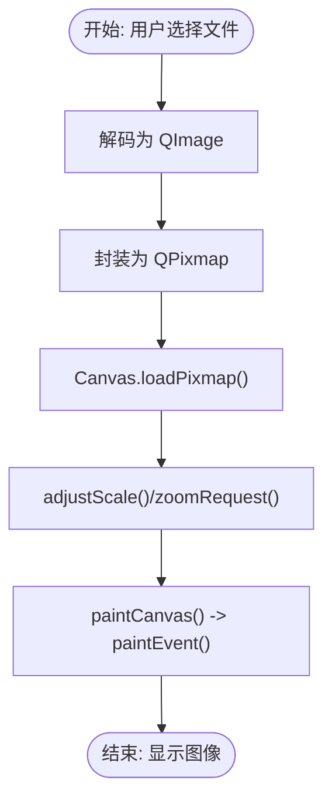
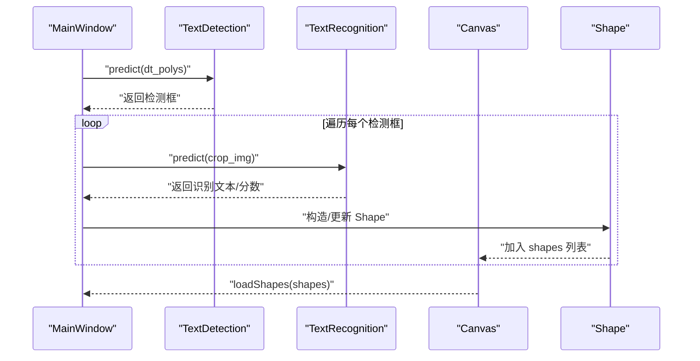
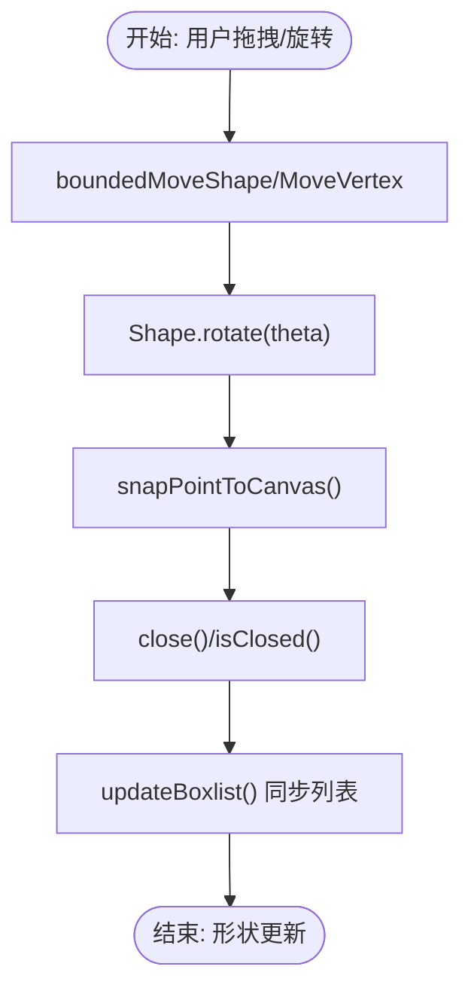
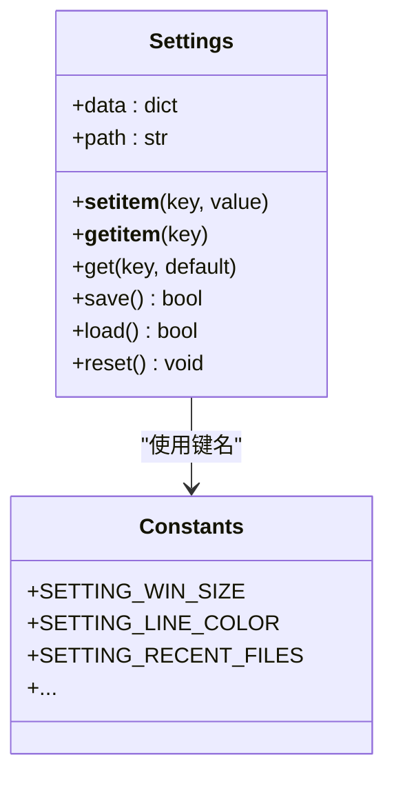
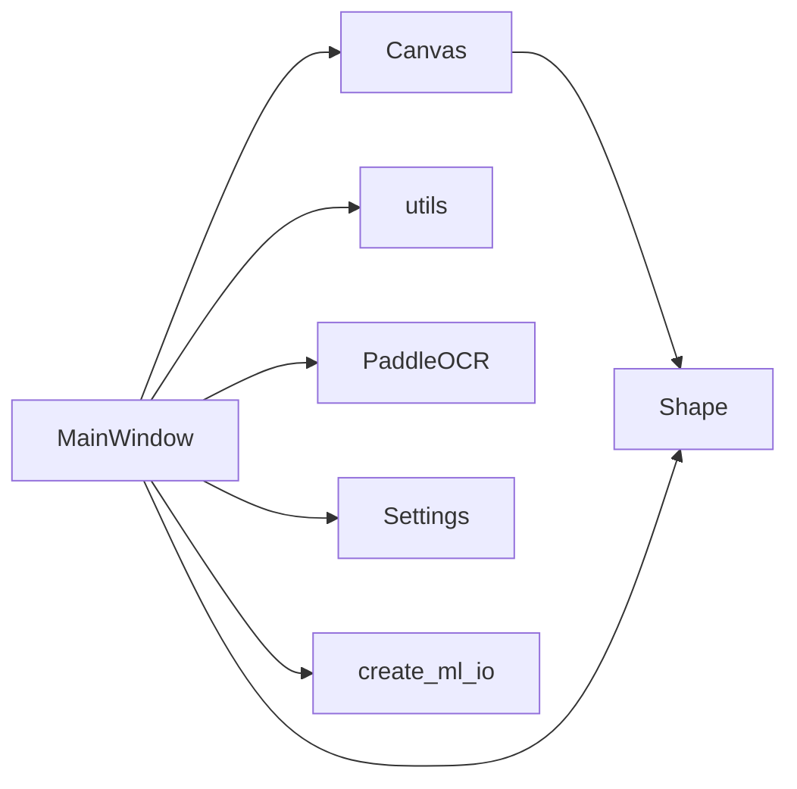

# 数据流管理

<cite>
**本文引用的文件**
- [PPOCRLabel.py](PPOCRLabel.md)
- [libs/shape.py](shape.md)
- [libs/canvas.py](canvas.md)
- [libs/settings.py](settings.md)
- [libs/utils.py](utils.md)
- [libs/constants.py](constants.md)
- [libs/create_ml_io.py](create_ml_io.md)
- [libs/labelDialog.py](labelDialog.md)
- [libs/editinlist.py](editinlist.md)
- [libs/unique_label_qlist_widget.py](unique_label_qlist_widget.md)
</cite>

## 目录
1. [简介](#简介)
2. [项目结构](#项目结构)
3. [核心组件](#核心组件)
4. [架构总览](#架构总览)
5. [详细组件分析](#详细组件分析)
6. [依赖关系分析](#依赖关系分析)
7. [性能考量](#性能考量)
8. [故障排查指南](#故障排查指南)
9. [结论](#结论)
10. [附录](#附录)

## 简介
本文件系统性梳理 PPOCRLabel 的数据流管理，覆盖从图像加载、OCR 推理、标注框几何变换、到配置与标注数据持久化的完整链路。重点解释：
- 图像加载与显示：从磁盘到 QImage/QPixmap 到 Canvas 的渲染管线
- OCR 推理结果的数据结构与转换：文本检测/识别输出到内部 Shape 结构
- 标注框的几何变换：旋转、缩放、平移、四点/矩形模式切换
- 配置数据的持久化：Settings 的序列化与恢复
- 组件间数据传递：Shape 对象状态、Canvas 绘制数据、Settings 同步

## 项目结构
项目采用 PyQt5 + PaddleOCR 的桌面应用架构，核心入口为 MainWindow，围绕其构建 Canvas、Shape、Settings 等子系统，并通过工具模块提供通用能力。



图表来源
- [PPOCRLabel.py](PPOCRLabel.md)
- [libs/canvas.py](canvas.md)
- [libs/shape.py](shape.md)
- [libs/settings.py](settings.md)
- [libs/utils.py](utils.md)
- [libs/create_ml_io.py](create_ml_io.md)
- [libs/labelDialog.py](labelDialog.md)
- [libs/editinlist.py](editinlist.md)
- [libs/unique_label_qlist_widget.py](unique_label_qlist_widget.md)

章节来源
- [PPOCRLabel.py](PPOCRLabel.md)

## 核心组件
- MainWindow：应用主控制器，负责图像加载、OCR 推理调度、标注数据组织、配置持久化、UI 控件绑定与事件分发。
- Canvas：绘图与交互核心，维护 Shape 列表、鼠标事件处理、缩放滚动、绘制状态与信号。
- Shape：标注对象，包含点集、颜色、选中/锁定状态、文本标签等，支持旋转、移动、绘制。
- Settings：配置存储，以 pickle 序列化键值对，支持默认路径与加载/保存。
- utils：提供几何计算（旋转裁剪、四边形生成、边界盒中心面积）、图像处理、字符串工具等。
- create_ml_io：导出接口（CreateML Writer/Reader）用于 JSON 导出。
- UI 组件：LabelDialog、EditInList、UniqueLabelQListWidget 等，支撑标签编辑与列表展示。

章节来源
- [libs/shape.py](shape.md)
- [libs/canvas.py](canvas.md)
- [libs/settings.py](settings.md)
- [libs/utils.py](utils.md)
- [libs/create_ml_io.py](create_ml_io.md)
- [libs/labelDialog.py](labelDialog.md)
- [libs/editinlist.py](editinlist.md)
- [libs/unique_label_qlist_widget.py](unique_label_qlist_widget.md)

## 架构总览
应用以 MainWindow 为中心，通过信号槽连接 Canvas 与 UI 控件，Canvas 内部持有 Shape 列表并驱动绘制；OCR 推理由 PaddleOCR 提供，返回结构化文本检测/识别结果，经 MainWindow 转换为 Shape 并写入标注缓存；配置由 Settings 持久化，常量定义于 constants。



图表来源
- [PPOCRLabel.py](PPOCRLabel.md)
- [libs/canvas.py](canvas.md)
- [libs/shape.py](shape.md)
- [libs/settings.py](settings.md)

## 详细组件分析

### 图像加载与显示数据流
- 加载流程：MainWindow 调用 loadFile，解码为 QImage，封装为 QPixmap，传入 Canvas.loadPixmap，触发 paintCanvas 与重绘。
- 缩放与滚动：MainWindow 调整缩放值，Canvas.scale 更新，offsetToCenter 计算偏移，最终在 paintEvent 中绘制。
- 状态同步：MainWindow 将文件状态、最近文件、窗口尺寸等写入 Settings，退出时统一保存。



图表来源
- [PPOCRLabel.py](PPOCRLabel.md)
- [libs/canvas.py](canvas.md)
- [libs/canvas.py](canvas.md)

章节来源
- [PPOCRLabel.py](PPOCRLabel.md)
- [libs/canvas.py](canvas.md)
- [libs/canvas.py](canvas.md)

### OCR 推理结果的数据结构与转换
- 文本检测/识别：TextDetection 返回 dt_polys（多边形），TextRecognition 返回 rec_text/rec_score；MainWindow 在 reRecognition/singleRerecognition 中将检测框裁剪并识别，生成 result 列表。
- 表格识别：PPStructureV3 返回 table_res_list，MainWindow 解析后生成多个 Shape 并清空旧标注。
- 结果到 Shape 的映射：MainWindow 将 OCR 输出转换为内部结构（transcription、points、difficult、key_cls），写入 result_dic/Cached label，并在 Canvas 中生成 Shape。



图表来源
- [PPOCRLabel.py](PPOCRLabel.md)
- [PPOCRLabel.py](PPOCRLabel.md)
- [PPOCRLabel.py](PPOCRLabel.md)

章节来源
- [PPOCRLabel.py](PPOCRLabel.md)
- [PPOCRLabel.py](PPOCRLabel.md)
- [PPOCRLabel.py](PPOCRLabel.md)

### 标注框的几何变换过程
- 四点/矩形模式：Canvas 支持四种点模式与矩形模式，绘制时根据 drawSquare/fourpoint 决定线段与闭合策略。
- 移动与旋转：Canvas.boundedMoveShape/boundedMoveVertex 支持拖拽移动；Shape.rotate 实现旋转；utils.get_rotate_crop_image 用于按四边形裁剪。
- 边界约束：Canvas.snapPointToCanvas/snapPointToCanvas 确保点在图像范围内；Canvas.outOfPixmap 防止越界。
- 索引与排序：MainWindow.updateBoxlist/updateIndexList 同步 BoxList 与索引列表；resortBoxPosition 基于坐标排序并重排。



图表来源
- [libs/canvas.py](canvas.md)
- [libs/canvas.py](canvas.md)
- [libs/shape.py](shape.md)
- [libs/utils.py](utils.md)
- [PPOCRLabel.py](PPOCRLabel.md)
- [PPOCRLabel.py](PPOCRLabel.md)

章节来源
- [libs/canvas.py](canvas.md)
- [libs/canvas.py](canvas.md)
- [libs/shape.py](shape.md)
- [libs/utils.py](utils.md)
- [PPOCRLabel.py](PPOCRLabel.md)
- [PPOCRLabel.py](PPOCRLabel.md)

### 配置数据的持久化机制
- 键值定义：constants 提供 SETTINGS_* 常量，如窗口尺寸、颜色、最近文件、自动保存等。
- 存储格式：Settings 使用 pickle 将字典序列化到 ~/.autoOCRSettings.pkl，默认路径。
- 加载/保存：MainWindow 初始化时 load()，退出时 save()；同时将当前状态写入 Settings 字典。



图表来源
- [libs/settings.py](settings.md)
- [libs/constants.py](constants.md)
- [PPOCRLabel.py](PPOCRLabel.md)

章节来源
- [libs/settings.py](settings.md)
- [libs/constants.py](constants.md)
- [PPOCRLabel.py](PPOCRLabel.md)

### 组件间数据传递与状态管理
- Shape 状态：label、points、selected、locked、difficult、key_cls、idx 等字段贯穿 Canvas 与 MainWindow。
- Canvas 与 MainWindow：Canvas.newShape/shapeMoved/selectionChanged 与 MainWindow 的 addLabel/remLabels/loadLabels/sync 列表联动。
- Settings 同步：MainWindow 在初始化与退出时同步窗口状态、颜色、选项到 Settings；Settings 保存到磁盘。

```mermaid
sequenceDiagram
participant CAN as "Canvas"
participant SHA as "Shape"
participant MW as "MainWindow"
participant LST as "识别结果列表"
participant BOX as "BoxList"
CAN->>MW : "newShape()"
MW->>SHA : "setLastLabel()"
MW->>CAN : "addLabel(shape)"
CAN-->>MW : "selectionChanged(selected_shapes)"
MW->>LST : "更新/同步"
MW->>BOX : "更新/同步"
CAN-->>MW : "shapeMoved()"
MW->>MW : "updateBoxlist()"
```

图表来源
- [libs/canvas.py](canvas.md)
- [libs/canvas.py](canvas.md)
- [PPOCRLabel.py](PPOCRLabel.md)
- [PPOCRLabel.py](PPOCRLabel.md)

章节来源
- [libs/canvas.py](canvas.md)
- [libs/canvas.py](canvas.md)
- [PPOCRLabel.py](PPOCRLabel.md)
- [PPOCRLabel.py](PPOCRLabel.md)

## 依赖关系分析
- 组件耦合
  - MainWindow 与 Canvas：强耦合，Canvas 的信号驱动 MainWindow 的 UI 与数据更新。
  - MainWindow 与 Shape：通过 Canvas 间接耦合，但数据结构清晰，便于扩展。
  - Canvas 与 Shape：直接耦合，Canvas 维护 shapes 列表并调用 Shape 方法。
  - Utils 与 Canvas/MainWindow：工具函数被广泛使用，低耦合高复用。
- 外部依赖
  - PaddleOCR：提供检测/识别/表格识别能力，返回结构化数据。
  - PyQt5：GUI 与事件系统。
  - OpenCV/Numpy：图像解码与裁剪。



图表来源
- [PPOCRLabel.py](PPOCRLabel.md)
- [libs/canvas.py](canvas.md)
- [libs/shape.py](shape.md)
- [libs/utils.py](utils.md)
- [libs/create_ml_io.py](create_ml_io.md)
- [libs/settings.py](settings.md)

章节来源
- [PPOCRLabel.py](PPOCRLabel.md)
- [libs/canvas.py](canvas.md)
- [libs/shape.py](shape.md)
- [libs/utils.py](utils.md)
- [libs/create_ml_io.py](create_ml_io.md)
- [libs/settings.py](settings.md)

## 性能考量
- 图像解码与显示：使用 QImage/QPixmap，避免重复解码；Canvas 缓存 pixmap，缩放通过矩阵变换减少重绘成本。
- OCR 推理：批量处理与进度对话框（AutoDialog）提升用户体验；单框识别仅对选中区域裁剪，降低计算量。
- 几何计算：utils 中的 get_rotate_crop_image 与 boxPad 采用向量化操作，注意大图与大批量时的内存占用。
- 列表同步：MainWindow.updateBoxlist/updateIndexList 与 Canvas.updateShapeIndex 需要避免频繁触发导致卡顿，建议在批量更新时合并刷新。

## 故障排查指南
- 无法保存/导出
  - 检查 MainWindow.saveFilestate/savePPlabel/saveRecResult 的文件路径与权限。
  - 确认 Label.txt 与 fileState.txt 的编码一致性（UTF-8）。
- 旋转/缩放异常
  - 确认 Canvas.zoomRequest 与 MainWindow.adjustScale 的比例计算逻辑。
  - 检查 utils.map_value 与 bbox_auto_zoom_center 的边界条件。
- OCR 识别失败
  - 检查裁剪区域是否越界（Canvas.outOfPixmap/snapPointToCanvas）。
  - 确认检测框为四点且顺序正确（utils.get_rotate_crop_image 的方向判断）。
- 配置丢失
  - 确认 Settings.save/load 是否成功，检查 ~/.autoOCRSettings.pkl 权限与磁盘空间。

章节来源
- [PPOCRLabel.py](PPOCRLabel.md)
- [PPOCRLabel.py](PPOCRLabel.md)
- [PPOCRLabel.py](PPOCRLabel.md)
- [libs/utils.py](utils.md)
- [libs/settings.py](settings.md)

## 结论
PPOCRLabel 的数据流以 MainWindow 为核心，通过 Canvas 与 Shape 实现标注绘制与几何变换，借助 PaddleOCR 完成 OCR 推理并将结果映射为内部结构；Settings 提供配置持久化，utils 提供关键几何与图像处理能力。整体架构清晰、职责分离明确，具备良好的扩展性与可维护性。

## 附录
- 关键流程图与时序图已在前述章节中给出，读者可结合源码定位具体实现位置。
- 如需进一步优化，建议：
  - 引入增量更新与批处理机制，减少 UI 刷新频率；
  - 对 OCR 推理结果进行缓存，避免重复计算；
  - 增加日志与错误回退策略，提升稳定性。