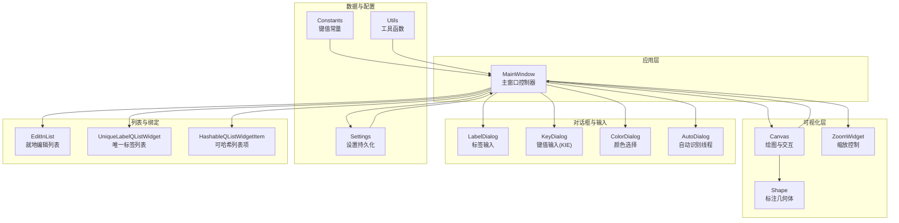
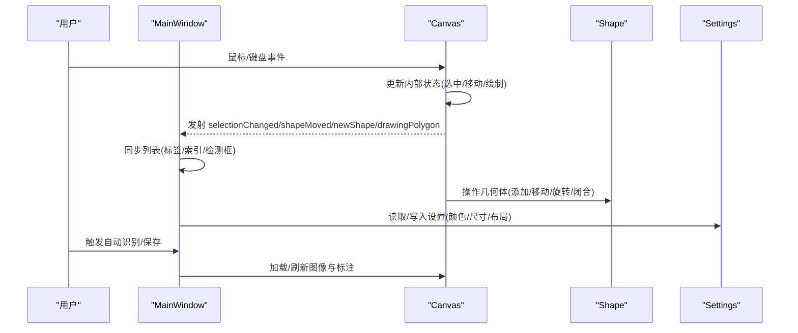
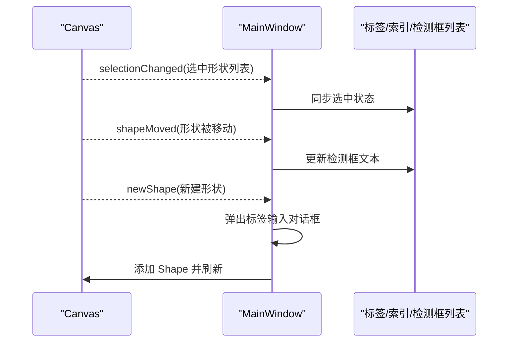
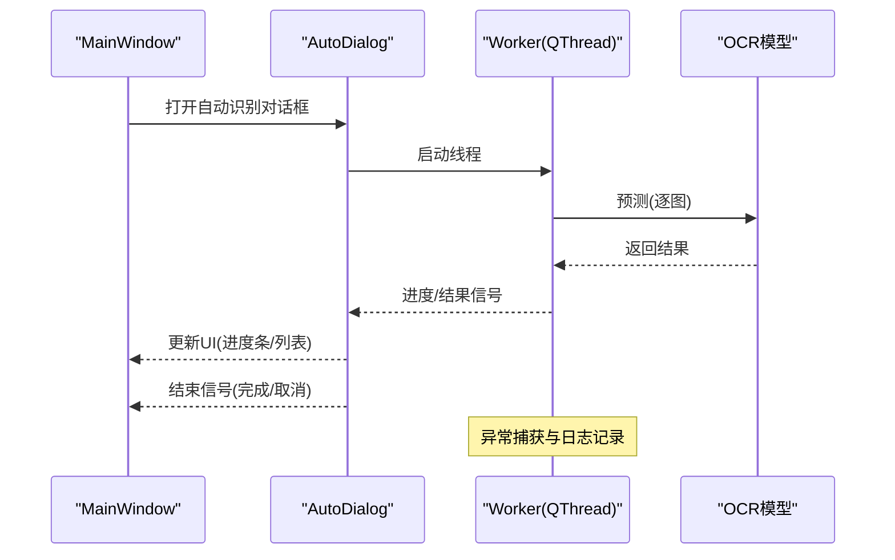
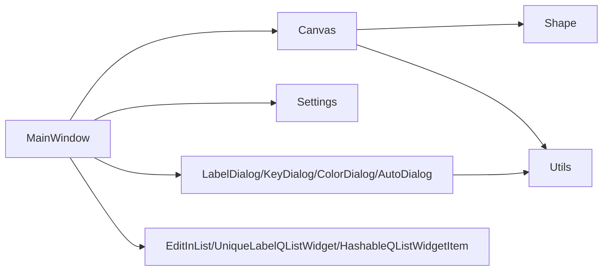

# 组件交互机制

<cite>
**本文引用的文件**
- [PPOCRLabel.py](PPOCRLabel.md)
- [canvas.py](canvas.md)
- [shape.py](shape.md)
- [settings.py](settings.md)
- [constants.py](constants.md)
- [utils.py](utils.md)
- [autoDialog.py](autoDialog.md)
- [labelDialog.py](labelDialog.md)
- [colorDialog.py](colorDialog.md)
- [zoomWidget.py](zoomWidget.md)
- [editinlist.py](editinlist.md)
- [unique_label_qlist_widget.py](unique_label_qlist_widget.md)
- [hashableQListWidgetItem.py](hashableQListWidgetItem.md)
- [keyDialog.py](keyDialog.md)
</cite>

## 目录
1. [引言](#引言)
2. [项目结构](#项目结构)
3. [核心组件](#核心组件)
4. [架构总览](#架构总览)
5. [详细组件分析](#详细组件分析)
6. [依赖关系分析](#依赖关系分析)
7. [性能考量](#性能考量)
8. [故障排查指南](#故障排查指南)
9. [结论](#结论)

## 引言
本文件聚焦于 PPOCRLabel 的组件交互机制，系统性阐述 PyQt5 信号槽在项目中的使用方式（含自定义信号定义与连接）、MainWindow 与 Canvas、Shape、Settings 等组件之间的消息传递、状态同步与数据更新流程，并给出异步处理与错误传播的实现要点。文档以循序渐进的方式呈现，既适合初学者快速上手，也便于资深开发者深入理解架构细节。

## 项目结构
项目采用“主窗口 + 多个子组件”的分层组织方式：
- 主入口与主窗口：PPOCRLabel.py 中的 MainWindow 负责应用生命周期、菜单与工具栏、状态管理、与 Canvas 的桥接等。
- 可视化与交互：libs/canvas.py 定义 Canvas 控件，负责鼠标/键盘事件、绘制、缩放滚动、选择与移动等；libs/shape.py 定义 Shape 数据模型与绘制逻辑。
- 设置与常量：libs/settings.py 提供持久化设置；libs/constants.py 定义键值常量。
- 对话框与输入控件：libs/labelDialog.py、libs/colorDialog.py、libs/zoomWidget.py、libs/autoDialog.py、libs/keyDialog.py 等。
- 列表与数据绑定：libs/editinlist.py、libs/unique_label_qlist_widget.py、libs/hashableQListWidgetItem.py 等用于列表项编辑、唯一标签列表与可哈希列表项。
- 工具函数：libs/utils.py 提供图标、动作、排序、图像处理等通用能力。

图表来源
- [PPOCRLabel.py](PPOCRLabel.md)
- [canvas.py](canvas.md)
- [shape.py](shape.md)
- [settings.py](settings.md)
- [constants.py](constants.md)
- [utils.py](utils.md)
- [autoDialog.py](autoDialog.md)
- [labelDialog.py](labelDialog.md)
- [colorDialog.py](colorDialog.md)
- [zoomWidget.py](zoomWidget.md)
- [editinlist.py](editinlist.md)
- [unique_label_qlist_widget.py](unique_label_qlist_widget.md)
- [hashableQListWidgetItem.py](hashableQListWidgetItem.md)

章节来源
- [PPOCRLabel.py](PPOCRLabel.md)
- [canvas.py](canvas.md)
- [shape.py](shape.md)
- [settings.py](settings.md)
- [constants.py](constants.md)
- [utils.py](utils.md)
- [autoDialog.py](autoDialog.md)
- [labelDialog.py](labelDialog.md)
- [colorDialog.py](colorDialog.md)
- [zoomWidget.py](zoomWidget.md)
- [editinlist.py](editinlist.md)
- [unique_label_qlist_widget.py](unique_label_qlist_widget.md)
- [hashableQListWidgetItem.py](hashableQListWidgetItem.md)

## 核心组件
- MainWindow：应用主控制器，负责加载设置、初始化各子组件、建立信号槽连接、处理用户交互、驱动 Canvas 与列表的数据同步、触发 OCR 自动识别与保存流程。
- Canvas：绘图与交互核心，定义多种自定义信号（如 zoomRequest、scrollRequest、newShape、selectionChanged、shapeMoved、drawingPolygon），并维护 Shape 列表与当前选中状态。
- Shape：标注几何体，包含点集、颜色、文本、索引、是否闭合等属性，提供绘制、高亮、移动、旋转等方法。
- Settings：设置持久化，支持保存/加载键值对到本地文件。
- Utils：提供图标、动作、快捷键格式化、自然排序、图像处理等工具。
- AutoDialog：自动识别线程封装，通过 QThread 与 pyqtSignal 在后台执行 OCR 并向主线程回传进度与结果。
- 其他对话框与控件：LabelDialog、KeyDialog、ColorDialog、ZoomWidget、EditInList、UniqueLabelQListWidget、HashableQListWidgetItem。

章节来源
- [PPOCRLabel.py](PPOCRLabel.md)
- [canvas.py](canvas.md)
- [shape.py](shape.md)
- [settings.py](settings.md)
- [utils.py](utils.md)
- [autoDialog.py](autoDialog.md)
- [labelDialog.py](labelDialog.md)
- [colorDialog.py](colorDialog.md)
- [zoomWidget.py](zoomWidget.md)
- [editinlist.py](editinlist.md)
- [unique_label_qlist_widget.py](unique_label_qlist_widget.md)
- [hashableQListWidgetItem.py](hashableQListWidgetItem.md)

## 架构总览
下图展示了 MainWindow 与 Canvas、Shape、Settings 等组件之间的交互关系与信号流向。

图表来源
- [PPOCRLabel.py](PPOCRLabel.md)
- [canvas.py](canvas.md)
- [shape.py](shape.md)
- [settings.py](settings.md)

章节来源
- [PPOCRLabel.py](PPOCRLabel.md)
- [canvas.py](canvas.md)
- [shape.py](shape.md)
- [settings.py](settings.md)

## 详细组件分析

### 信号槽系统与自定义信号
- Canvas 定义的自定义信号包括：
  - zoomRequest：缩放请求（整型增量）
  - scrollRequest：滚动请求（方向+增量）
  - newShape：新标注完成
  - selectionChanged：选择变更（形状列表）
  - shapeMoved：形状被拖动
  - drawingPolygon：开始/结束绘制多边形
- MainWindow 通过 connect 将这些信号映射到相应槽函数，实现画布与主窗口的状态同步与界面更新。
- 示例路径（不展示代码内容）：
  - Canvas 自定义信号定义：[canvas.py](canvas.md)
  - MainWindow 连接 Canvas 信号：[PPOCRLabel.py](PPOCRLabel.md)
  - MainWindow 响应 selectionChanged/updateBoxlist：[PPOCRLabel.py](PPOCRLabel.md)
  - MainWindow 响应 shapeMoved/updateBoxlist：[PPOCRLabel.py](PPOCRLabel.md)

章节来源
- [canvas.py](canvas.md)
- [PPOCRLabel.py](PPOCRLabel.md)
- [PPOCRLabel.py](PPOCRLabel.md)

### MainWindow 与 Canvas 的通信
- 初始化阶段：MainWindow 创建 Canvas 实例，连接其 zoomRequest/scrollRequest/newShape/shapeMoved/selectionChanged 等信号至对应槽。
- 事件传递：
  - 缩放与滚动：Canvas 在滚轮/鼠标事件中发射 zoomRequest/scrollRequest，MainWindow 计算新缩放值并调整滚动条位置。
  - 新标注：Canvas 在完成绘制后发射 newShape，MainWindow 弹出标签输入对话框并创建 Shape。
  - 选择与移动：Canvas 发射 selectionChanged/shapeMoved，MainWindow 同步列表选择与检测框文本。
- 状态同步：
  - MainWindow 维护 itemsToShapes/shapesToItems 映射，确保 Shape、标签列表、索引列表、检测框列表一致。
  - 当用户在标签/索引/检测框列表中选择时，MainWindow 通过 canvas.selectShapes 同步画布选中状态。

图表来源
- [PPOCRLabel.py](PPOCRLabel.md)
- [PPOCRLabel.py](PPOCRLabel.md)
- [PPOCRLabel.py](PPOCRLabel.md)

章节来源
- [PPOCRLabel.py](PPOCRLabel.md)
- [PPOCRLabel.py](PPOCRLabel.md)
- [PPOCRLabel.py](PPOCRLabel.md)

### MainWindow 与 Shape 的协作
- Shape 是 Canvas 内部的几何对象，包含点集、颜色、标签、索引等属性。
- MainWindow 通过 Canvas 的接口（新增、复制、删除、选择、更新索引）与 Shape 协作，同时维护三类列表与 Shape 的双向映射。
- 关键路径（不展示代码内容）：
  - Shape 属性与绘制：[shape.py](shape.md)
  - MainWindow 添加/移除标签与检测框：[PPOCRLabel.py](PPOCRLabel.md)
  - MainWindow 加载/保存标注：[PPOCRLabel.py](PPOCRLabel.md)

章节来源
- [shape.py](shape.md)
- [PPOCRLabel.py](PPOCRLabel.md)
- [PPOCRLabel.py](PPOCRLabel.md)

### MainWindow 与 Settings 的集成
- MainWindow 在构造时创建 Settings 并加载持久化设置（窗口大小、位置、最近文件、颜色、布局等）。
- Settings 支持保存/加载键值对到本地文件，MainWindow 在关闭事件中写回当前状态。
- 关键路径（不展示代码内容）：
  - Settings 类与持久化：[settings.py](settings.md)
  - MainWindow 读取/写入设置：[PPOCRLabel.py](PPOCRLabel.md)
  - MainWindow 关闭事件保存设置：[PPOCRLabel.py](PPOCRLabel.md)

章节来源
- [settings.py](settings.md)
- [PPOCRLabel.py](PPOCRLabel.md)
- [PPOCRLabel.py](PPOCRLabel.md)

### 异步操作与错误传播（自动识别）
- AutoDialog 使用 QThread 执行 OCR 任务，通过自定义 Worker 线程在后台预测，使用 pyqtSignal 向主线程回传进度、结果与结束信号。
- 主窗口通过 AutoDialog 的信号更新进度条、列表与窗口标题，支持取消与异常捕获。
- 关键路径（不展示代码内容）：
  - Worker 线程与信号：[autoDialog.py](autoDialog.md)
  - AutoDialog 与主线程交互：[autoDialog.py](autoDialog.md)
  - MainWindow 触发自动识别：[PPOCRLabel.py](PPOCRLabel.md)

图表来源
- [autoDialog.py](autoDialog.md)
- [autoDialog.py](autoDialog.md)
- [PPOCRLabel.py](PPOCRLabel.md)

章节来源
- [autoDialog.py](autoDialog.md)
- [autoDialog.py](autoDialog.md)
- [PPOCRLabel.py](PPOCRLabel.md)

### 列表与数据绑定
- EditInList：支持就地编辑列表项，避免重复打开编辑器。
- UniqueLabelQListWidget：唯一标签列表，支持根据标签生成彩色项并可清空选择。
- HashableQListWidgetItem：为列表项提供可哈希标识，避免不可哈希触发的槽异常。
- MainWindow 通过 itemsToShapes/shapesToItems 映射，保证 Shape、标签列表、索引列表、检测框列表的一致性。
- 关键路径（不展示代码内容）：
  - 就地编辑：[editinlist.py](editinlist.md)
  - 唯一标签列表：[unique_label_qlist_widget.py](unique_label_qlist_widget.md)
  - 可哈希列表项：[hashableQListWidgetItem.py](hashableQListWidgetItem.md)
  - 列表与 Shape 的增删改：[PPOCRLabel.py](PPOCRLabel.md)

章节来源
- [editinlist.py](editinlist.md)
- [unique_label_qlist_widget.py](unique_label_qlist_widget.md)
- [hashableQListWidgetItem.py](hashableQListWidgetItem.md)
- [PPOCRLabel.py](PPOCRLabel.md)

### 对话框与输入控件
- LabelDialog：弹出输入框，支持补全与校验，返回用户输入。
- KeyDialog：KIE 模式下的键值输入，支持列表选择、上下键导航、旗标动态更新。
- ColorDialog：颜色选择对话框，支持透明通道与默认色恢复。
- ZoomWidget：缩放百分比输入控件，配合 MainWindow 的缩放逻辑。
- 关键路径（不展示代码内容）：
  - 标签输入：[labelDialog.py](labelDialog.md)
  - 键值输入：[keyDialog.py](keyDialog.md)
  - 颜色选择：[colorDialog.py](colorDialog.md)
  - 缩放控件：[zoomWidget.py](zoomWidget.md)

章节来源
- [labelDialog.py](labelDialog.md)
- [keyDialog.py](keyDialog.md)
- [colorDialog.py](colorDialog.md)
- [zoomWidget.py](zoomWidget.md)

## 依赖关系分析
- 组件耦合与内聚：
  - MainWindow 与 Canvas 高内聚：MainWindow 作为协调者，集中处理 Canvas 的信号与 UI 同步。
  - Canvas 与 Shape 低耦合：Canvas 仅持有 Shape 列表，不直接依赖 MainWindow 的业务逻辑。
  - Settings 与 MainWindow 松耦合：通过键值常量访问，避免硬编码。
- 直接与间接依赖：
  - MainWindow 依赖 Canvas、Settings、对话框与列表组件。
  - Canvas 依赖 Shape 与工具函数。
  - AutoDialog 依赖 OCR 模型与主线程交互。
- 外部依赖与集成点：
  - 图像解码与显示依赖 OpenCV 与 QImage/QPixmap。
  - OCR 模型调用由 PaddleOCR 提供。
- 接口契约与实现细节：
  - Canvas 的自定义信号是跨组件通信的契约，MainWindow 严格按契约处理。
  - AutoDialog 的 Worker 通过信号-槽与主线程解耦。

图表来源
- [PPOCRLabel.py](PPOCRLabel.md)
- [canvas.py](canvas.md)
- [shape.py](shape.md)
- [settings.py](settings.md)
- [utils.py](utils.md)
- [autoDialog.py](autoDialog.md)
- [labelDialog.py](labelDialog.md)
- [colorDialog.py](colorDialog.md)
- [zoomWidget.py](zoomWidget.md)
- [editinlist.py](editinlist.md)
- [unique_label_qlist_widget.py](unique_label_qlist_widget.md)
- [hashableQListWidgetItem.py](hashableQListWidgetItem.md)

章节来源
- [PPOCRLabel.py](PPOCRLabel.md)
- [canvas.py](canvas.md)
- [shape.py](shape.md)
- [settings.py](settings.md)
- [utils.py](utils.md)
- [autoDialog.py](autoDialog.md)
- [labelDialog.py](labelDialog.md)
- [colorDialog.py](colorDialog.md)
- [zoomWidget.py](zoomWidget.md)
- [editinlist.py](editinlist.md)
- [unique_label_qlist_widget.py](unique_label_qlist_widget.md)
- [hashableQListWidgetItem.py](hashableQListWidgetItem.md)

## 性能考量
- 绘制与缩放：
  - Canvas 在 paintEvent 中按缩放比例绘制，避免频繁重绘；MainWindow 通过 ZoomWidget 与滑块联动，减少不必要的重绘。
- 事件处理：
  - Canvas 在 mouseMoveEvent 中仅在必要时重绘，避免过度调用 repaint。
- 列表同步：
  - MainWindow 通过批量更新列表项与索引，减少 UI 抖动。
- 异步识别：
  - AutoDialog 使用 QThread 与信号-槽，避免阻塞主线程；通过进度信号平滑更新 UI。
- 图像处理：
  - 图像解码与转换在加载文件时一次性完成，后续仅进行缩放与绘制。

[本节为通用指导，无需列出具体文件来源]

## 故障排查指南
- 无法保存或设置未生效：
  - 检查 Settings 是否成功加载/保存；确认 MainWindow 关闭事件是否触发保存。
  - 参考路径：[settings.py](settings.md)、[PPOCRLabel.py](PPOCRLabel.md)
- 列表项不可编辑或异常触发：
  - 确认使用 HashableQListWidgetItem；检查 EditInList 的就地编辑逻辑。
  - 参考路径：[hashableQListWidgetItem.py](hashableQListWidgetItem.md)、[editinlist.py](editinlist.md)
- 自动识别无响应或卡顿：
  - 检查 AutoDialog 的 Worker 线程是否启动；确认信号连接是否正确；查看日志输出。
  - 参考路径：[autoDialog.py](autoDialog.md)、[autoDialog.py](autoDialog.md)
- 缩放/滚动异常：
  - 确认 Canvas 的 zoomRequest/scrollRequest 是否被 MainWindow 正确处理；检查 MainWindow 的 zoomRequest/scrollRequest 实现。
  - 参考路径：[canvas.py](canvas.md)、[PPOCRLabel.py](PPOCRLabel.md)

章节来源
- [settings.py](settings.md)
- [PPOCRLabel.py](PPOCRLabel.md)
- [hashableQListWidgetItem.py](hashableQListWidgetItem.md)
- [editinlist.py](editinlist.md)
- [autoDialog.py](autoDialog.md)
- [autoDialog.py](autoDialog.md)
- [canvas.py](canvas.md)
- [PPOCRLabel.py](PPOCRLabel.md)

## 结论
PPOCRLabel 通过清晰的组件划分与严格的信号槽契约，实现了 MainWindow 与 Canvas、Shape、Settings 等模块的高效协作。Canvas 作为交互中枢，将用户输入转化为结构化的 Shape 数据，并通过自定义信号驱动 MainWindow 完成 UI 同步与业务处理。异步识别通过 AutoDialog 与 QThread 解耦主线程，提升用户体验。整体架构具备良好的扩展性与可维护性，适合在此基础上进一步增强功能与优化性能。