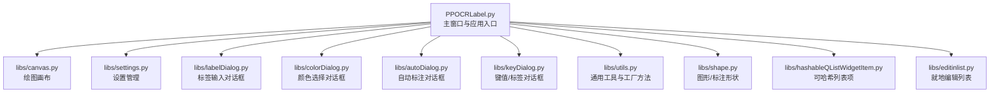
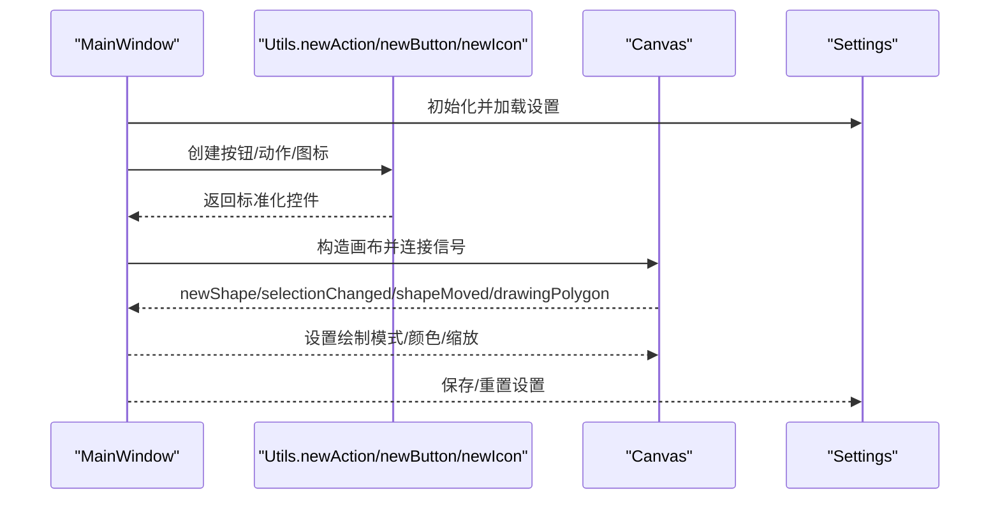
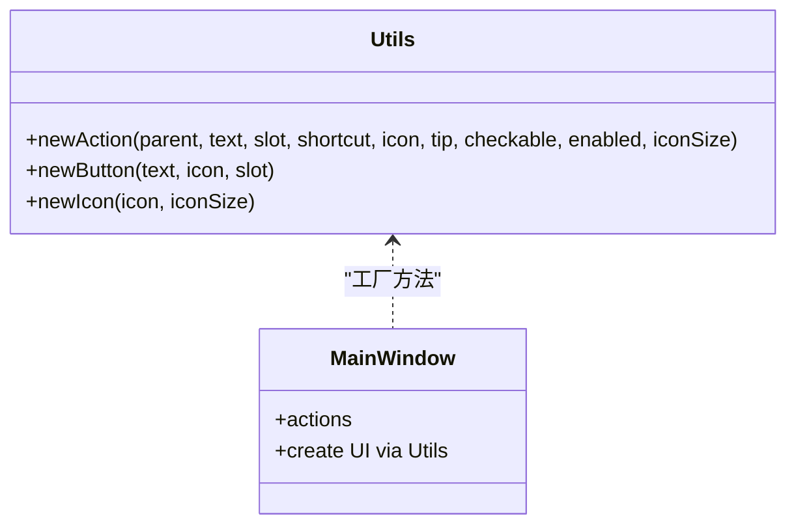
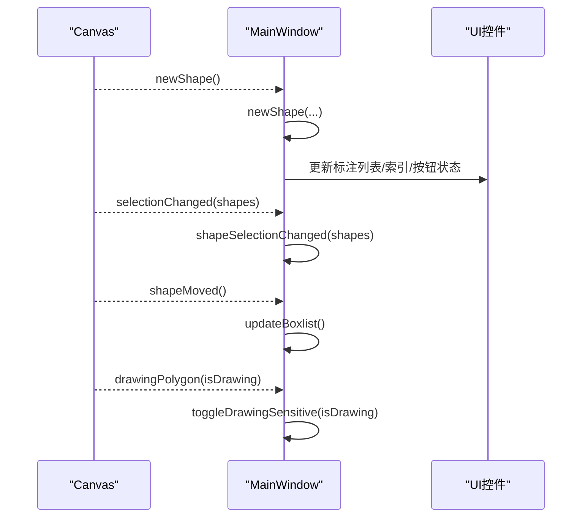
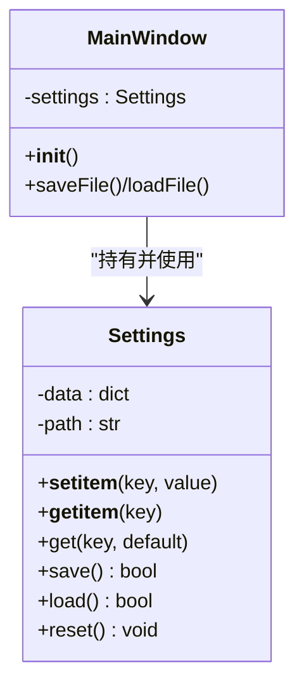
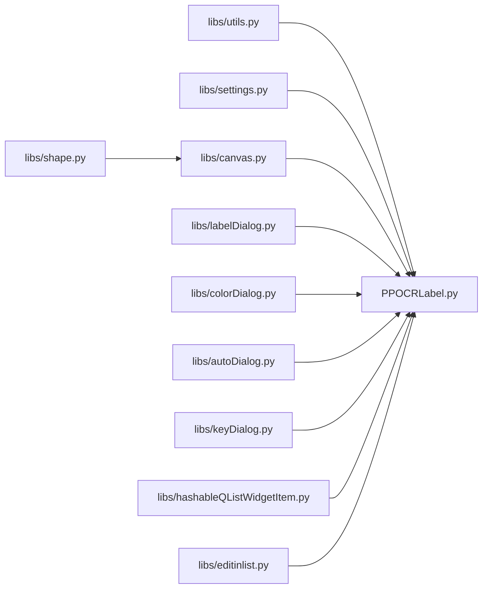

# 设计模式应用

<cite>
**本文引用的文件**
- [PPOCRLabel.py](PPOCRLabel.md)
- [settings.py](settings.md)
- [canvas.py](canvas.md)
- [labelDialog.py](labelDialog.md)
- [colorDialog.py](colorDialog.md)
- [autoDialog.py](autoDialog.md)
- [keyDialog.py](keyDialog.md)
- [utils.py](utils.md)
- [shape.py](shape.md)
- [hashableQListWidgetItem.py](hashableQListWidgetItem.md)
- [editinlist.py](editinlist.md)
</cite>

## 目录
1. [引言](#引言)
2. [项目结构](#项目结构)
3. [核心组件](#核心组件)
4. [架构总览](#架构总览)
5. [详细组件分析](#详细组件分析)
6. [依赖关系分析](#依赖关系分析)
7. [性能考量](#性能考量)
8. [故障排查指南](#故障排查指南)
9. [结论](#结论)

## 引言
本文件聚焦于 PPOCRLabel 中应用的设计模式，围绕以下三类模式展开：
- 工厂模式：在 UI 组件创建中的应用，通过统一工厂方法生成标准控件与对话框，提升一致性与可扩展性。
- 观察者模式：在信号槽机制中的体现，Canvas 与 MainWindow 之间通过 PyQt 信号实现松耦合通信。
- 单例模式：在 Settings 管理中的使用，确保全局配置的唯一读写入口。

我们将结合具体文件与代码片段路径，解释每种模式的应用场景、实现方式与带来的好处，并给出如何通过这些模式提升系统的可扩展性与可维护性。

## 项目结构
项目采用分层组织：主窗口逻辑集中在入口脚本，UI 对话框与工具类位于 libs 子模块，核心绘图与形状对象位于 canvas 与 shape 模块，工具函数位于 utils。这种结构便于按职责划分，利于工厂模式与观察者模式的落地。

图表来源
- [PPOCRLabel.py](PPOCRLabel.md)
- [canvas.py](canvas.md)
- [settings.py](settings.md)
- [labelDialog.py](labelDialog.md)
- [colorDialog.py](colorDialog.md)
- [autoDialog.py](autoDialog.md)
- [keyDialog.py](keyDialog.md)
- [utils.py](utils.md)
- [shape.py](shape.md)
- [hashableQListWidgetItem.py](hashableQListWidgetItem.md)
- [editinlist.py](editinlist.md)

章节来源
- [PPOCRLabel.py](PPOCRLabel.md)

## 核心组件
- Settings：提供键值存储、持久化与默认值访问，作为全局配置中心。
- Canvas：绘图画布，发出多种信号用于通知主窗口状态变化。
- Dialog 系列：标签输入、颜色选择、自动标注、键值对话框等，承担用户交互。
- Utils：提供 newAction/newButton/newIcon 等工厂方法，统一创建 UI 控件与动作。
- Shape：标注图形的抽象与绘制逻辑。
- 列表控件扩展：可哈希列表项与就地编辑列表，增强列表交互能力。

章节来源
- [settings.py](settings.md)
- [canvas.py](canvas.md)
- [labelDialog.py](labelDialog.md)
- [colorDialog.py](colorDialog.md)
- [autoDialog.py](autoDialog.md)
- [keyDialog.py](keyDialog.md)
- [utils.py](utils.md)
- [shape.py](shape.md)
- [hashableQListWidgetItem.py](hashableQListWidgetItem.md)
- [editinlist.py](editinlist.md)

## 架构总览
下图展示了 MainWindow 如何通过工厂方法创建 UI 组件，并与 Canvas 通过信号槽交互，同时 Settings 提供全局配置支持。

图表来源
- [PPOCRLabel.py](PPOCRLabel.md)
- [utils.py](utils.md)
- [canvas.py](canvas.md)
- [settings.py](settings.md)

章节来源
- [PPOCRLabel.py](PPOCRLabel.md)

## 详细组件分析

### 工厂模式：UI 组件创建
- 应用场景
  - 在主窗口中大量创建按钮、动作与图标，需要保持一致的外观与行为规范。
  - 通过工厂方法封装创建细节，避免重复代码与分散的样式配置。
- 实现方式
  - newAction：统一创建 QAction，支持图标、快捷键、提示文本与触发回调。
  - newButton：统一创建 QPushButton，支持图标与点击回调。
  - newIcon：统一加载图标资源，支持尺寸参数。
- 好处
  - 统一风格与行为，降低维护成本。
  - 易于扩展新控件类型，只需在工厂中新增分支。
  - 便于集中修改样式与交互策略。

图表来源
- [utils.py](utils.md)
- [PPOCRLabel.py](PPOCRLabel.md)

章节来源
- [utils.py](utils.md)
- [PPOCRLabel.py](PPOCRLabel.md)

### 观察者模式：信号槽机制
- 应用场景
  - Canvas 作为事件源，产生鼠标移动、选择变更、形状移动、绘制状态等事件。
  - MainWindow 作为订阅者，响应这些事件并更新界面与数据。
- 实现方式
  - Canvas 定义多个 pyqtSignal（如 newShape、selectionChanged、shapeMoved、drawingPolygon）。
  - MainWindow 在初始化时连接这些信号到对应处理方法。
  - 通过信号传递轻量数据（如布尔值、列表），避免直接耦合。
- 好处
  - 松耦合：画布无需关心调用方，只需发出信号。
  - 可扩展：新增观察者只需连接同一信号。
  - 易测试：信号可被模拟，便于单元测试。

图表来源
- [canvas.py](canvas.md)
- [PPOCRLabel.py](PPOCRLabel.md)

章节来源
- [canvas.py](canvas.md)
- [PPOCRLabel.py](PPOCRLabel.md)

### 单例模式：Settings 管理
- 应用场景
  - 全局配置需要跨模块共享，且只存在一份实例，避免并发写入与状态不一致。
- 实现方式
  - Settings 类以进程内唯一实例提供配置读写，内部维护 data 字典与持久化路径。
  - 主窗口在启动时创建并加载设置；退出或需要时保存或重置。
- 好处
  - 唯一访问点，简化配置管理。
  - 透明持久化，减少样板代码。
  - 易于扩展新的配置项，无需改动调用方。

图表来源
- [settings.py](settings.md)
- [PPOCRLabel.py](PPOCRLabel.md)

章节来源
- [settings.py](settings.md)
- [PPOCRLabel.py](PPOCRLabel.md)

### 其他相关组件与模式补充
- 对话框工厂
  - LabelDialog/ColorDialog/AutoDialog/KeyDialog 等均继承自 QDialog/QColorDialog/QThread 等，提供统一的弹窗与线程交互能力。
  - 这些对话框通过工厂方法创建的按钮与图标，保证视觉与交互一致性。
- 列表控件扩展
  - HashableQListWidgetItem：为列表项提供可哈希能力，便于集合操作。
  - EditInList：支持就地编辑，优化用户输入体验。
- 图形与绘制
  - Shape 抽象了标注图形的绘制、高亮、旋转与拷贝等行为，Canvas 负责事件与渲染，二者配合实现可视化标注。

章节来源
- [labelDialog.py](labelDialog.md)
- [colorDialog.py](colorDialog.md)
- [autoDialog.py](autoDialog.md)
- [keyDialog.py](keyDialog.md)
- [hashableQListWidgetItem.py](hashableQListWidgetItem.md)
- [editinlist.py](editinlist.md)
- [shape.py](shape.md)

## 依赖关系分析
- 组件耦合
  - MainWindow 依赖 Utils 的工厂方法创建 UI；依赖 Settings 提供配置；依赖 Canvas 发出的信号驱动界面更新。
  - Canvas 仅依赖 Shape 与工具函数，不直接依赖 MainWindow，保持低耦合。
- 外部依赖
  - PyQt5 信号槽系统是观察者模式的核心基础设施。
  - pickle 用于 Settings 的持久化。
- 循环依赖
  - 未发现循环导入；各模块职责清晰，接口边界明确。

图表来源
- [PPOCRLabel.py](PPOCRLabel.md)
- [utils.py](utils.md)
- [settings.py](settings.md)
- [canvas.py](canvas.md)
- [shape.py](shape.md)
- [labelDialog.py](labelDialog.md)
- [colorDialog.py](colorDialog.md)
- [autoDialog.py](autoDialog.md)
- [keyDialog.py](keyDialog.md)
- [hashableQListWidgetItem.py](hashableQListWidgetItem.md)
- [editinlist.py](editinlist.md)

章节来源
- [PPOCRLabel.py](PPOCRLabel.md)

## 性能考量
- 工厂模式
  - 统一创建控件可减少重复初始化开销，但需注意避免过度封装导致的间接调用成本。
- 观察者模式
  - 信号槽在 Qt 事件循环中高效分发；建议避免在高频信号回调中执行耗时操作，必要时使用异步或批处理。
- Settings
  - 持久化采用二进制序列化，I/O 成本较低；建议在应用退出或关键节点保存，避免频繁写入。
- Canvas/Shape
  - 绘制与高亮逻辑应避免在每次 repaint 中进行昂贵计算；可通过缓存与增量更新优化。

## 故障排查指南
- 设置加载失败
  - 现象：日志出现加载设置失败警告。
  - 排查：检查设置文件是否存在与权限；确认 pickle 文件格式是否损坏。
  - 参考路径：[settings.py](settings.md)
- 信号未触发
  - 现象：UI 不响应画布事件。
  - 排查：确认 MainWindow 是否正确连接 Canvas 的信号；检查信号名称与参数是否匹配。
  - 参考路径：[canvas.py](canvas.md)、[PPOCRLabel.py](PPOCRLabel.md)
- 对话框弹出异常
  - 现象：自动标注或颜色选择对话框无法关闭或无响应。
  - 排查：确认线程与信号连接是否正确；检查 reject/validate 流程。
  - 参考路径：[autoDialog.py](autoDialog.md)、[colorDialog.py](colorDialog.md)

章节来源
- [settings.py](settings.md)
- [canvas.py](canvas.md)
- [PPOCRLabel.py](PPOCRLabel.md)
- [autoDialog.py](autoDialog.md)
- [colorDialog.py](colorDialog.md)

## 结论
- 工厂模式通过统一的 UI 创建方法，提升了界面一致性与可维护性。
- 观察者模式借助 PyQt 信号槽，实现了画布与主窗口之间的松耦合通信，增强了系统的扩展性。
- 单例模式的 Settings 为全局配置提供了安全、统一的访问入口，简化了配置生命周期管理。
- 综合运用这些设计模式，PPOCRLabel 在复杂 UI 场景下仍保持清晰的职责分离与良好的可演进性。