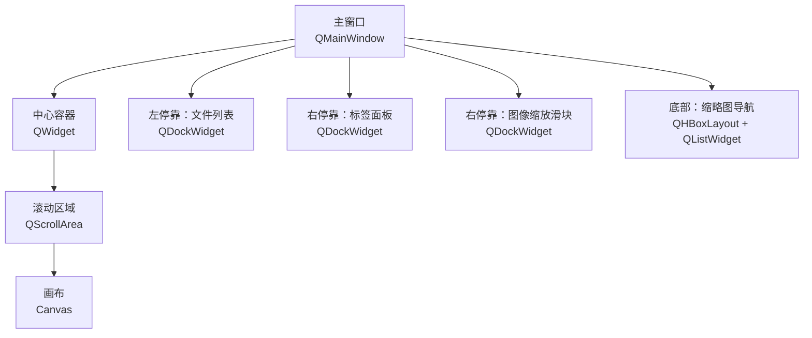
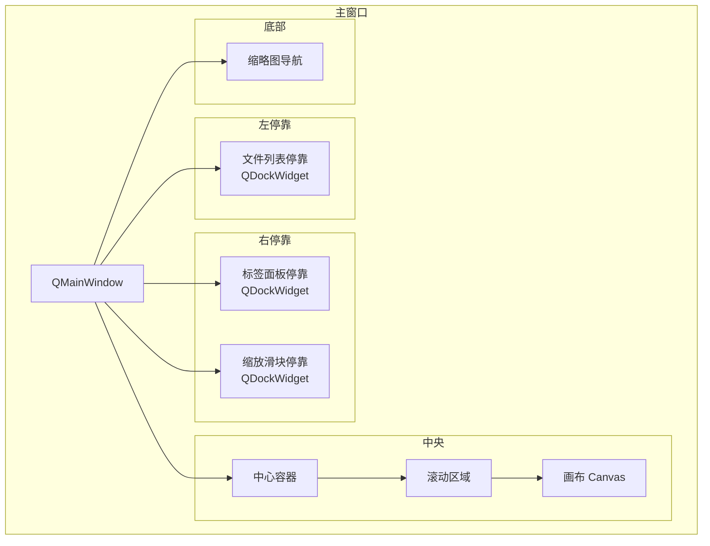
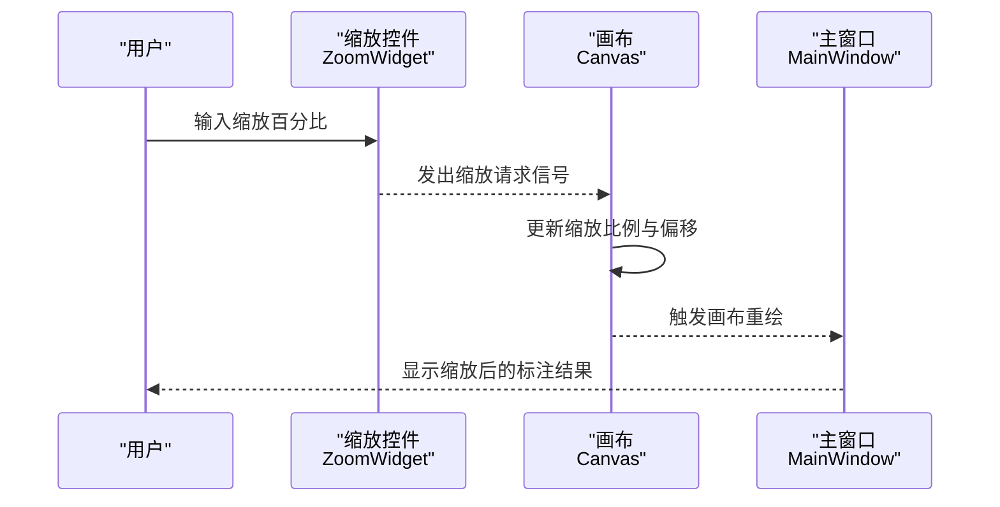
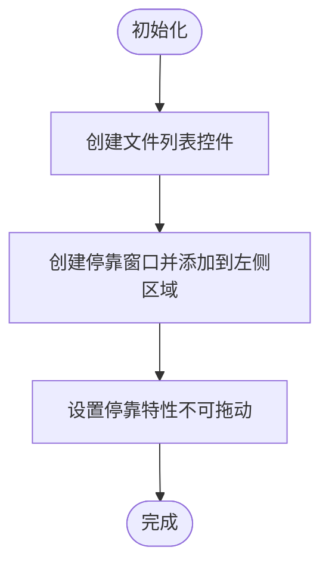
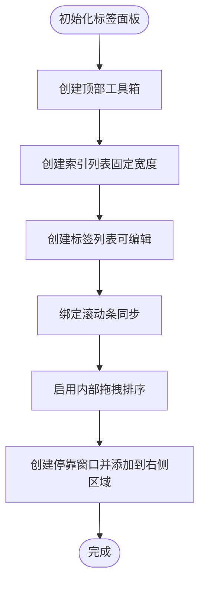
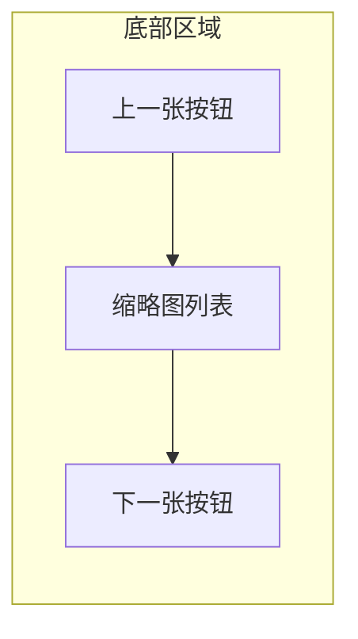
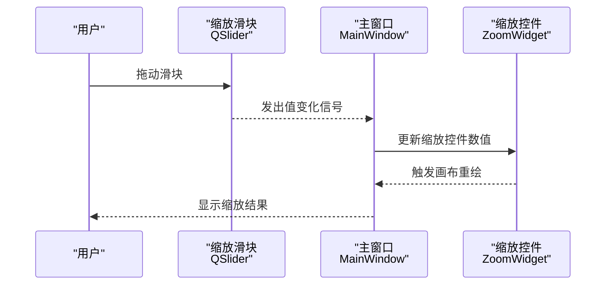
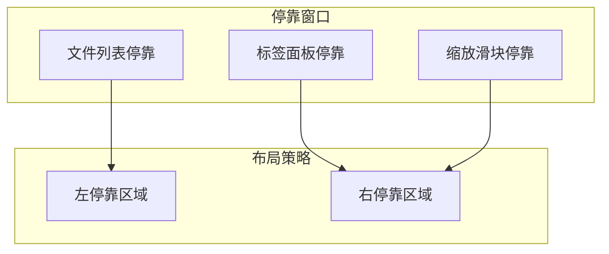
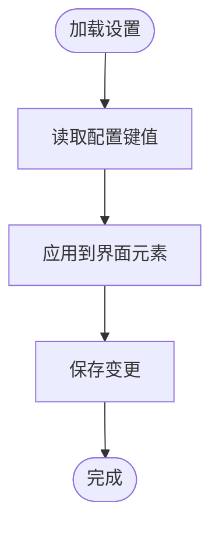
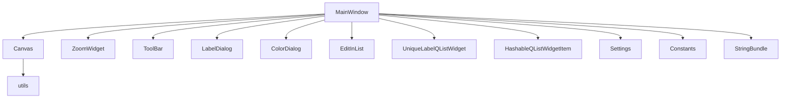

# 主窗口布局设计

<cite>
**本文引用的文件**
- [PPOCRLabel.py](PPOCRLabel.md)
- [canvas.py](canvas.md)
- [toolBar.py](toolBar.md)
- [zoomWidget.py](zoomWidget.md)
- [settings.py](settings.md)
- [constants.py](constants.md)
- [utils.py](utils.md)
- [stringBundle.py](stringBundle.md)
- [editinlist.py](editinlist.md)
- [unique_label_qlist_widget.py](unique_label_qlist_widget.md)
- [hashableQListWidgetItem.py](hashableQListWidgetItem.md)
- [colorDialog.py](colorDialog.md)
- [labelDialog.py](labelDialog.md)
- [README.md](README.md)
</cite>

## 目录
1. [简介](#简介)
2. [项目结构](#项目结构)
3. [核心组件](#核心组件)
4. [架构总览](#架构总览)
5. [详细组件分析](#详细组件分析)
6. [依赖关系分析](#依赖关系分析)
7. [性能考虑](#性能考虑)
8. [故障排查指南](#故障排查指南)
9. [结论](#结论)
10. [附录](#附录)

## 简介
本文件聚焦于 PPOCRLabel 的主窗口布局设计，系统性阐述主窗口的整体布局结构与停靠窗口（DockWidget）体系，包括：
- 中央画布区域、左侧文件列表、右侧标签面板、底部缩略图与工具栏的布局策略
- 停靠窗口系统的实现（文件列表停靠、标签列表停靠、检测框列表停靠、图像缩放滑块停靠）
- 响应式设计与窗口状态管理
- 布局定制选项与用户界面可调整性
- 布局优化建议与最佳实践

## 项目结构
PPOCRLabel 采用 PyQt5 的主窗口（QMainWindow）作为容器，通过停靠窗口（QDockWidget）组织左右侧功能区，并在中央区域放置可滚动的画布（Canvas）。底部为缩略图导航条，顶部为菜单与工具栏。整体布局以“中央画布 + 左右停靠 + 底部缩略图”的模式组织，支持多窗口停靠、浮动与关闭，满足标注工作流的高效操作。

图表来源
- [PPOCRLabel.py](PPOCRLabel.md)

章节来源
- [PPOCRLabel.py](PPOCRLabel.md)

## 核心组件
- 主窗口类：负责初始化设置、加载语言包、构建停靠窗口与中央画布、连接信号槽、管理动作与工具栏等。
- 画布组件：Canvas 提供绘制、选择、编辑标注框的交互能力，支持鼠标事件、键盘快捷键、平移与缩放。
- 工具栏组件：ToolBar/ToolButton 统一按钮尺寸与风格，适配不同平台显示。
- 缩放控件：ZoomWidget 提供百分比缩放输入，配合 Canvas 的缩放请求信号进行联动。
- 设置与常量：Settings/Constants 负责窗口状态、颜色、布局参数的持久化与读取。
- 列表组件：EditInList、UniqueLabelQListWidget、HashableQListWidgetItem 支持标签编辑、唯一标签展示与可哈希项管理。
- 对话框：LabelDialog、ColorDialog 提供标签输入与颜色选择。

章节来源
- [PPOCRLabel.py](PPOCRLabel.md)
- [canvas.py](canvas.md)
- [toolBar.py](toolBar.md)
- [zoomWidget.py](zoomWidget.md)
- [settings.py](settings.md)
- [constants.py](constants.md)
- [utils.py](utils.md)
- [stringBundle.py](stringBundle.md)
- [editinlist.py](editinlist.md)
- [unique_label_qlist_widget.py](unique_label_qlist_widget.md)
- [hashableQListWidgetItem.py](hashableQListWidgetItem.md)
- [colorDialog.py](colorDialog.md)
- [labelDialog.py](labelDialog.md)

## 架构总览
主窗口采用“中央画布 + 左右停靠 + 底部缩略图”的布局，结合 Canvas 的缩放与滚动机制，形成完整的标注工作区。停靠窗口支持拖拽、浮动、关闭与重置，标签面板与索引列表同步滚动，检测框列表与标签列表联动更新。

图表来源
- [PPOCRLabel.py](PPOCRLabel.md)
- [canvas.py](canvas.md)

## 详细组件分析

### 中央画布区域
- 容器与滚动：中心容器包含一个可滚动区域，画布作为其子部件，支持自动调整大小与滚动条联动。
- 缩放与平移：Canvas 接收来自 ZoomWidget 的缩放请求信号，处理鼠标滚轮与拖动事件，实现平移与缩放。
- 选择与编辑：支持单选/多选、顶点移动、整框移动、复制与撤销；与主窗口的标签列表、检测框列表保持状态同步。

图表来源
- [zoomWidget.py](zoomWidget.md)
- [canvas.py](canvas.md)
- [PPOCRLabel.py](PPOCRLabel.md)

章节来源
- [PPOCRLabel.py](PPOCRLabel.md)
- [canvas.py](canvas.md)

### 左侧文件列表停靠
- 布局：垂直布局，包含文件列表、可选的关键字列表（KIE 模式）、自动识别数量与按钮。
- 功能：点击文件项触发图像切换；支持自然排序；可配置是否启用自动识别。
- 特性：文件列表停靠窗口无可拖动特征，便于固定在左侧。

图表来源
- [PPOCRLabel.py](PPOCRLabel.md)

章节来源
- [PPOCRLabel.py](PPOCRLabel.md)

### 右侧标签面板
- 结构：顶部工具箱（新建、多边形、重识别、表格识别），中部标签列表与索引列表并排，底部保存/删除/排序按钮。
- 同步滚动：标签列表与索引列表共享垂直滚动条，保证序号与内容对齐。
- 拖拽排序：启用内部拖拽移动，支持行移动事件回调，用于重新排列检测框顺序。
- 特性：标签面板停靠窗口无可拖动特征，便于固定在右侧。

图表来源
- [PPOCRLabel.py](PPOCRLabel.md)

章节来源
- [PPOCRLabel.py](PPOCRLabel.md)
- [editinlist.py](editinlist.md)
- [unique_label_qlist_widget.py](unique_label_qlist_widget.md)

### 底部缩略图与工具栏
- 缩略图：水平布局，包含上一张、图标列表（图片缩略图）、下一张按钮；固定高度，便于快速跳转。
- 工具栏：统一按钮尺寸与风格，支持无边框显示；工具按钮最小尺寸自适应，确保在不同分辨率下的可用性。

图表来源
- [PPOCRLabel.py](PPOCRLabel.md)
- [toolBar.py](toolBar.md)

章节来源
- [PPOCRLabel.py](PPOCRLabel.md)
- [toolBar.py](toolBar.md)

### 图像缩放滑块停靠
- 控件：水平方向的滑块，支持数值变化信号；设置透明度效果与背景样式。
- 停靠：右停靠区域，支持浮动；与 ZoomWidget 协同控制缩放级别。

图表来源
- [PPOCRLabel.py](PPOCRLabel.md)
- [zoomWidget.py](zoomWidget.md)

章节来源
- [PPOCRLabel.py](PPOCRLabel.md)
- [zoomWidget.py](zoomWidget.md)

### 停靠窗口系统与响应式设计
- 停靠区域：左侧与右侧区域分别添加文件列表与标签面板；右侧还添加图像缩放滑块。
- 浮动与关闭：标签面板与缩放滑块支持关闭与浮动；文件列表停靠窗口无拖动特性，便于固定。
- 响应式：画布区域随窗口大小变化自动调整；滚动条与缩放联动，保证大图场景下的可用性。

图表来源
- [PPOCRLabel.py](PPOCRLabel.md)
- [PPOCRLabel.py](PPOCRLabel.md)
- [PPOCRLabel.py](PPOCRLabel.md)

章节来源
- [PPOCRLabel.py](PPOCRLabel.md)
- [PPOCRLabel.py](PPOCRLabel.md)
- [PPOCRLabel.py](PPOCRLabel.md)

### 窗口状态管理与布局定制
- 状态存储：通过 Settings 类持久化窗口尺寸、位置、几何与状态键值，支持跨会话恢复。
- 常量键：使用常量键（如窗口尺寸、位置、状态、最近文件等）统一管理设置项。
- 字符串本地化：通过 StringBundle 加载多语言字符串，提升国际化体验。
- 布局定制：支持禁用/启用某些停靠窗口、调整标签列表高度、设置缩放控件范围与后缀等。

图表来源
- [settings.py](settings.md)
- [constants.py](constants.md)
- [stringBundle.py](stringBundle.md)
- [utils.py](utils.md)

章节来源
- [settings.py](settings.md)
- [constants.py](constants.md)
- [stringBundle.py](stringBundle.md)
- [utils.py](utils.md)

## 依赖关系分析
- 主窗口依赖：Canvas、ZoomWidget、工具栏、对话框、列表组件、设置与常量模块。
- Canvas 依赖：Shape、utils（距离计算等）、Qt 事件与信号。
- 列表组件依赖：Qt 的 QListWidget 与自定义扩展（可编辑、唯一标签、可哈希项）。
- 对话框依赖：Qt 的标准对话框与工具函数。

图表来源
- [PPOCRLabel.py](PPOCRLabel.md)
- [canvas.py](canvas.md)
- [editinlist.py](editinlist.md)
- [unique_label_qlist_widget.py](unique_label_qlist_widget.md)
- [hashableQListWidgetItem.py](hashableQListWidgetItem.md)
- [settings.py](settings.md)
- [constants.py](constants.md)
- [stringBundle.py](stringBundle.md)
- [utils.py](utils.md)

章节来源
- [PPOCRLabel.py](PPOCRLabel.md)
- [canvas.py](canvas.md)
- [editinlist.py](editinlist.md)
- [unique_label_qlist_widget.py](unique_label_qlist_widget.md)
- [hashableQListWidgetItem.py](hashableQListWidgetItem.md)
- [settings.py](settings.md)
- [constants.py](constants.md)
- [stringBundle.py](stringBundle.md)
- [utils.py](utils.md)

## 性能考虑
- 画布渲染：Canvas 在绘制时根据图像尺寸动态调整字体大小，避免在小图上文字过小，在大图上文字过大，提升可读性。
- 滚动与缩放：通过 QScrollArea 与 Canvas 的缩放/平移事件联动，减少不必要的重绘；合理设置最小尺寸提示，避免布局抖动。
- 列表同步：标签列表与索引列表的滚动条同步，避免重复计算滚动位置，提高交互流畅度。
- 设置持久化：通过 Settings 将窗口状态写入磁盘，减少每次启动的初始化成本。

## 故障排查指南
- 缩放异常：检查 ZoomWidget 的数值范围与后缀设置，确认 Canvas 的缩放请求信号是否正确连接。
- 列表不同步：核对标签列表与索引列表的滚动条连接逻辑，确保值变化信号一致。
- 停靠窗口丢失：确认 addDockWidget 的区域参数与停靠窗口特性设置；必要时重置停靠状态。
- 多语言字符串缺失：检查 StringBundle 的资源路径与键值是否存在，必要时重新编译资源文件。
- 设置加载失败：查看 Settings 的 load 流程与异常日志，确认配置文件路径与权限。

章节来源
- [zoomWidget.py](zoomWidget.md)
- [canvas.py](canvas.md)
- [PPOCRLabel.py](PPOCRLabel.md)
- [stringBundle.py](stringBundle.md)
- [settings.py](settings.md)

## 结论
PPOCRLabel 的主窗口布局以“中央画布 + 左右停靠 + 底部缩略图”为核心，结合停靠窗口系统与 Canvas 的缩放/滚动机制，实现了高效的标注工作流。通过 Settings 与 Constants 的状态管理、StringBundle 的本地化支持以及工具栏与对话框的统一风格，整体界面具备良好的可定制性与可维护性。建议在实际使用中关注停靠窗口的浮动与关闭行为、列表同步滚动与缩放联动，以获得更佳的用户体验。

## 附录
- 快速参考：主窗口初始化、停靠窗口添加、中央画布设置、底部缩略图与工具栏构建均集中在主窗口类中，便于集中维护与扩展。
- 扩展建议：可增加更多停靠窗口（如属性面板、历史记录等），并通过统一的布局策略与状态管理接口进行集成。

章节来源
- [PPOCRLabel.py](PPOCRLabel.md)
- [README.md](README.md)