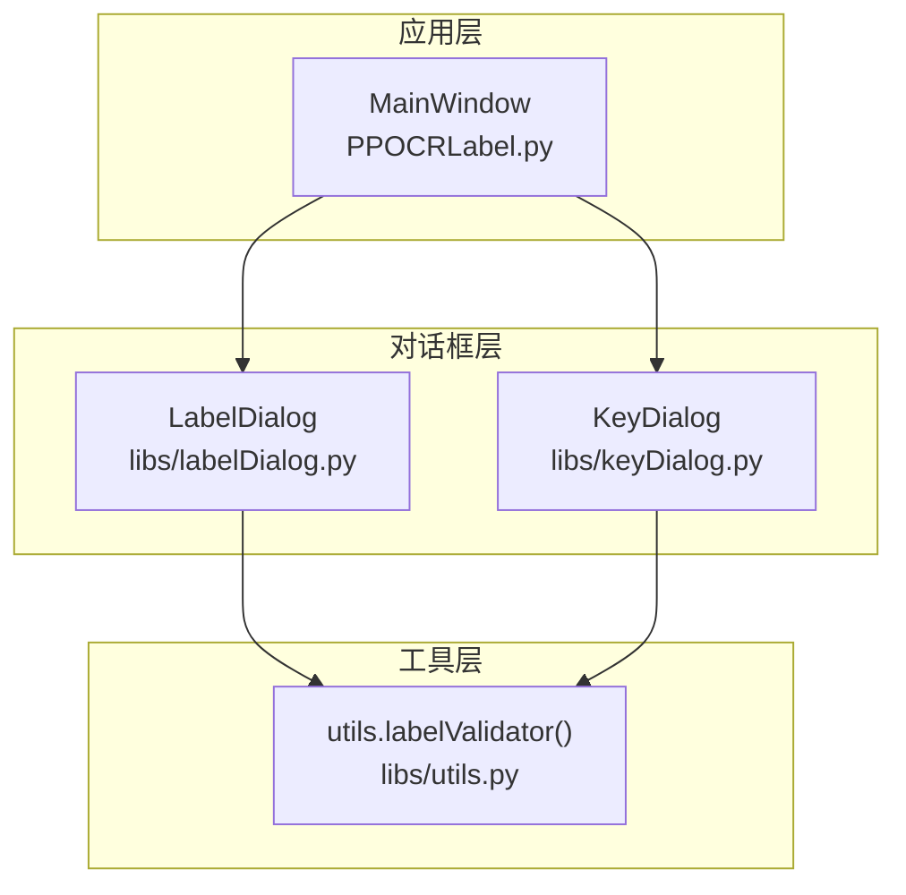
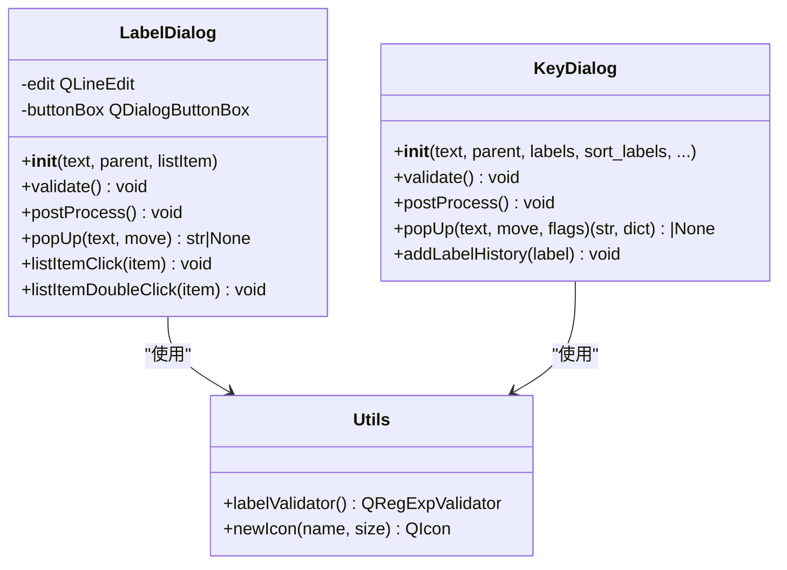
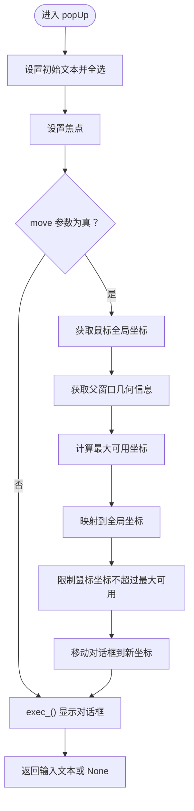
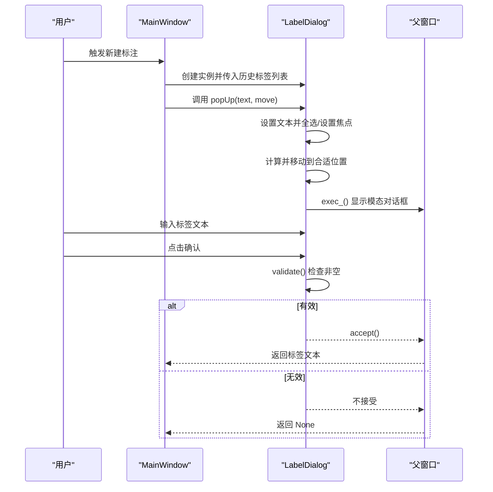
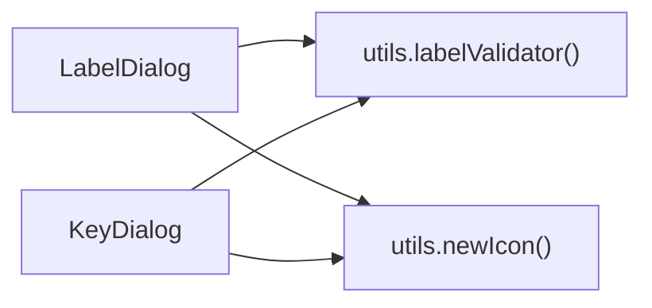

# 标签对话框

<cite>
**本文档引用的文件**
- [libs/labelDialog.py](labelDialog.md)
- [libs/utils.py](utils.md)
- [libs/keyDialog.py](keyDialog.md)
- [PPOCRLabel.py](PPOCRLabel.md)
</cite>

## 目录
1. [简介](#简介)
2. [项目结构](#项目结构)
3. [核心组件](#核心组件)
4. [架构总览](#架构总览)
5. [详细组件分析](#详细组件分析)
6. [依赖关系分析](#依赖关系分析)
7. [性能考量](#性能考量)
8. [故障排除指南](#故障排除指南)
9. [结论](#结论)
10. [附录](#附录)

## 简介
本文件系统性地阐述标签对话框（LabelDialog）的设计目标、实现细节与使用方式，覆盖单行文本输入、自动补全、模态对话框行为、数据验证、焦点管理、位置调整算法、弹出显示机制以及确认/取消流程。文档同时提供与主应用（PPOCRLabel）的集成示例与最佳实践建议，帮助开发者快速理解并正确使用该组件。

## 项目结构
标签对话框位于应用的通用库模块中，采用独立的类定义与工具函数支持，便于在不同场景复用。其主要文件分布如下：
- libs/labelDialog.py：定义标签对话框类，负责UI布局、事件绑定与交互逻辑
- libs/utils.py：提供图标加载、正则校验器等通用工具，其中包含标签校验器
- libs/keyDialog.py：提供键值标签对话框，展示更完整的自动补全与校验实现
- PPOCRLabel.py：主窗口中对标签对话框的实例化与调用

图表来源
- [PPOCRLabel.py](PPOCRLabel.md)
- [libs/labelDialog.py](labelDialog.md)
- [libs/keyDialog.py](keyDialog.md)
- [libs/utils.py](utils.md)

章节来源
- [libs/labelDialog.py](labelDialog.md)
- [libs/utils.py](utils.md)
- [libs/keyDialog.py](keyDialog.md)
- [PPOCRLabel.py](PPOCRLabel.md)

## 核心组件
- LabelDialog：继承自 QDialog，提供单行文本输入、自动补全、确认/取消按钮、文本清理与验证、弹出显示与位置调整等功能
- 工具函数 labelValidator：提供正则表达式校验器，确保标签文本符合基本格式要求
- KeyDialog：作为对比参考，展示了更完善的自动补全、校验与标志位处理

章节来源
- [libs/labelDialog.py](labelDialog.md)
- [libs/utils.py](utils.md)
- [libs/keyDialog.py](keyDialog.md)

## 架构总览
LabelDialog 作为模态对话框嵌入到主窗口中，通过父窗口传递列表项用于自动补全；其内部通过 QLineEdit 提供输入，QCompleter 提供自动补全，QDialogButtonBox 提供确认/取消按钮。验证逻辑在 validate 与 postProcess 中实现，并兼容 PyQt 版本差异。

图表来源
- [libs/labelDialog.py](labelDialog.md)
- [libs/utils.py](utils.md)
- [libs/keyDialog.py](keyDialog.md)

## 详细组件分析

### 初始化过程与界面布局
- 构造函数接收父窗口与历史标签列表，创建单行输入框与确认/取消按钮
- 将历史标签列表转换为 QStringListModel 并绑定到 QCompleter，启用自动补全
- 布局采用垂直布局，输入框在上，按钮在下
- 为按钮设置图标，提升用户体验

章节来源
- [libs/labelDialog.py](labelDialog.md)

### 数据验证机制
- validate 方法在点击确认时触发，检查输入文本是否非空（去除首尾空白）
- 兼容 PyQt 版本差异：当 trimmed 方法不可用时回退到 strip
- postProcess 在编辑完成时自动清理输入文本（去除首尾空白）

章节来源
- [libs/labelDialog.py](labelDialog.md)

### 文本处理方法（trimming/strip）
- 输入框在 editingFinished 信号触发时调用 postProcess
- postProcess 优先使用 trimmed，若不可用则使用 strip
- validate 与 listItemClick 同样遵循相同的清理策略

章节来源
- [libs/labelDialog.py](labelDialog.md)
- [libs/labelDialog.py](labelDialog.md)

### 焦点管理
- popUp 调用后设置输入框为焦点，焦点类型为 PopupFocusReason
- 设置全选文本，便于用户直接输入或替换
- KeyDialog 展示了更完整的焦点与自动补全联动（移动时设置光标位置）

章节来源
- [libs/labelDialog.py](labelDialog.md)
- [libs/keyDialog.py](keyDialog.md)

### 位置调整算法
- popUp 支持根据鼠标位置与父窗口几何信息计算对话框最佳显示位置
- 计算父窗口右下角最大可用区域，映射到全局坐标后限制对话框不超出屏幕边界
- 若鼠标位置超出最大可用范围，则将对话框移动到最大可用位置

图表来源
- [libs/labelDialog.py](labelDialog.md)

### 弹出显示机制与模态行为
- exec_() 以模态方式显示对话框，阻塞父窗口交互直至用户确认或取消
- 确认时 accept()，取消时 reject()，返回值为输入文本或 None
- KeyDialog 展示了类似的模态显示与返回值处理

章节来源
- [libs/labelDialog.py](labelDialog.md)
- [libs/keyDialog.py](keyDialog.md)

### 用户交互流程
- 新建标注时，主窗口创建 LabelDialog 实例并调用 popUp
- 用户输入标签文本，点击确认触发 validate，若有效则接受对话框
- 双击历史标签项可快速填充输入框并触发验证

图表来源
- [PPOCRLabel.py](PPOCRLabel.md)
- [libs/labelDialog.py](labelDialog.md)

### 与主应用的集成示例
- 主窗口在初始化时创建 LabelDialog，并传入历史标签列表
- 新建形状时，调用 popUp 获取用户输入的标签文本
- 若返回非 None，则继续创建形状并更新界面

章节来源
- [PPOCRLabel.py](PPOCRLabel.md)
- [PPOCRLabel.py](PPOCRLabel.md)

## 依赖关系分析
- LabelDialog 依赖 utils.newIcon 为按钮设置图标
- LabelDialog 依赖 utils.labelValidator 作为输入校验器（尽管当前注释掉）
- KeyDialog 展示了更完整的自动补全与校验链路，可作为扩展参考

图表来源
- [libs/labelDialog.py](labelDialog.md)
- [libs/utils.py](utils.md)
- [libs/keyDialog.py](keyDialog.md)

章节来源
- [libs/labelDialog.py](labelDialog.md)
- [libs/utils.py](utils.md)
- [libs/keyDialog.py](keyDialog.md)

## 性能考量
- 自动补全基于 QStringListModel，适合中小规模的历史标签列表
- validate 与 postProcess 仅进行简单的字符串清理与非空判断，开销极低
- popUp 的位置计算涉及几何运算与全局坐标映射，通常在用户交互时触发，影响可忽略

## 故障排除指南
- 输入为空导致无法确认：validate 会拒绝空文本；确保输入非空后再确认
- PyQt 版本差异导致 trimmed/strip 报错：代码已内置异常处理，回退到对应方法
- 对话框显示位置异常：检查父窗口 geometry 与屏幕边界；必要时禁用 move 参数
- 自动补全不生效：确认历史标签列表非空且已正确绑定到 QCompleter

章节来源
- [libs/labelDialog.py](labelDialog.md)
- [libs/labelDialog.py](labelDialog.md)

## 结论
LabelDialog 提供了简洁高效的标签输入体验，具备自动补全、文本清理、焦点管理与位置调整等关键能力。通过与主应用的紧密集成，它在标注流程中扮演重要角色。对于更大规模的标签管理与更复杂的交互需求，可参考 KeyDialog 的实现进行扩展。

## 附录

### 最佳实践指南
- 在调用 popUp 前确保历史标签列表已准备就绪，以提升自动补全效果
- 如需更严格的输入校验，可启用 labelValidator 并在构造函数中连接校验器
- 对于多语言或复杂输入场景，可考虑引入 KeyDialog 的自动补全与标志位处理思路
- 注意 PyQt 版本差异，保持对 trimmed/strip 的兼容处理

### 关键接口速览
- 构造：LabelDialog(parent, listItem)
- 显示：LabelDialog.popUp(text="", move=True)
- 验证：LabelDialog.validate()
- 文本清理：LabelDialog.postProcess()
- 历史标签项点击/双击：listItemClick、listItemDoubleClick

章节来源
- [libs/labelDialog.py](labelDialog.md)