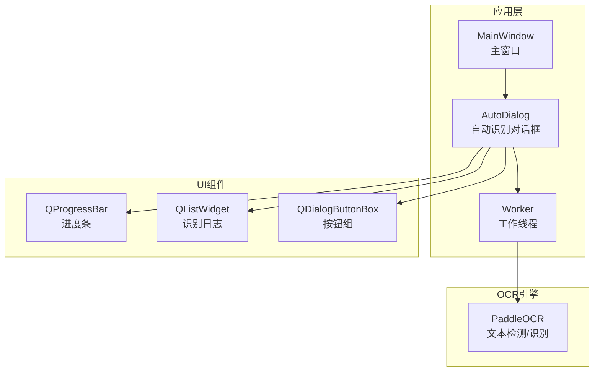
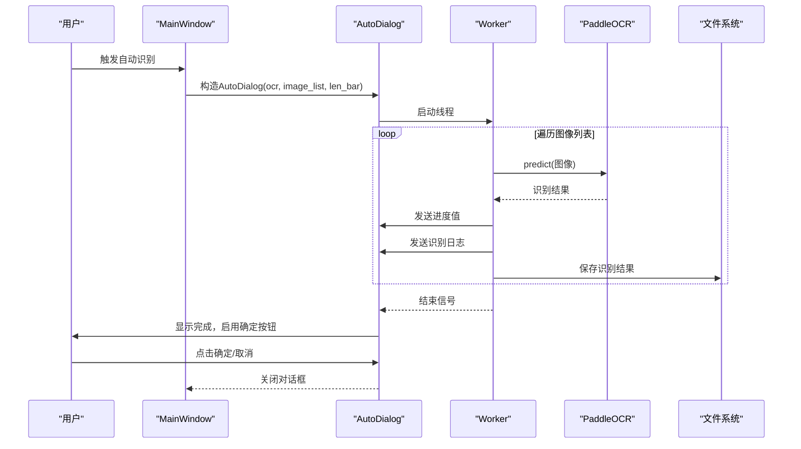
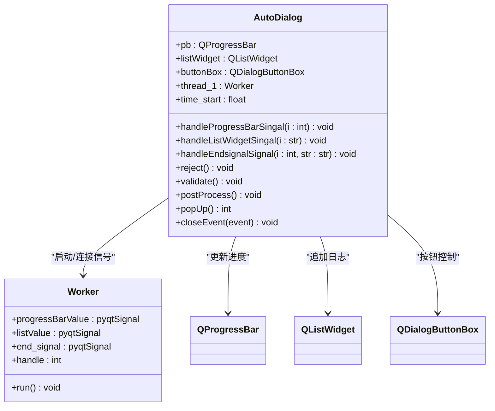
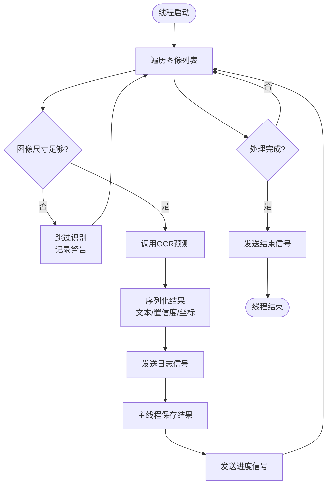
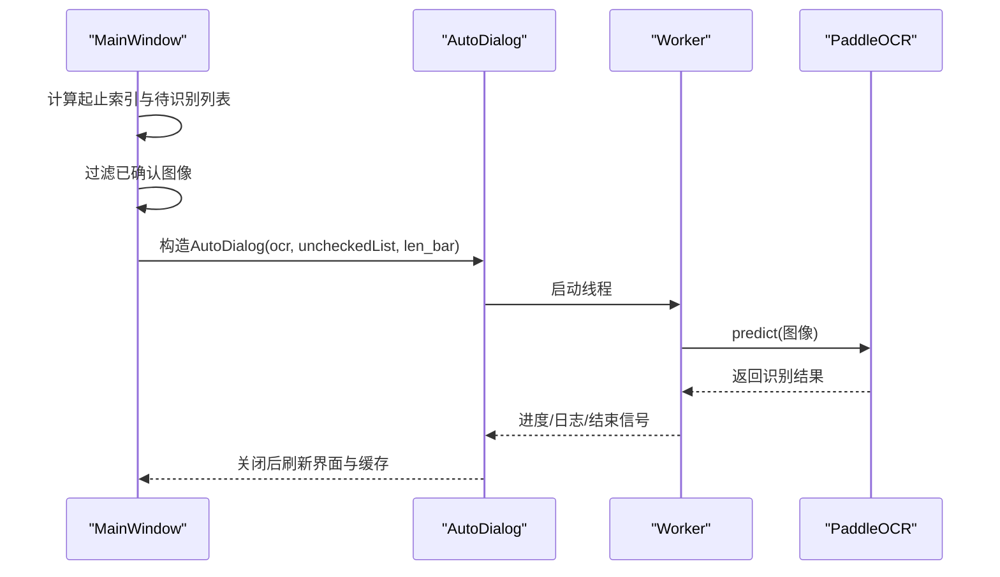
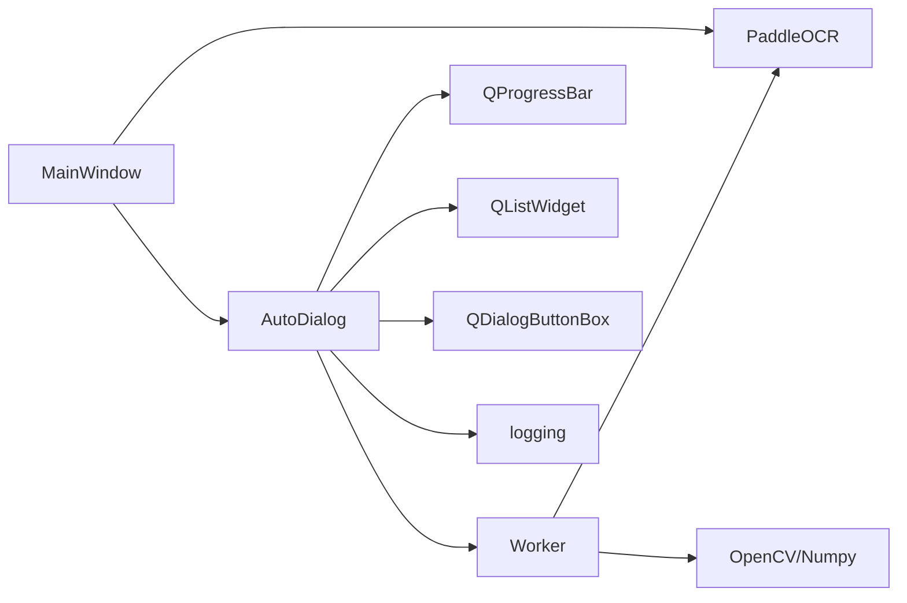

# 自动识别对话框

<cite>
**本文档引用的文件**
- [libs/autoDialog.py](autoDialog.md)
- [PPOCRLabel.py](PPOCRLabel.md)
- [libs/utils.py](utils.md)
- [libs/settings.py](settings.md)
- [libs/constants.py](constants.md)
- [README.md](README.md)
</cite>

## 目录
1. [简介](#简介)
2. [项目结构](#项目结构)
3. [核心组件](#核心组件)
4. [架构总览](#架构总览)
5. [详细组件分析](#详细组件分析)
6. [依赖关系分析](#依赖关系分析)
7. [性能考量](#性能考量)
8. [故障排查指南](#故障排查指南)
9. [结论](#结论)
10. [附录](#附录)

## 简介
本文件系统性地阐述自动识别对话框（AutoDialog）的设计理念、实现方式与使用方法。AutoDialog负责在后台线程中批量执行OCR识别，并通过进度条、列表与模态对话框向用户反馈识别进度与结果；同时支持取消识别、时间估算与结果持久化。本文档覆盖以下主题：
- 自动识别参数配置与识别模式选择
- 批量处理选项与交互流程
- 对话框初始化、进度显示与模态行为
- 开始识别与取消操作的处理机制
- 使用场景、参数调优建议与性能优化指南

## 项目结构
AutoDialog位于应用的图形界面层，与主窗口（MainWindow）协作完成自动识别任务。其核心文件与职责如下：
- libs/autoDialog.py：定义AutoDialog与Worker线程类，负责识别流程、进度与结果展示
- PPOCRLabel.py：主窗口，负责构建识别任务、传递参数并触发AutoDialog
- libs/utils.py：工具函数，提供图标加载等通用能力
- libs/settings.py：设置管理，用于持久化配置
- libs/constants.py：常量定义
- README.md：项目使用说明与功能概览

图表来源
- [libs/autoDialog.py](autoDialog.md)
- [PPOCRLabel.py](PPOCRLabel.md)

章节来源
- [libs/autoDialog.py](autoDialog.md)
- [PPOCRLabel.py](PPOCRLabel.md)

## 核心组件
- AutoDialog：模态对话框，承载进度条、识别日志与按钮，协调主线程与工作线程
- Worker：后台线程，遍历图像列表，调用OCR引擎执行识别，通过信号更新UI与保存结果
- MainWindow：发起自动识别请求，准备图像列表与参数，触发对话框弹出
- UI组件：进度条、列表控件、按钮组，用于实时反馈识别状态与结果

章节来源
- [libs/autoDialog.py](autoDialog.md)
- [PPOCRLabel.py](PPOCRLabel.md)

## 架构总览
AutoDialog采用“主线程负责UI与调度，子线程负责计算”的架构设计。主线程在对话框中维护进度条与日志列表，子线程负责实际的OCR识别与结果序列化。识别完成后，主线程根据结果决定是否启用“确定”按钮并刷新界面。

图表来源
- [libs/autoDialog.py](autoDialog.md)
- [libs/autoDialog.py](autoDialog.md)
- [PPOCRLabel.py](PPOCRLabel.md)

## 详细组件分析

### AutoDialog 类
- 职责
  - 初始化UI：进度条、日志列表、按钮组
  - 模态显示：阻塞用户其他操作，确保识别期间的稳定性
  - 进度反馈：基于已处理数量动态更新进度条与剩余时间
  - 结果展示：将单条识别结果追加到列表控件
  - 控制流：启动工作线程、处理取消与结束事件
- 关键属性
  - pb：进度条
  - listWidget：识别日志列表
  - buttonBox：包含“确定/取消”按钮
  - thread_1：工作线程实例
  - time_start：开始时间，用于估算剩余时间
- 关键方法
  - handleProgressBarSingal：更新进度与标题栏剩余时间
  - handleListWidgetSingal：滚动到最新日志项
  - handleEndsignalSignal：识别完成后启用“确定”按钮
  - reject：取消识别，终止线程并接受对话框
  - validate：确认并关闭对话框
  - popUp：启动线程并进入模态循环
  - closeEvent：窗口关闭时走取消逻辑

图表来源
- [libs/autoDialog.py](autoDialog.md)
- [libs/autoDialog.py](autoDialog.md)

章节来源
- [libs/autoDialog.py](autoDialog.md)

### Worker 线程
- 职责
  - 在后台遍历图像列表，调用OCR引擎执行识别
  - 将识别结果转换为字符串并发送到主线程的日志列表
  - 将结果写入主线程缓存并触发保存
  - 更新进度条并发出结束信号
- 关键逻辑
  - 图像尺寸检查：小于阈值的图像跳过识别
  - 结果序列化：将多边形坐标与文本、置信度打包
  - 取消机制：handle标志为负值时提前退出循环
- 错误处理
  - 捕获异常并记录日志，避免主线程崩溃

图表来源
- [libs/autoDialog.py](autoDialog.md)

章节来源
- [libs/autoDialog.py](autoDialog.md)

### MainWindow 与自动识别入口
- MainWindow.autoRecognition：构建识别任务
  - 计算起止索引与待识别图像集合
  - 基于文件状态字典过滤已确认的图像
  - 实例化AutoDialog并弹出
  - 弹出后刷新当前文件、保存缓存并初始化关键信息列表
- MainWindow.autoRecognitionNum：限制批量数量，避免一次性处理过多图像

图表来源
- [PPOCRLabel.py](PPOCRLabel.md)

章节来源
- [PPOCRLabel.py](PPOCRLabel.md)

### 用户交互流程
- 参数配置
  - 批量数量：通过Spin Box设置本次自动识别的图像数量上限
  - 识别模式：默认使用内置轻量级模型（由MainWindow构造）
- 交互步骤
  - 用户点击“自动识别”
  - 系统弹出AutoDialog，显示进度条与日志
  - 用户可随时点击“取消”中断识别
  - 识别完成后启用“确定”，点击后关闭对话框并刷新界面
- 时间估算
  - 基于平均耗时动态计算剩余时间并显示在标题栏

章节来源
- [PPOCRLabel.py](PPOCRLabel.md)
- [libs/autoDialog.py](autoDialog.md)

## 依赖关系分析
- AutoDialog依赖
  - PyQt5：UI组件与信号槽机制
  - PaddleOCR：文本检测与识别
  - OpenCV/Numpy：图像解码与基础运算
  - 日志模块：记录错误与警告
- 主窗口依赖
  - MainWindow持有OCR实例与图像列表，负责任务编排
  - 通过AutoDialog封装识别流程，保证UI线程稳定

图表来源
- [libs/autoDialog.py](autoDialog.md)
- [PPOCRLabel.py](PPOCRLabel.md)

章节来源
- [libs/autoDialog.py](autoDialog.md)
- [PPOCRLabel.py](PPOCRLabel.md)

## 性能考量
- 线程栈大小
  - Worker线程设置了较大的栈空间以满足OCR推理需求
- 图像尺寸阈值
  - 小于阈值的图像会被跳过，避免无效计算
- 进度与日志
  - 进度按图像数量更新，日志逐条追加，避免一次性传输大量数据
- 取消机制
  - 通过handle标志快速中断循环，及时释放资源
- 设备选择
  - MainWindow根据环境选择GPU/CPU设备，影响整体吞吐

章节来源
- [libs/autoDialog.py](autoDialog.md)
- [PPOCRLabel.py](PPOCRLabel.md)

## 故障排查指南
- 无法识别小图
  - 现象：日志出现尺寸过小警告
  - 处理：增大图像分辨率或调整识别阈值
- 识别结果为空
  - 现象：日志提示无法识别该文件
  - 处理：检查图像质量与OCR模型配置
- 取消后界面卡顿
  - 现象：点击取消后线程未完全退出
  - 处理：确认线程isFinished循环已结束再accept
- 进度异常
  - 现象：进度条不动或倒退
  - 处理：检查信号连接与len_bar传参是否正确

章节来源
- [libs/autoDialog.py](autoDialog.md)
- [libs/autoDialog.py](autoDialog.md)

## 结论
AutoDialog通过清晰的线程分离与UI反馈机制，实现了高效稳定的批量OCR识别体验。其模态对话框设计确保了识别过程的可控性，结合进度估算与日志展示提升了用户体验。在工程实践中，建议合理设置批量规模、关注图像质量与设备配置，以获得更佳的识别效果与性能表现。

## 附录

### 使用场景与最佳实践
- 场景
  - 大规模图像标注前的预识别
  - 快速验证标注质量与覆盖率
- 最佳实践
  - 先小批量测试，逐步扩大规模
  - 优先处理高价值目标区域
  - 结合“重新识别”功能修正误识别结果

章节来源
- [README.md](README.md)

### 参数调优建议
- 批量数量
  - 初期建议较小批量，观察系统资源占用与识别速度
- 设备选择
  - GPU环境下优先使用GPU推理，CPU环境下注意内存与I/O瓶颈
- 模型配置
  - 根据业务语言与场景选择合适的轻量级模型

章节来源
- [PPOCRLabel.py](PPOCRLabel.md)
- [README.md](README.md)