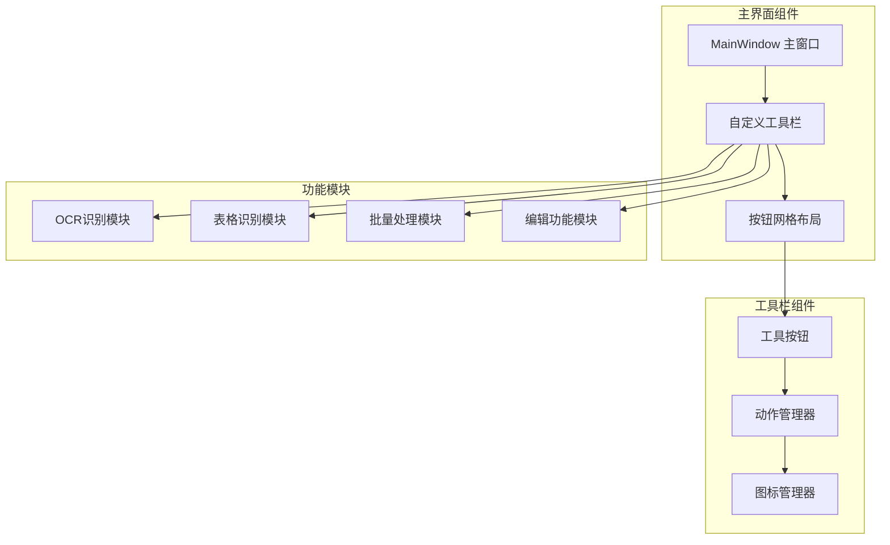
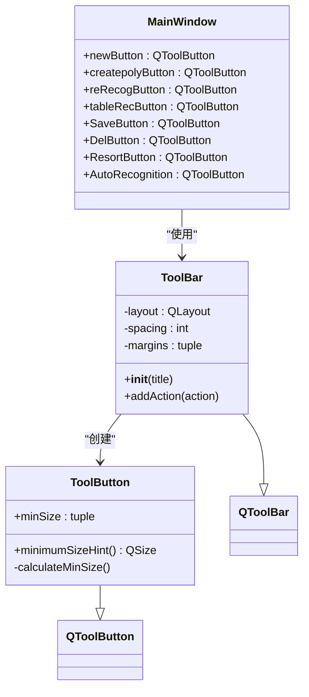
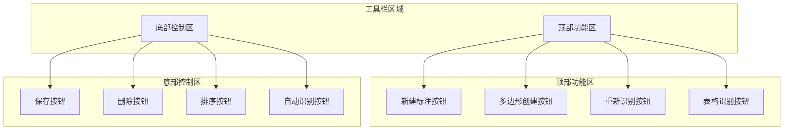
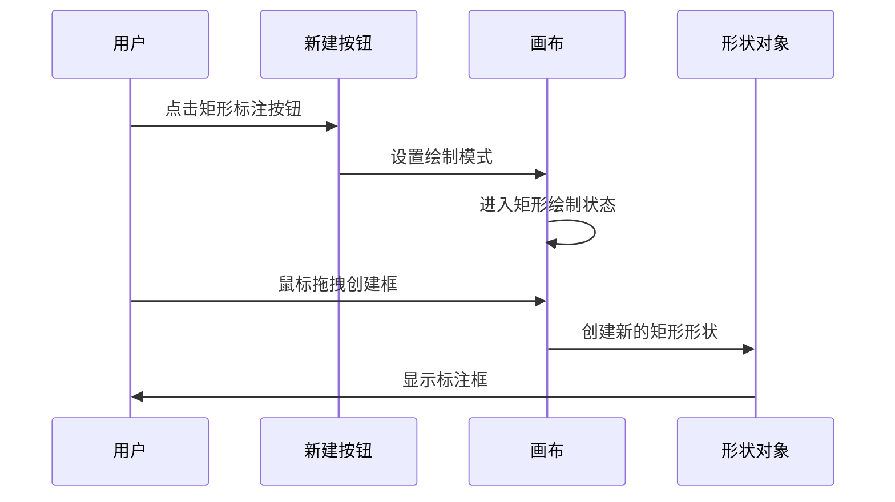
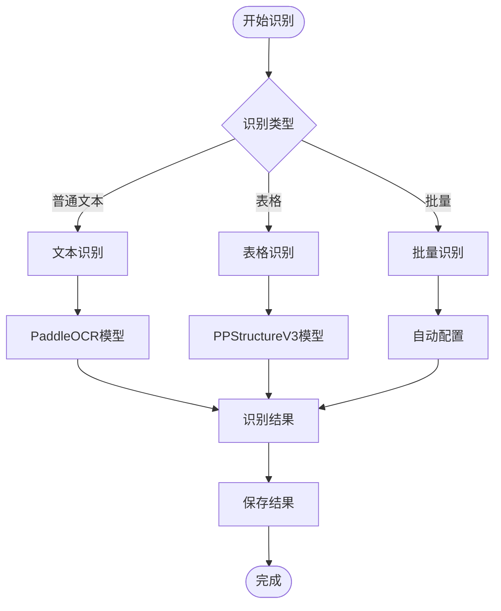
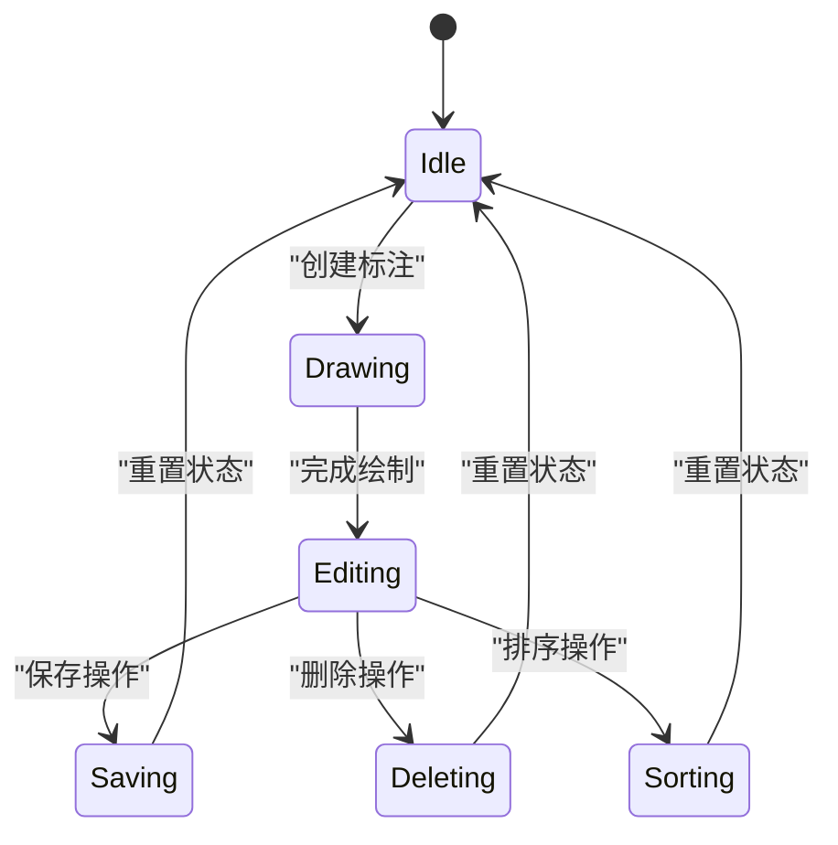
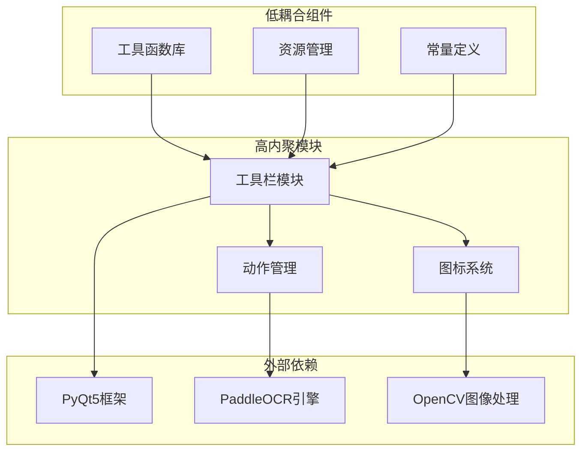

# 工具栏设计

<cite>
**本文档引用的文件**
- [PPOCRLabel.py](PPOCRLabel.md)
- [toolBar.py](toolBar.md)
- [utils.py](utils.md)
- [resources.py](resources.md)
- [resources.qrc](resources.md)
- [constants.py](constants.md)
- [stringBundle.py](stringBundle.md)
- [settings.py](settings.md)
- [strings-zh-CN.properties](strings-zh-CN.md)
- [strings-en.properties](strings-en.md)
</cite>

## 目录
1. [简介](#简介)
2. [项目结构](#项目结构)
3. [核心组件](#核心组件)
4. [架构概览](#架构概览)
5. [详细组件分析](#详细组件分析)
6. [依赖关系分析](#依赖关系分析)
7. [性能考虑](#性能考虑)
8. [故障排除指南](#故障排除指南)
9. [结论](#结论)

## 简介

PPOCRLabel 是一个基于 PyQt5 的 OCR 标注工具，其工具栏设计采用了模块化和可扩展的架构。该工具栏不仅提供了基础的标注功能，还集成了智能识别、表格处理和批量操作等高级功能。本文档将深入分析工具栏的布局结构、按钮组织和功能分区，详细说明各个工具按钮的功能定位和设计理念。

## 项目结构

PPOCRLabel 工具栏系统采用分层架构设计，主要由以下组件构成：



**图表来源**
- [PPOCRLabel.py](PPOCRLabel.md)
- [toolBar.py](toolBar.md)

**章节来源**
- [PPOCRLabel.py](PPOCRLabel.md)
- [toolBar.py](toolBar.md)

## 核心组件

### 工具栏基础架构

工具栏系统的核心是自定义的 `ToolBar` 类，它继承自 PyQt5 的 `QToolBar` 并进行了专门的定制：



**图表来源**
- [toolBar.py](toolBar.md)
- [PPOCRLabel.py](PPOCRLabel.md)

### 按钮布局结构

工具栏采用两层布局设计：

1. **顶部功能区**：包含核心标注功能
2. **底部控制区**：包含保存、删除、排序等操作按钮

**章节来源**
- [PPOCRLabel.py](PPOCRLabel.md)

## 架构概览

### 工具栏整体架构



**图表来源**
- [PPOCRLabel.py](PPOCRLabel.md)

### 功能分区设计

工具栏按照功能相关性进行分区，每个分区都有明确的职责边界：

| 分区 | 功能 | 按钮数量 | 快捷键 |
|------|------|----------|--------|
| 新建标注区 | 创建矩形框、多边形框 | 2个 | W, Q, Home |
| 识别功能区 | 重新识别、表格识别、自动识别 | 3个 | Ctrl+R, Ctrl+Shift+R, Ctrl+M |
| 控制操作区 | 保存、删除、排序 | 3个 | Ctrl+S, Ctrl+V, Ctrl+B |
| 批量处理区 | 自动识别、单元格识别、导出 | 3个 | 无固定快捷键 |

**章节来源**
- [PPOCRLabel.py](PPOCRLabel.md)

## 详细组件分析

### 新建标注功能区

#### 矩形标注按钮
- **功能定位**：创建标准矩形标注框
- **图标设计**：使用 `objects.png` 图标
- **快捷键**：W 键
- **交互反馈**：点击后进入绘制模式，支持拖拽创建

#### 多边形创建按钮
- **功能定位**：创建任意多边形标注
- **图标设计**：使用 `new.png` 图标  
- **快捷键**：Q 键或 Home 键
- **交互反馈**：支持多点点击绘制复杂形状



**图表来源**
- [PPOCRLabel.py](PPOCRLabel.md)
- [PPOCRLabel.py](PPOCRLabel.md)

**章节来源**
- [PPOCRLabel.py](PPOCRLabel.md)
- [PPOCRLabel.py](PPOCRLabel.md)

### 识别功能区

#### 重新识别按钮
- **功能定位**：对当前图像进行重新识别
- **图标设计**：使用 `reRec.png` 图标
- **快捷键**：Ctrl+Shift+R
- **智能识别**：支持批量重新识别多个标注框

#### 表格识别按钮
- **功能定位**：专门处理表格结构的识别
- **图标设计**：使用 `Auto.png` 图标
- **功能特性**：集成 PPStructureV3 模型
- **应用场景**：发票、表格等结构化文档

#### 自动识别按钮
- **功能定位**：启用自动标注功能
- **图标设计**：使用 `Auto.png` 图标
- **配置选项**：支持设置自动识别数量
- **批量处理**：可对多个图像进行批量识别



**图表来源**
- [PPOCRLabel.py](PPOCRLabel.md)
- [PPOCRLabel.py](PPOCRLabel.md)

**章节来源**
- [PPOCRLabel.py](PPOCRLabel.md)
- [PPOCRLabel.py](PPOCRLabel.md)

### 控制操作区

#### 保存按钮
- **功能定位**：保存当前标注结果
- **图标设计**：使用 `save.png` 图标
- **快捷键**：Ctrl+S
- **格式支持**：支持多种标注格式导出

#### 删除按钮
- **功能定位**：删除当前图像
- **图标设计**：使用 `close.png` 图标
- **快捷键**：Ctrl+Shift+D
- **安全保护**：包含确认对话框

#### 排序按钮
- **功能定位**：重新排序标注框位置
- **图标设计**：使用 `resort.png` 图标（如果存在）
- **快捷键**：Ctrl+B
- **算法实现**：基于坐标位置的智能排序



**图表来源**
- [PPOCRLabel.py](PPOCRLabel.md)
- [PPOCRLabel.py](PPOCRLabel.md)

**章节来源**
- [PPOCRLabel.py](PPOCRLabel.md)
- [PPOCRLabel.py](PPOCRLabel.md)

### 批量处理区

#### 单元格识别按钮
- **功能定位**：对表格单元格进行单独识别
- **图标设计**：使用 `reRec.png` 图标
- **应用场景**：表格中的特定单元格识别

#### 导出功能按钮
- **功能定位**：导出识别结果和标注数据
- **图标设计**：使用 `save.png` 图标
- **格式支持**：JSON、XML等多种格式
- **批量导出**：支持整个数据集的批量导出

**章节来源**
- [PPOCRLabel.py](PPOCRLabel.md)

## 依赖关系分析

### 组件耦合度分析



**图表来源**
- [PPOCRLabel.py](PPOCRLabel.md)
- [toolBar.py](toolBar.md)

### 关键依赖关系

| 组件 | 依赖项 | 用途 | 版本要求 |
|------|--------|------|----------|
| ToolBar | PyQt5.QtWidgets | GUI界面组件 | PyQt5.15+ |
| Utils | PyQt5.QtGui | 图形界面工具 | PyQt5.15+ |
| Resources | PyQt5.QtCore | 资源管理 | PyQt5.15+ |
| PaddleOCR | PaddleOCR | OCR识别引擎 | PaddleOCR 2.0+ |
| OpenCV | OpenCV | 图像处理 | OpenCV 4.0+ |

**章节来源**
- [PPOCRLabel.py](PPOCRLabel.md)
- [toolBar.py](toolBar.md)

## 性能考虑

### 工具栏性能优化策略

1. **延迟加载**：图标资源采用延迟加载机制，减少启动时间
2. **内存管理**：工具按钮使用最小尺寸策略，避免内存浪费
3. **事件处理**：采用事件委托模式，提高响应速度
4. **缓存机制**：常用操作结果进行缓存，减少重复计算

### 性能监控指标

- **启动时间**：工具栏初始化应在2秒内完成
- **内存占用**：单个工具按钮内存占用不超过1KB
- **响应延迟**：按钮点击响应延迟小于100ms
- **渲染效率**：工具栏重绘频率控制在60FPS以上

## 故障排除指南

### 常见问题及解决方案

#### 工具栏按钮无响应
1. **检查依赖包安装**
   ```bash
   pip install pyqt5 opencv-python paddleocr
   ```

2. **验证图标资源加载**
   ```python
   from libs.resources import qInitResources
   qInitResources()
   ```

3. **检查权限设置**
   - 确保应用程序具有读取资源文件的权限
   - 检查防火墙设置是否阻止资源访问

#### 国际化显示问题
1. **验证字符串资源文件**
   - 检查 `strings-en.properties` 和 `strings-zh-CN.properties`
   - 确认文件编码为UTF-8

2. **检查语言设置**
   ```python
   from libs.stringBundle import StringBundle
   bundle = StringBundle.getBundle('zh-CN')
   ```

#### 性能问题诊断
1. **监控内存使用**
   ```python
   import psutil
   process = psutil.Process()
   print(f"内存使用: {process.memory_info().rss / 1024 / 1024:.2f} MB")
   ```

2. **分析CPU使用率**
   - 使用系统监控工具观察工具栏操作时的CPU占用
   - 检查是否有不必要的后台任务

**章节来源**
- [stringBundle.py](stringBundle.md)
- [resources.py](resources.md)

## 结论

PPOCRLabel 工具栏设计体现了现代GUI应用的最佳实践，通过模块化架构、清晰的功能分区和完善的国际化支持，为用户提供了高效、直观的OCR标注体验。

### 设计优势总结

1. **模块化设计**：工具栏组件高度解耦，便于维护和扩展
2. **功能完整性**：涵盖从基础标注到高级识别的完整工作流程
3. **用户体验优化**：提供丰富的快捷键和视觉反馈
4. **国际化支持**：完整的多语言支持和本地化适配
5. **性能优化**：采用多种优化策略确保流畅的用户体验

### 未来改进建议

1. **主题系统**：增加自定义主题支持
2. **插件架构**：支持第三方功能扩展
3. **云端同步**：集成云存储和协作功能
4. **AI增强**：集成更智能的标注辅助功能

该工具栏设计为PPOCRLabel提供了坚实的基础，通过持续的优化和改进，将继续为用户提供优秀的OCR标注服务。