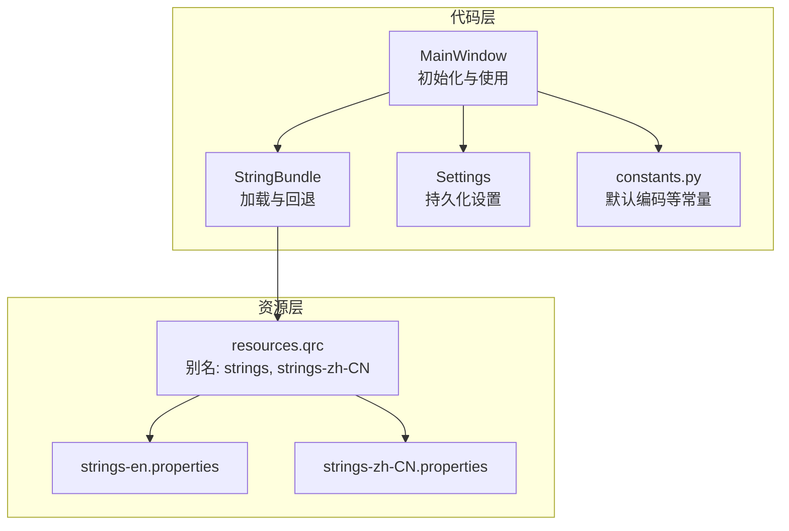
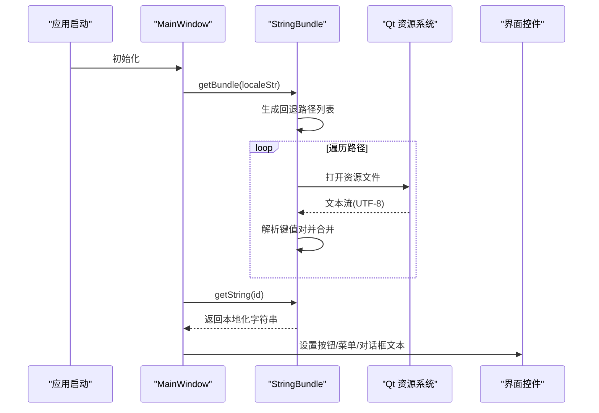
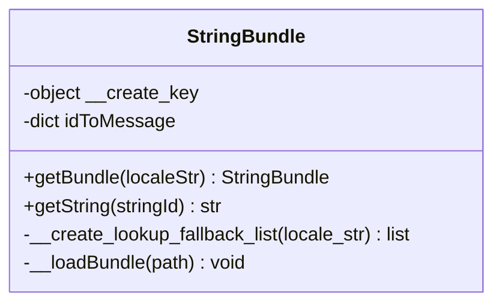
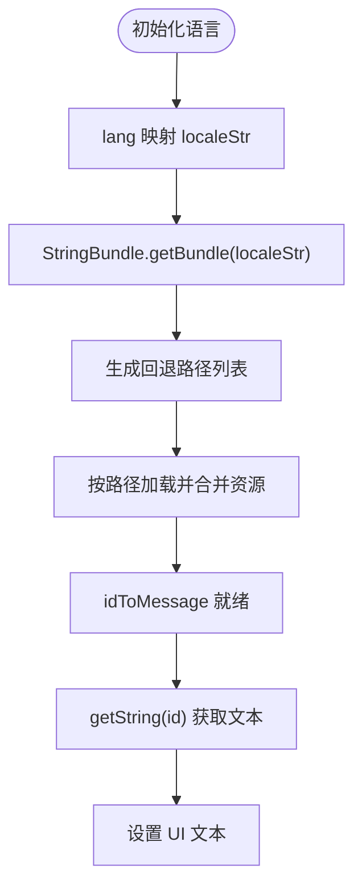
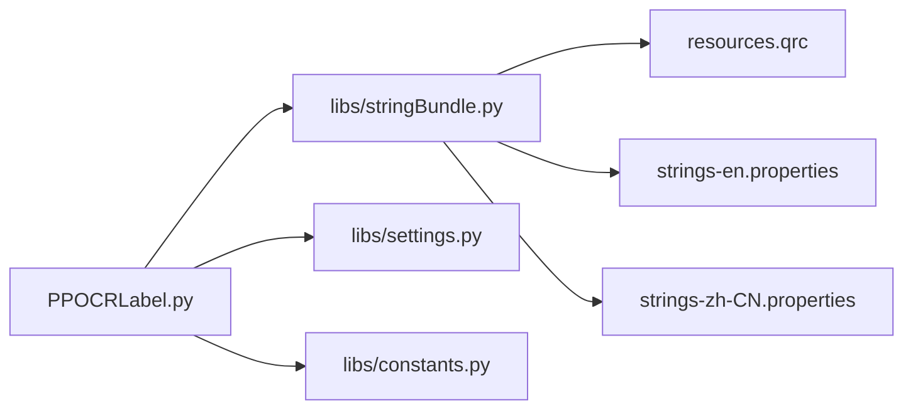

# 国际化和本地化

<cite>
**本文引用的文件**
- [libs/stringBundle.py](stringBundle.md)
- [resources/strings/strings-en.properties](strings-en.md)
- [resources/strings/strings-zh-CN.properties](strings-zh-CN.md)
- [PPOCRLabel.py](PPOCRLabel.md)
- [resources.qrc](resources.md)
- [libs/constants.py](constants.md)
- [libs/settings.py](settings.md)
</cite>

## 目录
1. [简介](#简介)
2. [项目结构](#项目结构)
3. [核心组件](#核心组件)
4. [架构总览](#架构总览)
5. [组件详解](#组件详解)
6. [依赖关系分析](#依赖关系分析)
7. [性能考量](#性能考量)
8. [故障排查指南](#故障排查指南)
9. [结论](#结论)
10. [附录](#附录)

## 简介
本文件系统性阐述 PPOCRLabel 应用的国际化与本地化（i18n/l10n）实现，重点围绕 StringBundle 类的设计与运行机制，覆盖以下方面：
- 字符串资源的加载、合并与回退策略
- .properties 资源文件的格式规范与编码处理
- 中英文字符串资源的组织方式与命名约定
- 运行时语言切换与字符串获取流程
- 新语言扩展步骤与最佳实践
- 与主程序的集成方式及性能优化建议

## 项目结构
国际化相关的核心文件与资源分布如下：
- 字符串资源：resources/strings/strings-en.properties、resources/strings/strings-zh-CN.properties
- 资源打包：resources.qrc 将字符串资源以别名形式打包进 Qt 资源系统
- 核心类：libs/stringBundle.py 提供字符串包加载与回退机制
- 主程序集成：PPOCRLabel.py 在初始化阶段创建 StringBundle 实例，并通过 getString 获取本地化文本
- 常量与设置：libs/constants.py 定义默认编码等常量；libs/settings.py 提供应用设置持久化能力

图表来源
- [resources.qrc](resources.md)
- [libs/stringBundle.py](stringBundle.md)
- [PPOCRLabel.py](PPOCRLabel.md)
- [libs/settings.py](settings.md)
- [libs/constants.py](constants.md)

章节来源
- [resources.qrc](resources.md)
- [libs/stringBundle.py](stringBundle.md)
- [PPOCRLabel.py](PPOCRLabel.md)
- [libs/constants.py](constants.md)
- [libs/settings.py](settings.md)

## 核心组件
- StringBundle：负责根据区域设置加载字符串资源，支持回退链式查找与合并，提供 getString 获取本地化文本。
- MainWindow：在构造函数中基于语言参数选择 localeStr，创建 StringBundle 实例，并通过内部辅助函数统一调用 getString 获取文本。
- 资源打包：resources.qrc 将 .properties 文件以别名形式嵌入 Qt 资源系统，便于运行时通过 QFile 访问。
- 设置与常量：Settings 提供持久化；constants.py 提供默认编码等常量，确保资源读取一致性。

章节来源
- [libs/stringBundle.py](stringBundle.md)
- [PPOCRLabel.py](PPOCRLabel.md)
- [resources.qrc](resources.md)
- [libs/constants.py](constants.md)

## 架构总览
国际化流程从 MainWindow 初始化开始，依据传入的语言参数确定 localeStr，随后通过 StringBundle.getBundle 创建字符串包。StringBundle 的构造函数会生成回退路径列表，按顺序加载资源并合并到内存字典中。最终，MainWindow 使用 getString 获取对应键值的本地化文本。

图表来源
- [PPOCRLabel.py](PPOCRLabel.md)
- [libs/stringBundle.py](stringBundle.md)
- [resources.qrc](resources.md)

## 组件详解

### StringBundle 类设计与实现
- 设计要点
  - 单例式工厂：通过类方法 getBundle 创建实例，禁止直接构造，保证全局唯一与一致的资源加载行为。
  - 区域回退链：根据 localeStr 拆分标签，生成基础路径后逐级追加子标签，形成回退链，优先使用更具体的资源。
  - 合并策略：按路径顺序加载，后加载的同键值会覆盖先前值，实现“具体覆盖通用”的合并语义。
  - 编码处理：使用 UTF-8 读取 .properties 文件，避免中文乱码问题。
  - 错误处理：当键不存在时断言失败，便于快速定位缺失的字符串键。

- 关键方法与职责
  - getBundle(localeStr): 生成 StringBundle 实例，localeStr 默认从系统环境解析，异常时回退到英文。
  - __create_lookup_fallback_list(locale_str): 生成回退路径列表，如 zh-CN 会被拆分为 ["zh","CN"] 并依次拼接。
  - __loadBundle(path): 通过 QFile/QTextStream 读取资源，按行解析键值对，去除引号与空白，写入 idToMessage。
  - getString(stringId): 返回对应键的本地化字符串，不存在时抛出断言错误。

- 复杂度分析
  - 加载复杂度：假设资源数量为 N，每条路径加载 O(N)，总加载复杂度 O(K·N)，K 为回退路径数。
  - 查询复杂度：字典查找 O(1)，字符串获取为 O(1)。
  - 空间复杂度：idToMessage 存储所有键值对，空间为 O(N)。

图表来源
- [libs/stringBundle.py](stringBundle.md)

章节来源
- [libs/stringBundle.py](stringBundle.md)

### .properties 文件格式规范与编码处理
- 文件命名与组织
  - 英文资源：resources/strings/strings-en.properties
  - 中文资源：resources/strings/strings-zh-CN.properties
  - 资源打包：resources.qrc 中以别名 strings、strings-zh-CN 引入，便于运行时访问。

- 键值对格式
  - 使用等号分隔键与值，例如 key=value。
  - 值可带双引号，加载时会去除首尾空白与外层双引号。
  - 注释与空行被忽略，仅解析非空行且包含等号的键值对。

- 编码处理
  - 读取时显式设置 UTF-8 编码，确保中文字符正确解码。
  - 保存与持久化采用 UTF-8 编码，避免跨平台兼容问题。

章节来源
- [resources/strings/strings-en.properties](strings-en.md)
- [resources/strings/strings-zh-CN.properties](strings-zh-CN.md)
- [resources.qrc](resources.md)
- [libs/stringBundle.py](stringBundle.md)
- [libs/constants.py](constants.md)

### 语言切换与运行时字符串获取
- 切换入口
  - MainWindow 构造函数接收 lang 参数，映射为 localeStr："ch" 映射为 "zh-CN"，否则为 "en"。
  - 通过 StringBundle.getBundle(localeStr) 创建字符串包，确保后续 getString 获取到目标语言文本。

- 运行时获取
  - 内部定义 get_str 函数封装 getString，统一从 stringBundle 获取文本。
  - 大量 UI 元素（菜单、按钮、对话框标题与提示）均通过 getString 获取本地化文本。

- 示例路径
  - 字符串包创建与使用：[PPOCRLabel.py](PPOCRLabel.md)
  - 文本获取示例：[PPOCRLabel.py](PPOCRLabel.md)、[PPOCRLabel.py](PPOCRLabel.md)

图表来源
- [PPOCRLabel.py](PPOCRLabel.md)
- [libs/stringBundle.py](stringBundle.md)

章节来源
- [PPOCRLabel.py](PPOCRLabel.md)
- [PPOCRLabel.py](PPOCRLabel.md)
- [PPOCRLabel.py](PPOCRLabel.md)

### 添加新语言支持的步骤与最佳实践
- 步骤
  1. 新建 .properties 文件：在 resources/strings/ 下新增 strings-<lang>.properties，键名与现有资源保持一致。
  2. 资源打包：在 resources.qrc 中为新文件添加别名，例如 alias="strings-xx"。
  3. 语言映射：在 MainWindow 初始化处增加 lang 到 localeStr 的映射分支，或扩展回退逻辑。
  4. 测试验证：启动应用，切换到新语言，检查 UI 文本是否正确显示。
  5. 编码与一致性：确保新文件保存为 UTF-8，键名与值格式与现有资源一致。

- 最佳实践
  - 键名命名：采用小写+下划线风格，语义清晰，避免重复与歧义。
  - 值处理：保留必要的占位符与换行，必要时在 UI 层进行格式化。
  - 回退策略：尽量提供完整键集，减少回退链长度，提升加载效率。
  - 文档与校对：建立翻译清单，确保所有 UI 文本均有对应键值。

章节来源
- [resources.qrc](resources.md)
- [PPOCRLabel.py](PPOCRLabel.md)

### 与主程序的集成方式
- 资源访问：通过 Qt 资源系统访问 .properties 文件，无需外部文件依赖，部署简单。
- 初始化集成：MainWindow 在构造函数早期创建 StringBundle，后续所有文本获取统一走 getString。
- 设置持久化：Settings 负责应用设置的读写，与国际化无直接耦合，但可作为语言偏好存储的载体（如未来扩展）。

章节来源
- [PPOCRLabel.py](PPOCRLabel.md)
- [libs/settings.py](settings.md)

## 依赖关系分析
- StringBundle 依赖 Qt 资源系统（QFile/QTextStream），用于读取 .properties 文件。
- MainWindow 依赖 StringBundle 提供的 getString 接口，完成 UI 文本本地化。
- 资源打包依赖 resources.qrc，确保 .properties 文件被嵌入到可执行文件中。
- constants.py 提供默认编码常量，保障资源读取的一致性。

图表来源
- [PPOCRLabel.py](PPOCRLabel.md)
- [libs/stringBundle.py](stringBundle.md)
- [resources.qrc](resources.md)
- [libs/settings.py](settings.md)
- [libs/constants.py](constants.md)

章节来源
- [PPOCRLabel.py](PPOCRLabel.md)
- [libs/stringBundle.py](stringBundle.md)
- [resources.qrc](resources.md)
- [libs/settings.py](settings.md)
- [libs/constants.py](constants.md)

## 性能考量
- 加载策略
  - 回退链顺序加载，后加载覆盖先加载，建议尽量提供完整键集，减少回退层级。
  - .properties 文件较小，加载成本低；若未来资源增多，可考虑按需懒加载或分模块加载。
- 查询性能
  - 字典查找 O(1)，字符串获取为常数时间，满足高频 UI 更新场景。
- 编码与内存
  - 统一 UTF-8 编码，避免多编码转换开销。
  - idToMessage 一次性构建，内存占用与键数量线性相关，建议控制键数量与长度。

[本节为通用性能讨论，不直接分析特定文件，故无章节来源]

## 故障排查指南
- 常见问题
  - getString 抛出断言错误：表示资源中缺少该键，检查 .properties 文件与键名拼写。
  - 中文显示乱码：确认 .properties 文件保存为 UTF-8，读取时设置 UTF-8 编码。
  - 语言切换无效：检查 lang 到 localeStr 的映射分支是否覆盖目标语言。
  - 资源未找到：确认 resources.qrc 中已添加新语言资源别名。

- 定位方法
  - 在调用 getString 前打印 localeStr 与回退路径，核对资源是否存在。
  - 在 __loadBundle 中增加日志，记录加载的键值对，排查解析问题。

章节来源
- [libs/stringBundle.py](stringBundle.md)
- [libs/stringBundle.py](stringBundle.md)
- [PPOCRLabel.py](PPOCRLabel.md)

## 结论
PPOCRLabel 的国际化方案简洁高效：通过 StringBundle 的回退链与合并策略，结合 Qt 资源系统，实现了稳定的多语言支持。资源文件采用 .properties 格式并统一 UTF-8 编码，确保跨平台一致性。主程序通过统一的 getString 接口获取文本，易于维护与扩展。未来可在资源规模增大时引入更精细的加载策略与缓存机制，进一步优化性能。

[本节为总结性内容，不直接分析特定文件，故无章节来源]

## 附录

### .properties 文件格式与编码规范
- 键值对：key=value，值可带双引号，加载时去除首尾空白与外层引号。
- 注释与空行：忽略，仅解析包含等号的非空行。
- 编码：UTF-8，读取时显式设置编码，避免乱码。

章节来源
- [resources/strings/strings-en.properties](strings-en.md)
- [resources/strings/strings-zh-CN.properties](strings-zh-CN.md)
- [libs/stringBundle.py](stringBundle.md)

### 资源打包与访问
- 资源别名：strings、strings-zh-CN 对应英文与中文资源文件。
- 访问方式：通过 QFile 打开资源路径，使用 QTextStream 读取并设置 UTF-8 编码。

章节来源
- [resources.qrc](resources.md)
- [libs/stringBundle.py](stringBundle.md)