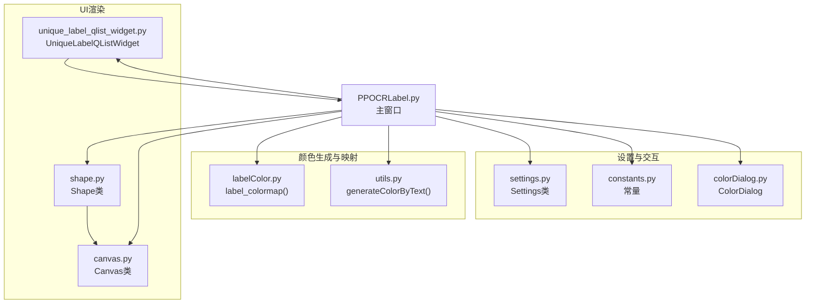
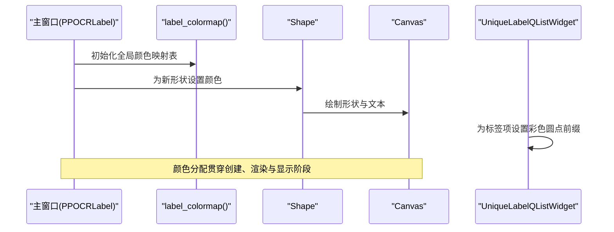
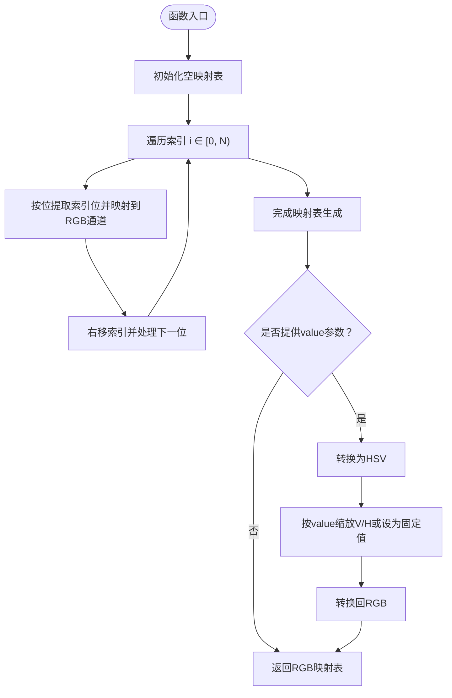
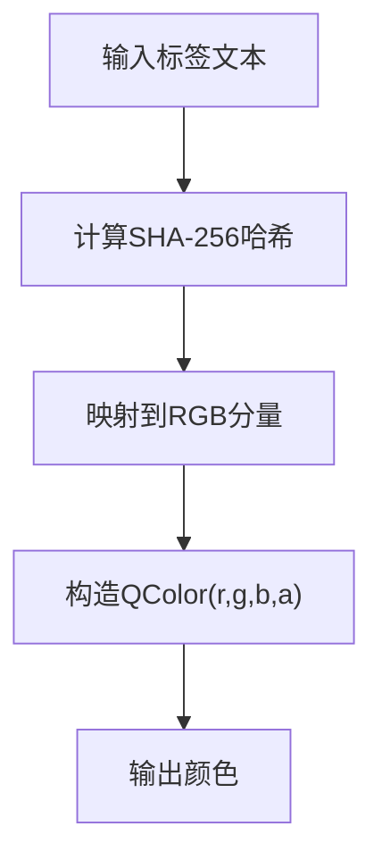
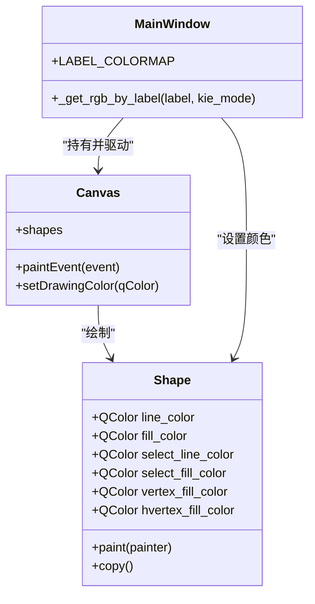
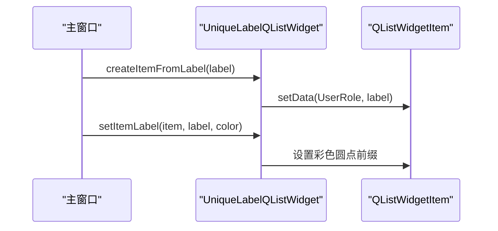
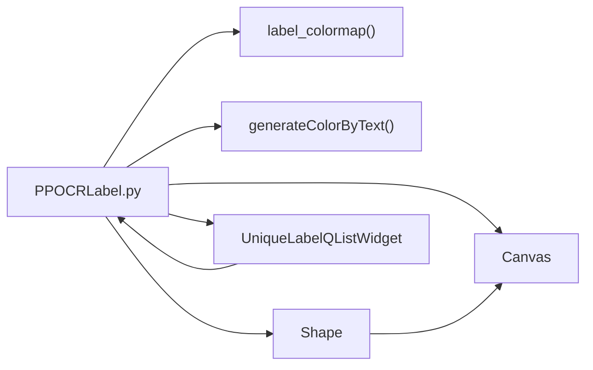

# 标签颜色管理

<cite>
**本文引用的文件**
- [libs/labelColor.py](labelColor.md)
- [libs/utils.py](utils.md)
- [libs/shape.py](shape.md)
- [libs/canvas.py](canvas.md)
- [libs/colorDialog.py](colorDialog.md)
- [libs/settings.py](settings.md)
- [libs/unique_label_qlist_widget.py](unique_label_qlist_widget.md)
- [libs/constants.py](constants.md)
- [PPOCRLabel.py](PPOCRLabel.md)
</cite>

## 目录
1. [简介](#简介)
2. [项目结构](#项目结构)
3. [核心组件](#核心组件)
4. [架构总览](#架构总览)
5. [详细组件分析](#详细组件分析)
6. [依赖关系分析](#依赖关系分析)
7. [性能考量](#性能考量)
8. [故障排查指南](#故障排查指南)
9. [结论](#结论)
10. [附录](#附录)

## 简介
本文件系统化阐述标签颜色管理系统的设计与实现，覆盖以下方面：
- 标签颜色分配算法与颜色生成机制
- 颜色唯一性保证与视觉可区分性原则
- 颜色数据结构设计与存储格式
- 颜色与标签名称的映射关系与动态分配策略
- 颜色主题的自定义选项与用户偏好设置
- 最佳实践与扩展指南（新增颜色方案）
- 颜色系统在UI渲染中的应用与性能考虑

## 项目结构
围绕颜色管理的核心模块与文件如下：
- 颜色生成与映射：libs/labelColor.py、libs/utils.py
- UI交互与显示：libs/shape.py、libs/canvas.py、libs/unique_label_qlist_widget.py
- 用户偏好与设置：libs/settings.py、libs/constants.py
- 主窗口集成：PPOCRLabel.py
- 颜色选择对话框：libs/colorDialog.py

图表来源
- [libs/labelColor.py](labelColor.md)
- [libs/utils.py](utils.md)
- [libs/shape.py](shape.md)
- [libs/canvas.py](canvas.md)
- [libs/unique_label_qlist_widget.py](unique_label_qlist_widget.md)
- [libs/settings.py](settings.md)
- [libs/constants.py](constants.md)
- [libs/colorDialog.py](colorDialog.md)
- [PPOCRLabel.py](PPOCRLabel.md)

章节来源
- [PPOCRLabel.py](PPOCRLabel.md)
- [libs/labelColor.py](labelColor.md)
- [libs/utils.py](utils.md)
- [libs/shape.py](shape.md)
- [libs/canvas.py](canvas.md)
- [libs/unique_label_qlist_widget.py](unique_label_qlist_widget.md)
- [libs/settings.py](settings.md)
- [libs/constants.py](constants.md)
- [libs/colorDialog.py](colorDialog.md)

## 核心组件
- 颜色映射表生成器：基于固定规则生成标签到颜色的映射数组，支持HSV空间亮度/饱和度缩放。
- 文本哈希颜色生成器：基于标签文本的哈希值生成稳定且唯一的颜色，用于列表项背景等场景。
- UI形状与画布：Shape类持有颜色属性；Canvas负责渲染形状与文本标签。
- 唯一标签列表：为标签项设置带颜色的圆点前缀，提升可读性。
- 设置与偏好：通过Settings持久化用户偏好，如线条/填充颜色等。
- 颜色选择对话框：提供颜色选择与默认恢复能力。

章节来源
- [libs/labelColor.py](labelColor.md)
- [libs/utils.py](utils.md)
- [libs/shape.py](shape.md)
- [libs/canvas.py](canvas.md)
- [libs/unique_label_qlist_widget.py](unique_label_qlist_widget.md)
- [libs/settings.py](settings.md)
- [libs/colorDialog.py](colorDialog.md)

## 架构总览
颜色系统在主窗口初始化时加载全局颜色映射表，并在不同场景下按需分配颜色：
- 标签列表项：使用文本哈希生成稳定颜色作为背景或前缀色。
- 检测框与关键信息实体：根据标签索引从全局映射表取色，确保同标签一致的颜色。
- UI渲染：Canvas根据Shape的颜色属性绘制边框、填充与文本标签。

图表来源
- [PPOCRLabel.py](PPOCRLabel.md)
- [libs/labelColor.py](labelColor.md)
- [libs/shape.py](shape.md)
- [libs/canvas.py](canvas.md)
- [libs/unique_label_qlist_widget.py](unique_label_qlist_widget.md)

## 详细组件分析

### 颜色映射表生成器（label_colormap）
- 功能概述
  - 生成长度为n_label的RGB颜色映射表，每个索引对应一种颜色。
  - 可选地在HSV空间对亮度/饱和度进行缩放或设定固定值，以控制颜色明暗与鲜艳程度。
- 数据结构与复杂度
  - 输入：n_label（整数）、value（可选，浮点或整数）。
  - 输出：形状为(N, 3)的numpy数组，dtype为uint8。
  - 时间复杂度：O(N)，空间复杂度：O(N)。
- 唯一性与可区分性
  - 通过位操作将索引映射到RGB通道，确保相邻索引颜色差异较大，满足基本的视觉区分需求。
  - 当提供value参数时，通过HSV转换与缩放进一步增强颜色对比度。
- 存储格式
  - numpy数组，元素类型为uint8，三通道顺序为RGB。

图表来源
- [libs/labelColor.py](labelColor.md)

章节来源
- [libs/labelColor.py](labelColor.md)

### 文本哈希颜色生成器（generateColorByText）
- 功能概述
  - 基于标签文本的SHA-256哈希，计算稳定的RGB值，生成QColor对象。
  - 用于列表项背景色或临时颜色，保证相同标签始终得到相同颜色。
- 数据结构与复杂度
  - 输入：字符串标签。
  - 输出：QColor(r, g, b, alpha)。
  - 复杂度：O(1)（哈希计算视为常量时间）。
- 唯一性与可区分性
  - 哈希函数具备良好的分散性，不同文本通常产生明显不同的颜色。
  - 在极少数哈希碰撞场景下，仍能保持稳定一致性。
- 存储格式
  - 返回PyQt5的QColor对象，内部包含r、g、b、alpha四个分量。

图表来源
- [libs/utils.py](utils.md)

章节来源
- [libs/utils.py](utils.md)

### UI形状与画布（Shape与Canvas）
- 形状颜色属性
  - Shape类维护线框色、填充色、选中色、顶点色等属性，支持类级默认值与实例级覆盖。
  - 渲染时根据选中状态与填充开关决定绘制样式。
- 画布渲染流程
  - Canvas在paintEvent中遍历所有可见形状，调用Shape.paint绘制路径、顶点与文本标签。
  - 字体大小随画布尺寸自适应，确保在不同缩放下标签清晰可读。
- 颜色应用
  - 主窗口在创建形状时，根据标签索引从全局映射表取色，设置Shape.line_color、fill_color等。
  - 列表项颜色由generateColorByText生成，用于列表项背景或前缀圆点。

图表来源
- [libs/shape.py](shape.md)
- [libs/shape.py](shape.md)
- [libs/canvas.py](canvas.md)
- [PPOCRLabel.py](PPOCRLabel.md)

章节来源
- [libs/shape.py](shape.md)
- [libs/shape.py](shape.md)
- [libs/canvas.py](canvas.md)
- [PPOCRLabel.py](PPOCRLabel.md)

### 唯一标签列表（UniqueLabelQListWidget）
- 功能概述
  - 为标签项设置彩色圆点前缀，前缀颜色来自颜色映射表或文本哈希生成的颜色。
  - 支持按键事件与鼠标事件，便于选择与编辑。
- 颜色应用
  - setItemLabel方法根据传入color参数决定是否显示彩色圆点前缀，提升标签可读性。

图表来源
- [libs/unique_label_qlist_widget.py](unique_label_qlist_widget.md)

章节来源
- [libs/unique_label_qlist_widget.py](unique_label_qlist_widget.md)

### 设置与偏好（Settings与常量）
- Settings类
  - 提供键值对存储与持久化，支持保存、加载与重置。
  - 路径默认位于用户主目录下的特定文件，便于跨会话保留用户偏好。
- 常量定义
  - 定义了窗口尺寸、颜色、自动保存、标签文件格式等键名，便于统一管理配置项。

章节来源
- [libs/settings.py](settings.md)
- [libs/constants.py](constants.md)

### 颜色选择对话框（ColorDialog）
- 功能概述
  - 基于QColorDialog，启用Alpha通道与非原生对话框，增加“恢复默认”按钮。
  - 提供getColor接口，支持设置标题、当前颜色与默认颜色。
- 应用场景
  - 主窗口中用于选择线条/填充颜色等用户偏好设置。

章节来源
- [libs/colorDialog.py](colorDialog.md)

## 依赖关系分析
- 全局映射表
  - 主窗口在启动时创建全局颜色映射表，供后续形状颜色分配使用。
- 标签到颜色映射
  - 主窗口根据标签索引（或KIE模式下的键列表索引）从映射表取色，保证同一标签颜色一致。
- 文本哈希颜色
  - 列表项背景色与临时颜色使用generateColorByText生成，确保稳定且唯一的颜色。
- UI渲染链路
  - Canvas遍历形状，Shape根据自身颜色属性绘制，最终在屏幕上呈现。

图表来源
- [PPOCRLabel.py](PPOCRLabel.md)
- [libs/labelColor.py](labelColor.md)
- [libs/utils.py](utils.md)
- [libs/shape.py](shape.md)
- [libs/canvas.py](canvas.md)
- [libs/unique_label_qlist_widget.py](unique_label_qlist_widget.md)

章节来源
- [PPOCRLabel.py](PPOCRLabel.md)
- [libs/labelColor.py](labelColor.md)
- [libs/utils.py](utils.md)
- [libs/shape.py](shape.md)
- [libs/canvas.py](canvas.md)
- [libs/unique_label_qlist_widget.py](unique_label_qlist_widget.md)

## 性能考量
- 映射表生成
  - label_colormap采用向量化与位运算，时间复杂度O(N)，适合一次性生成并缓存。
- 颜色计算
  - generateColorByText为纯哈希与模运算，常数时间复杂度，适合频繁调用。
- UI渲染
  - Canvas在paintEvent中逐形状绘制，建议避免在高频重绘场景下频繁创建大量新形状。
- 内存占用
  - 全局映射表长度固定，默认256，内存占用较小；文本哈希颜色按需生成，无额外缓存。

[本节为通用性能讨论，无需列出具体文件来源]

## 故障排查指南
- 颜色不显示或异常
  - 检查Shape的颜色属性是否正确设置（线框色、填充色、选中色）。
  - 确认Canvas处于可绘制状态且形状可见。
- 颜色不一致
  - 确认主窗口使用全局映射表为形状分配颜色，避免在Shape实例上随意修改颜色。
  - 对于列表项，确认generateColorByText的输入标签一致。
- 配置无法保存/加载
  - 检查Settings的路径与权限，确认pickle文件可读写。
- 颜色对话框行为异常
  - 确认ColorDialog的选项设置（Alpha通道、非原生对话框）与默认颜色恢复逻辑。

章节来源
- [libs/shape.py](shape.md)
- [libs/canvas.py](canvas.md)
- [libs/settings.py](settings.md)
- [libs/colorDialog.py](colorDialog.md)

## 结论
该颜色管理系统通过“全局映射表 + 文本哈希”的双重策略，在保证颜色唯一性与视觉可区分性的前提下，实现了稳定的标签颜色分配与良好的UI渲染体验。其模块化设计便于扩展新的颜色方案与主题，同时兼顾性能与易用性。

[本节为总结性内容，无需列出具体文件来源]

## 附录

### 颜色数据结构与存储格式
- 全局映射表
  - 类型：numpy.ndarray，形状(N, 3)，dtype=numpy.uint8，通道顺序RGB。
  - 来源：label_colormap()。
- 文本哈希颜色
  - 类型：PyQt5.QtGui.QColor，包含r、g、b、alpha四个分量。
  - 来源：generateColorByText()。
- Shape颜色属性
  - 类型：PyQt5.QtGui.QColor，用于绘制边框、填充、选中态与顶点。
  - 来源：主窗口根据标签索引设置。

章节来源
- [libs/labelColor.py](labelColor.md)
- [libs/utils.py](utils.md)
- [libs/shape.py](shape.md)

### 颜色与标签名称的映射关系
- 标签列表项
  - 使用generateColorByText生成稳定颜色，作为列表项背景或前缀色。
- 检测框与关键信息实体
  - 使用全局映射表按标签索引取色，保证同一标签颜色一致。
- KIE模式
  - 从键列表索引推导标签ID，再从映射表取色，避免冲突。

章节来源
- [PPOCRLabel.py](PPOCRLabel.md)
- [PPOCRLabel.py](PPOCRLabel.md)
- [libs/unique_label_qlist_widget.py](unique_label_qlist_widget.md)

### 动态颜色分配策略
- 创建形状时
  - 主窗口根据标签索引从全局映射表取色，设置Shape的颜色属性。
- 编辑/更新时
  - 若标签变更，重新计算颜色并更新Shape与列表项显示。
- 临时颜色
  - 对于未正式分配的形状或列表项，使用generateColorByText生成临时颜色。

章节来源
- [PPOCRLabel.py](PPOCRLabel.md)
- [PPOCRLabel.py](PPOCRLabel.md)
- [libs/utils.py](utils.md)

### 颜色主题与用户偏好
- 用户偏好
  - 通过Settings类保存/加载用户设置，如窗口尺寸、颜色、自动保存等。
- 颜色选择
  - 使用ColorDialog提供颜色选择与默认恢复功能，便于用户自定义偏好颜色。

章节来源
- [libs/settings.py](settings.md)
- [libs/constants.py](constants.md)
- [libs/colorDialog.py](colorDialog.md)

### 最佳实践与扩展指南
- 保持颜色唯一性
  - 使用全局映射表作为主要颜色源，避免重复分配相同颜色。
- 视觉可区分性
  - 合理设置value参数以调节HSV亮度/饱和度，确保颜色在不同背景下清晰可辨。
- 新增颜色方案
  - 可扩展label_colormap以支持自定义映射规则或外部配色表。
- 列表项颜色一致性
  - 对于需要稳定颜色的场景，优先使用generateColorByText，确保跨会话一致。
- 性能优化
  - 将全局映射表缓存于主窗口，避免重复生成；仅在必要时重建映射表。

[本节为通用指导，无需列出具体文件来源]