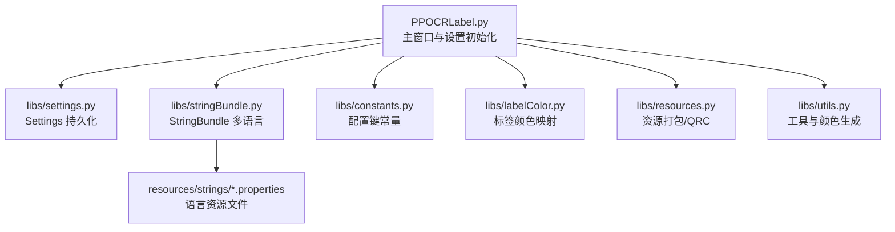
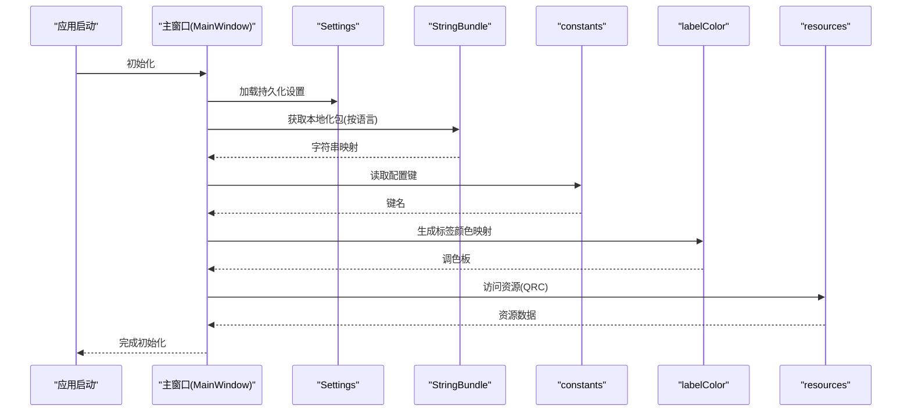
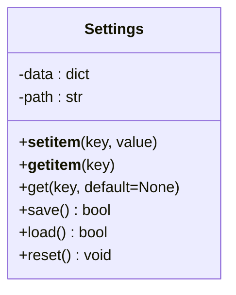
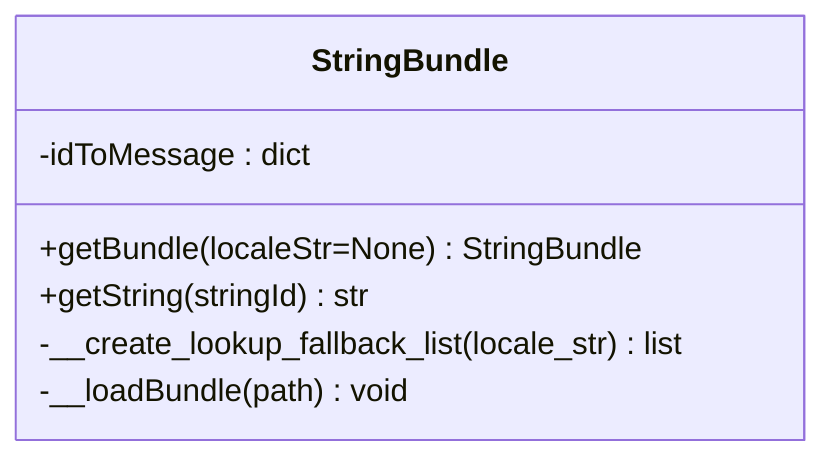
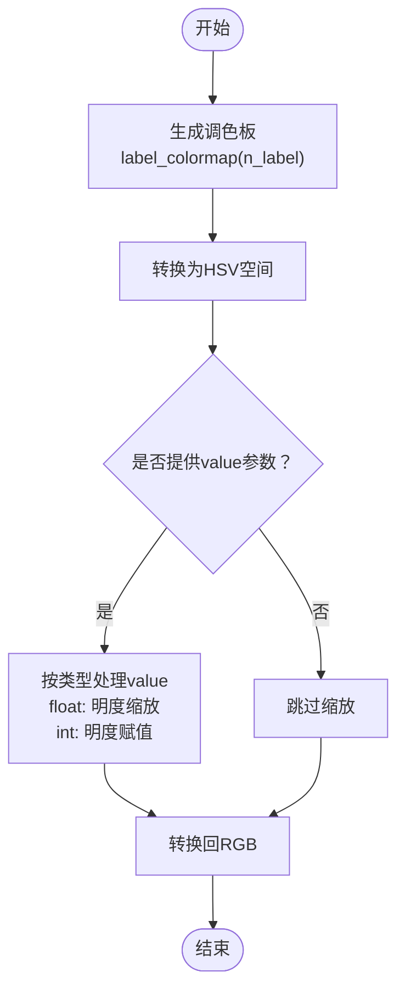
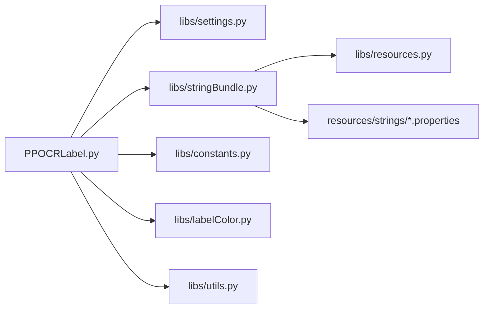

# 配置和设置管理

<cite>
**本文引用的文件**
- [PPOCRLabel.py](PPOCRLabel.md)
- [settings.py](settings.md)
- [stringBundle.py](stringBundle.md)
- [constants.py](constants.md)
- [labelColor.py](labelColor.md)
- [resources.py](resources.md)
- [strings-en.properties](strings-en.md)
- [strings-zh-CN.properties](strings-zh-CN.md)
- [utils.py](utils.md)
</cite>

## 目录
1. [简介](#简介)
2. [项目结构](#项目结构)
3. [核心组件](#核心组件)
4. [架构总览](#架构总览)
5. [详细组件分析](#详细组件分析)
6. [依赖关系分析](#依赖关系分析)
7. [性能考量](#性能考量)
8. [故障排查指南](#故障排查指南)
9. [结论](#结论)
10. [附录](#附录)

## 简介
本文件面向开发者与维护者，系统化阐述 PPOCRLabel 的配置与设置管理机制，覆盖以下主题：
- 应用程序配置系统的架构设计：设置存储、加载与持久化策略
- 多语言支持系统（StringBundle）的实现原理与使用方法
- 标签颜色管理与常量定义的组织方式
- 配置项的命名规范、默认值与用户自定义选项
- 配置迁移与版本兼容性处理建议
- 可扩展性与最佳实践

## 项目结构
围绕配置与设置管理的关键模块如下：
- 设置存储与持久化：libs/settings.py
- 多语言资源加载：libs/stringBundle.py + resources/strings/*.properties
- 常量与配置键：libs/constants.py
- 标签颜色生成：libs/labelColor.py
- 资源打包与访问：libs/resources.py
- 工具与颜色生成：libs/utils.py
- 主程序入口与设置初始化：PPOCRLabel.py

图表来源
- [PPOCRLabel.py](PPOCRLabel.md)
- [settings.py](settings.md)
- [stringBundle.py](stringBundle.md)
- [constants.py](constants.md)
- [labelColor.py](labelColor.md)
- [resources.py](resources.md)
- [utils.py](utils.md)

章节来源
- [PPOCRLabel.py](PPOCRLabel.md)
- [settings.py](settings.md)
- [stringBundle.py](stringBundle.md)
- [constants.py](constants.md)
- [labelColor.py](labelColor.md)
- [resources.py](resources.md)
- [utils.py](utils.md)

## 核心组件
- Settings：基于本地文件的键值配置容器，负责序列化/反序列化与默认值查询
- StringBundle：按区域设置回退链加载属性资源，提供字符串查询接口
- constants：集中定义配置键名与格式常量
- labelColor：生成标签颜色调色板，支持 HSV 明亮度调节
- resources：通过资源编译器打包语言资源，便于运行时访问
- utils：提供基于文本的稳定颜色生成等辅助能力

章节来源
- [settings.py](settings.md)
- [stringBundle.py](stringBundle.md)
- [constants.py](constants.md)
- [labelColor.py](labelColor.md)
- [resources.py](resources.md)
- [utils.py](utils.md)

## 架构总览
配置与设置管理的整体流程：
- 启动阶段：主窗口构造时加载 Settings 并从持久化文件恢复
- 运行阶段：根据 constants 中的键读取/写入配置；StringBundle 提供本地化字符串
- 渲染与交互：labelColor 与 utils 用于颜色与界面元素生成
- 资源访问：resources.py 提供统一资源访问入口，配合 properties 文件实现多语言

图表来源
- [PPOCRLabel.py](PPOCRLabel.md)
- [settings.py](settings.md)
- [stringBundle.py](stringBundle.md)
- [constants.py](constants.md)
- [labelColor.py](labelColor.md)
- [resources.py](resources.md)

## 详细组件分析

### 组件一：Settings（设置存储与持久化）
- 存储介质：用户主目录下的二进制文件（pickle）
- 关键行为：
  - 读取：load() 在文件存在时反序列化为内存字典
  - 写入：save() 使用最高协议版本序列化并落盘
  - 查询：get(key, default) 提供默认值兜底
  - 重置：reset() 删除持久化文件并清空内存数据
- 默认路径：用户主目录 + 固定文件名
- 异常处理：加载失败记录警告日志

图表来源
- [settings.py](settings.md)

章节来源
- [settings.py](settings.md)

### 组件二：StringBundle（多语言资源）
- 资源来源：
  - Qt 资源系统（QRC）打包的语言资源
  - 磁盘上的 .properties 文件（备用）
- 回退策略：根据区域设置生成回退路径列表，优先加载更具体的语言片段
- 加载流程：遍历路径列表，逐个加载属性文件，合并为字符串映射
- 使用方式：通过 getBundle(localeStr) 获取实例，再以 getString(id) 获取对应文案

图表来源
- [stringBundle.py](stringBundle.md)

章节来源
- [stringBundle.py](stringBundle.md)
- [resources.py](resources.md)
- [strings-en.properties](strings-en.md)
- [strings-zh-CN.properties](strings-zh-CN.md)

### 组件三：constants（配置键与格式常量）
- 配置键：窗口尺寸、位置、几何、颜色、自动保存、单类模式、标签文件格式等
- 格式常量：导出格式标识（如 PascalVOC、YOLO）
- 命名规范：统一使用全大写加下划线，层级以斜杠分隔（如 window/size）

章节来源
- [constants.py](constants.md)

### 组件四：labelColor（标签颜色管理）
- 功能：生成标签 ID 到 RGB 的映射表，支持 HSV 空间明度缩放
- 典型用途：为不同标签类别分配稳定且高对比度的颜色，提升可视化效果

图表来源
- [labelColor.py](labelColor.md)

章节来源
- [labelColor.py](labelColor.md)

### 组件五：resources（资源打包与访问）
- 作用：将语言资源等静态文件编译为 Python 模块，提供统一访问接口
- 访问方式：通过 Qt 资源系统（QFile/QTextStream）读取已打包资源

章节来源
- [resources.py](resources.md)

### 组件六：utils（工具与颜色生成）
- 文本到颜色：基于哈希的稳定颜色生成，用于标签名到颜色的映射
- 其他工具：快捷键格式化、自然排序、图像处理等

章节来源
- [utils.py](utils.md)

## 依赖关系分析
- 主程序依赖 Settings 与 StringBundle 完成初始化与本地化
- 配置键来自 constants，贯穿 UI 与业务逻辑
- labelColor 与 utils 为渲染与交互提供基础能力
- resources 为多语言资源提供统一入口

图表来源
- [PPOCRLabel.py](PPOCRLabel.md)
- [settings.py](settings.md)
- [stringBundle.py](stringBundle.md)
- [constants.py](constants.md)
- [labelColor.py](labelColor.md)
- [utils.py](utils.md)
- [resources.py](resources.md)

章节来源
- [PPOCRLabel.py](PPOCRLabel.md)

## 性能考量
- Settings 持久化采用 pickle 协议，序列化/反序列化开销低，适合小规模配置
- StringBundle 加载顺序为：资源路径优先，磁盘文件次之；建议保持资源文件最小化更新，减少 IO
- labelColor 生成调色板为一次性计算，后续仅做索引访问，成本极低
- 资源访问通过 Qt 资源系统，避免磁盘路径解析开销

## 故障排查指南
- 设置加载失败
  - 现象：启动时出现设置加载警告
  - 排查：检查持久化文件是否存在、权限是否可读；必要时调用 reset() 清理后重启
  - 参考路径：[settings.py](settings.md)
- 多语言字符串缺失
  - 现象：getString 抛出缺失键异常
  - 排查：确认键名拼写一致；检查 properties 文件是否包含该键；确认回退链是否正确
  - 参考路径：[stringBundle.py](stringBundle.md)
- 颜色显示异常
  - 现象：标签颜色不明显或偏色
  - 排查：确认是否传入了明度参数；检查 label_colormap 的 value 参数类型
  - 参考路径：[labelColor.py](labelColor.md)

章节来源
- [settings.py](settings.md)
- [stringBundle.py](stringBundle.md)
- [labelColor.py](labelColor.md)

## 结论
PPOCRLabel 的配置与设置管理以简洁可靠为核心目标：
- Settings 提供轻量级持久化，适合小体量配置
- StringBundle 通过资源与回退链实现灵活的多语言支持
- constants 将配置键集中化，降低耦合与拼写错误风险
- labelColor 与 utils 为界面与交互提供稳定的视觉与工具支撑
建议在后续演进中关注配置迁移与版本兼容策略，以保障长期可维护性。

## 附录

### 配置项与默认值清单（示例）
- 窗口相关：窗口尺寸、位置、几何、状态
- 视图与交互：线条颜色、填充颜色、绘制正方形开关、自动保存、单类模式、显示标签/索引
- 路径与文件：最近文件列表、保存目录、最后打开目录、标签文件格式
- 编码与格式：默认编码、导出格式（PascalVOC、YOLO）

章节来源
- [constants.py](constants.md)

### 配置文件格式说明
- 持久化文件：二进制 pickle 文件，默认位于用户主目录
- 多语言资源：属性文件（.properties），键值对形式，值使用 UTF-8 编码

章节来源
- [settings.py](settings.md)
- [stringBundle.py](stringBundle.md)
- [strings-en.properties](strings-en.md)
- [strings-zh-CN.properties](strings-zh-CN.md)

### 用户自定义选项与扩展建议
- 新增配置键：在 constants.py 中新增键名，遵循现有命名规范
- 默认值策略：在读取处提供合理默认值，避免硬编码散落各处
- 多语言扩展：在 properties 文件中添加新键与翻译，确保回退链完整
- 颜色策略：通过 label_colormap 控制标签颜色一致性，必要时引入明度参数

章节来源
- [constants.py](constants.md)
- [labelColor.py](labelColor.md)
- [strings-en.properties](strings-en.md)
- [strings-zh-CN.properties](strings-zh-CN.md)

### 配置迁移与版本兼容
- 版本升级时，建议在 Settings.save() 前进行键名迁移与默认值补丁
- 对于废弃键，提供迁移映射并在加载阶段清理
- 保持 constants 的向后兼容，新增键提供默认值，避免破坏旧配置

章节来源
- [settings.py](settings.md)
- [constants.py](constants.md)