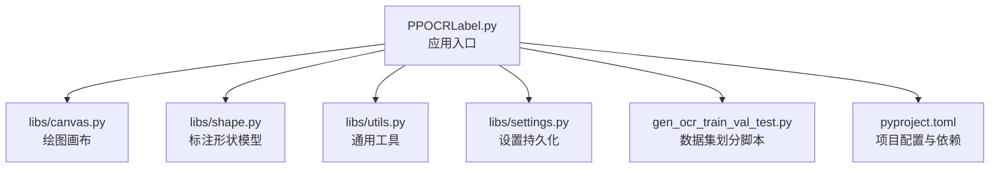
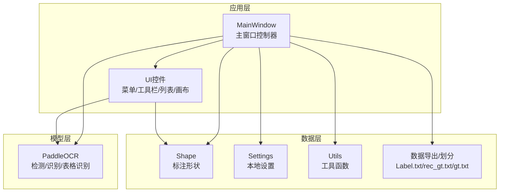
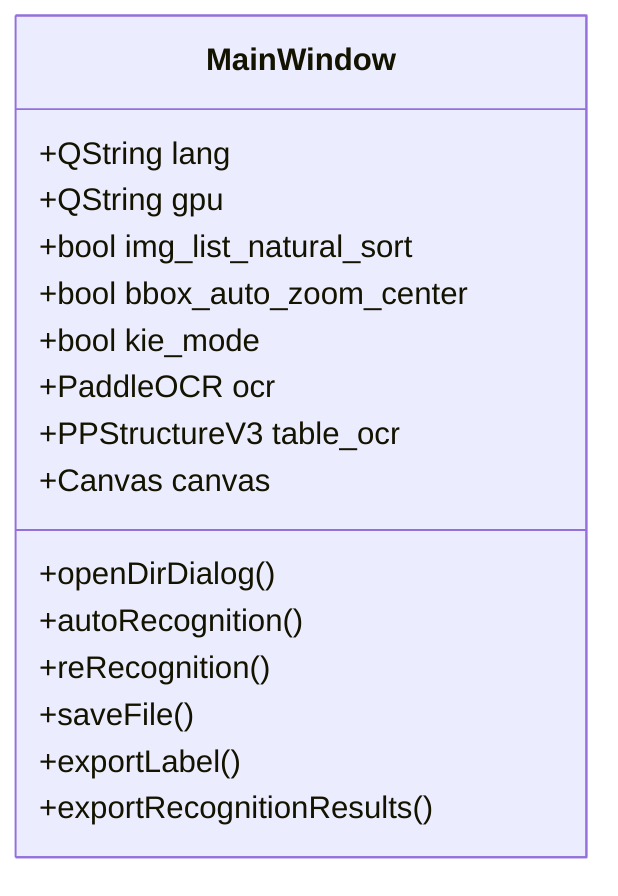
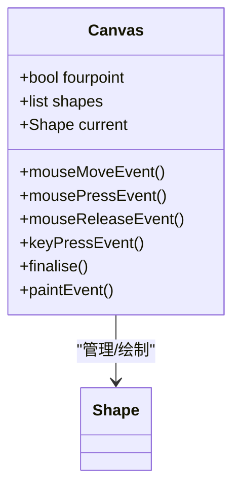
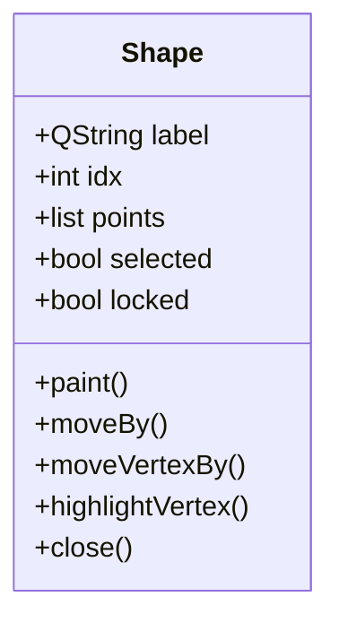
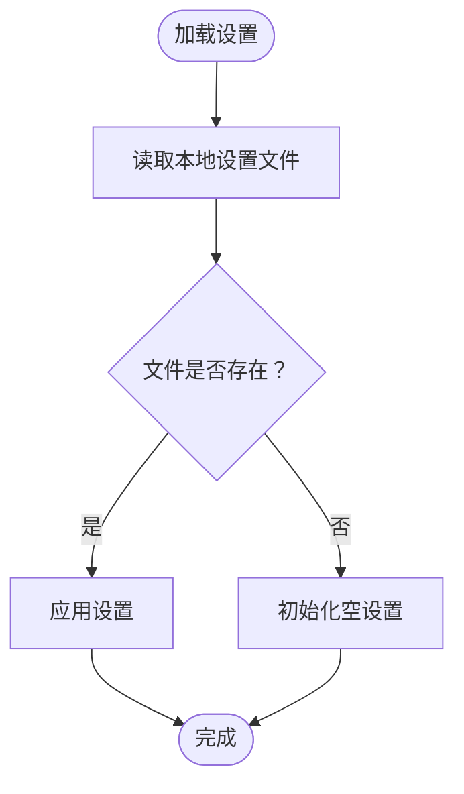
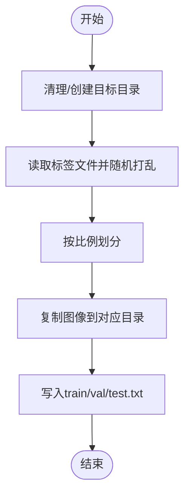
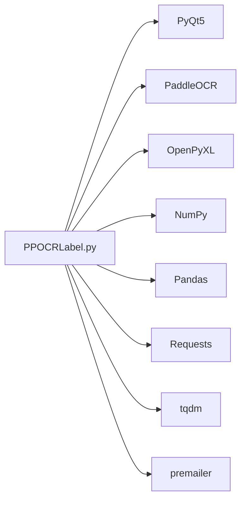

# 项目概述

<cite>
**本文引用的文件**
- [README.md](README.md)
- [README_ch.md](README_ch.md)
- [PPOCRLabel.py](PPOCRLabel.md)
- [libs/canvas.py](canvas.md)
- [libs/shape.py](shape.md)
- [libs/utils.py](utils.md)
- [libs/settings.py](settings.md)
- [gen_ocr_train_val_test.py](gen_ocr_train_val_test.md)
- [pyproject.toml](pyproject.md)
</cite>

## 目录
1. [简介](#简介)
2. [项目结构](#项目结构)
3. [核心组件](#核心组件)
4. [架构总览](#架构总览)
5. [详细组件分析](#详细组件分析)
6. [依赖关系分析](#依赖关系分析)
7. [性能与可用性考量](#性能与可用性考量)
8. [故障排查指南](#故障排查指南)
9. [结论](#结论)
10. [附录](#附录)

## 简介
PPOCRLabel 是一款基于 PyQt5 的半自动化 OCR 文本标注工具，专为 OCR 领域设计，内置 PaddleOCR 模型以实现智能文本检测与识别，支持矩形框、表格、不规则文本与关键信息（KIE）标注，并可直接导出训练所需的检测与识别标签。项目提供图形化界面与丰富的快捷键、批处理与自动保存等能力，显著提升标注效率与质量。

- 主要用途：为 PaddleOCR 检测与识别模型训练准备高质量标注数据
- 技术栈：PyQt5、PaddleOCR、OpenCV、OpenPyXL、NumPy、Pandas 等
- 许可证：Apache-2.0
- 目标用户：数据标注工程师、算法工程师、研究者与高校学生

**章节来源**
- [README.md](README.md)
- [pyproject.toml](pyproject.md)

## 项目结构
项目采用“入口脚本 + 子模块库”的组织方式：
- 应用入口：PPOCRLabel.py
- 核心 UI 组件：libs/canvas.py、libs/shape.py、libs/utils.py、libs/settings.py
- 数据导出与数据集划分：gen_ocr_train_val_test.py
- 项目元信息与依赖：pyproject.toml
- 国际化资源：resources/strings/*
- 资源打包：resources.qrc（由 README 中的打包流程说明）

**图表来源**
- [PPOCRLabel.py](PPOCRLabel.md)
- [libs/canvas.py](canvas.md)
- [libs/shape.py](shape.md)
- [libs/utils.py](utils.md)
- [libs/settings.py](settings.md)
- [gen_ocr_train_val_test.py](gen_ocr_train_val_test.md)
- [pyproject.toml](pyproject.md)

**章节来源**
- [PPOCRLabel.py](PPOCRLabel.md)
- [pyproject.toml](pyproject.md)

## 核心组件
- 主窗口与工作流：MainWindow 负责加载模型、管理文件列表、UI 控件、快捷键与动作、标注状态与导出逻辑
- 画布与交互：Canvas 提供鼠标/键盘事件处理、多点绘制、框选、平移缩放、顶点编辑与复制粘贴
- 形状模型：Shape 描述标注框的几何、颜色、标签、索引与绘制细节
- 工具与设置：utils 提供图标、动作、校验器、排序、图像裁剪与坐标映射；settings 提供本地设置持久化
- 数据导出与划分：gen_ocr_train_val_test.py 实现检测/识别数据集的训练/验证/测试划分

**章节来源**
- [PPOCRLabel.py](PPOCRLabel.md)
- [libs/canvas.py](canvas.md)
- [libs/shape.py](shape.md)
- [libs/utils.py](utils.md)
- [libs/settings.py](settings.md)
- [gen_ocr_train_val_test.py](gen_ocr_train_val_test.md)

## 架构总览
系统采用“主窗口协调 + 画布渲染 + 形状模型 + 工具与设置 + 数据导出”的分层架构，模型推理由 PaddleOCR 提供，UI 事件驱动标注流程，最终输出标准格式标注文件。

**图表来源**
- [PPOCRLabel.py](PPOCRLabel.md)
- [libs/canvas.py](canvas.md)
- [libs/shape.py](shape.md)
- [libs/utils.py](utils.md)
- [libs/settings.py](settings.md)
- [gen_ocr_train_val_test.py](gen_ocr_train_val_test.md)

## 详细组件分析

### 主窗口（MainWindow）
- 职责：初始化模型（检测/识别/表格）、加载语言与设置、构建 UI（文件列表、标注列表、识别结果、工具按钮、缩放条）、绑定快捷键与动作、处理自动标注/重新识别/导出
- 关键点：
  - 设备选择（GPU/CPU）与语言/模型参数注入
  - KIE 模式开关与关键字类别管理
  - 文件夹扫描、图片列表排序（自然排序）
  - 自动保存未提交变更、自动重新识别等增强特性
  - 与 Canvas/Shape 的事件联动（新增标注、移动、选择变化）

**图表来源**
- [PPOCRLabel.py](PPOCRLabel.md)

**章节来源**
- [PPOCRLabel.py](PPOCRLabel.md)

### 画布（Canvas）
- 职责：响应鼠标/键盘事件，维护当前绘制状态与选中形状，支持矩形/四点绘制、顶点高亮与移动、整体移动、复制粘贴、平移与缩放
- 关键点：
  - 绘制模式切换（CREATE/EDIT）
  - 多点绘制与闭合判定
  - 顶点移动与整体移动的区分
  - 与父窗口状态同步（坐标、尺寸、缩放）

**图表来源**
- [libs/canvas.py](canvas.md)
- [libs/shape.py](shape.md)

**章节来源**
- [libs/canvas.py](canvas.md)

### 形状模型（Shape）
- 职责：描述标注框的几何结构、颜色、标签、索引、绘制与高亮
- 关键点：
  - 支持四点/矩形、闭合与高亮
  - 绘制文本标签与编号
  - 旋转与中心计算

**图表来源**
- [libs/shape.py](shape.md)

**章节来源**
- [libs/shape.py](shape.md)

### 工具与设置（utils/settings）
- 职责：提供图标/动作/校验器、自然排序、图像裁剪、HTML重建、设置持久化等
- 关键点：
  - 设置文件持久化（pickle）
  - 图像旋转裁剪与透视变换
  - HTML 表格结构重建

**图表来源**
- [libs/settings.py](settings.md)

**章节来源**
- [libs/utils.py](utils.md)
- [libs/utils.py](utils.md)
- [libs/utils.py](utils.md)
- [libs/settings.py](settings.md)

### 数据导出与划分（gen_ocr_train_val_test.py）
- 职责：将标注数据划分为训练/验证/测试集，并复制对应图像与生成标签文件
- 关键点：
  - 按比例随机划分
  - 支持检测与识别两个子集
  - 清理旧目录并创建新目录

**图表来源**
- [gen_ocr_train_val_test.py](gen_ocr_train_val_test.md)
- [gen_ocr_train_val_test.py](gen_ocr_train_val_test.md)

**章节来源**
- [gen_ocr_train_val_test.py](gen_ocr_train_val_test.md)

## 依赖关系分析
- 运行时依赖：PyQt5、PaddleOCR、OpenPyXL、tqdm、pandas、requests、premailer 等
- 平台与版本：Python >= 3.9；Linux 需注意 OpenCV 版本与 Qt 平台插件问题
- GUI 入口：pyproject.toml 中注册 gui-scripts

**图表来源**
- [pyproject.toml](pyproject.md)

**章节来源**
- [pyproject.toml](pyproject.md)

## 性能与可用性考量
- 推理设备：自动检测 CUDA 并选择 GPU；无 GPU 时回退 CPU
- 模型参数：可配置检测/识别/分类模型目录与语言，支持自定义模型
- 交互优化：自然排序、自动保存未提交变更、自动重新识别、顶点独立移动、自动缩放中心
- 数据导出：支持自动/手动导出，关闭应用时自动写入

**章节来源**
- [PPOCRLabel.py](PPOCRLabel.md)
- [README.md](README.md)

## 故障排查指南
- Linux：opencv 版本过高导致 objc 错误，建议安装 4.2.0.32；Qt xcb 插件缺失时使用 wayland 并重新安装 headless opencv
- Windows：缺少 win32com 时安装 pywin32 与 premailer
- 资源编译：缺失字符串 id 时重新编译资源
- OpenCV 不兼容：cv2 无 INTER_NEAREST 时卸载并重装 4.2.0.32 headless 版本
- 数据集划分：whl 与源码混用可能导致 PaddleOCR 类调用优先级问题

**章节来源**
- [README.md](README.md)
- [README_ch.md](README_ch.md)

## 结论
PPOCRLabel 通过 PyQt5 提供直观易用的图形化标注界面，结合 PaddleOCR 的强大推理能力，实现了从自动标注到人工修正再到标准数据导出的完整闭环。其模块化设计与完善的快捷键、批处理与自动保存机制，使其既能满足初学者快速上手，也能满足专业用户的高效标注需求。配套的数据集划分脚本进一步完善了从标注到训练的全流程。

## 附录

### 使用场景与目标用户
- 场景：票据、表格、广告牌、文档等多类型文本的检测与识别标注
- 用户：标注团队、算法工程师、研究人员、高校教师与学生

**章节来源**
- [README.md](README.md)

### 许可证与贡献
- 许可证：Apache-2.0
- 贡献指南：可通过社区活动参与改进与反馈

**章节来源**
- [pyproject.toml](pyproject.md)
- [README.md](README.md)